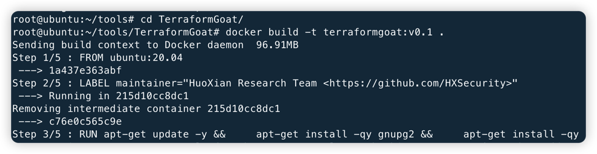
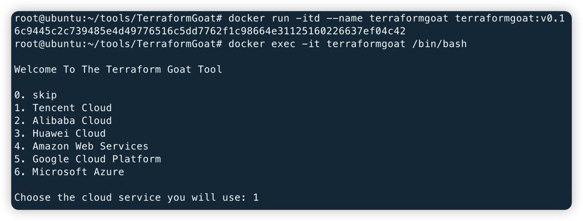

# Terraform Goat

English | [中文](./README_CN.md)

Terraform Goat is HuoXian research team' "Vulnerable by Design" multi cloud deployment tool.

Currently supported cloud vendors include Alibaba Cloud, Tencent Cloud, Huawei Cloud, Amazon Web Services, Google Cloud Platform, Microsoft Azure.

## Currently Supported Vulnerability Environments

|  ID  | Cloud Service Company  |  Types Of Cloud Services  |                    Vulnerable Environment                    |
| :--: | :--------------------: | :-----------------------: | :----------------------------------------------------------: |
|  1   |     Tencent Cloud      |      Object Storage       | [Bucket Object Traversal](https://github.com/HuoCorp/TerraformGoat/tree/main/tencentcloud/object_storage_service/bucket_object_traversal) |
|  2   |     Tencent Cloud      |      Object Storage       | [Unrestricted File Upload](https://github.com/HuoCorp/TerraformGoat/tree/main/tencentcloud/object_storage_service/unrestricted_file_upload) |
|  3   |     Alibaba Cloud      |      Object Storage       | [Bucket Object Traversal](https://github.com/HuoCorp/TerraformGoat/tree/main/aliyun/object_storage_service/bucket_object_traversal) |
|  4   |     Alibaba Cloud      |      Object Storage       | [Object ACL Writable](https://github.com/HuoCorp/TerraformGoat/tree/main/aliyun/object_storage_service/object_acl_writable) |
|  5   |     Alibaba Cloud      |      Object Storage       | [Special Bucket Policy](https://github.com/HuoCorp/TerraformGoat/tree/main/aliyun/object_storage_service/special_bucket_policy) |
|  6   |     Alibaba Cloud      |      Object Storage       | [Unrestricted File Upload](https://github.com/HuoCorp/TerraformGoat/tree/main/aliyun/object_storage_service/unrestricted_file_upload) |
|  7   |      Huawei Cloud      |      Object Storage       | [Object ACL Writable](https://github.com/HuoCorp/TerraformGoat/tree/main/huaweicloud/object_storage_service/object_acl_writable) |
|  8   |      Huawei Cloud      |      Object Storage       | [Special Bucket Policy](https://github.com/HuoCorp/TerraformGoat/tree/main/huaweicloud/object_storage_service/special_bucket_policy) |
|  9   |      Huawei Cloud      |      Object Storage       | [Unrestricted File Upload](https://github.com/HuoCorp/TerraformGoat/tree/main/huaweicloud/object_storage_service/unrestricted_file_upload) |
|  10  |      Huawei Cloud      |      Object Storage       | [Bucket Object Traversal](https://github.com/HuoCorp/TerraformGoat/tree/main/huaweicloud/object_storage_service/bucket_object_traversal) |
|  11  |  Amazon  Web Services  |      Object Storage       | [Bucket Object Traversal](https://github.com/HuoCorp/TerraformGoat/tree/main/aws/object_storage_service/bucket_object_traversal) |
|  12  |  Amazon  Web Services  |      Object Storage       | [Special Bucket Policy](https://github.com/HuoCorp/TerraformGoat/tree/main/aws/object_storage_service/special_bucket_policy) |
|  13  |  Amazon  Web Services  |      Object Storage       | [Unrestricted File Upload](https://github.com/HuoCorp/TerraformGoat/tree/main/aws/object_storage_service/unrestricted_file_upload) |
|  14  |  Amazon  Web Services  |      Object Storage       | [Object ACL Writable](https://github.com/HuoCorp/TerraformGoat/tree/main/aws/object_storage_service/object_acl_writable) |
|  15  |  Amazon  Web Services  | Elastic Computing Service | [EC2 SSRF](https://github.com/HuoCorp/TerraformGoat/tree/main/aws/elastic_computing_service/ec2_ssrf) |
|  16  | Google  Cloud Platform |      Object Storage       | [Bucket Object Traversal](https://github.com/HuoCorp/TerraformGoat/tree/main/gcp/object_storage_service/bucket_object_traversal) |
|  17  | Google  Cloud Platform |      Object Storage       | [Object ACL Writable](https://github.com/HuoCorp/TerraformGoat/tree/main/gcp/object_storage_service/object_acl_writable) |
|  18  | Google  Cloud Platform |      Object Storage       | [Bucket ACL Writable](https://github.com/HuoCorp/TerraformGoat/tree/main/gcp/object_storage_service/bucket_acl_writable) |
|  19  | Google  Cloud Platform |      Object Storage       | [Unrestricted File Upload](https://github.com/HuoCorp/TerraformGoat/tree/main/gcp/object_storage_service/unrestricted_file_upload) |
|  20  |    Microsoft  Azure    |      Object Storage       | [Blob  Public Access](https://github.com/HuoCorp/TerraformGoat/tree/main/azure/object_storage_service/blob_public_access/) |

## Install

Terraform Goat is built using Dockerfile, so you need to install the Docker environment first. For the Docker installation method, please refer to: [https://docs.docker.com/get-docker/](https://docs.docker.com/get-docker/)

```shell
git clone https://github.com/HuoCorp/TerraformGoat.git
cd terraformgoat
docker build -t terraformgoat:v0.1 .
```



After docker build is complete, start and enter the container

```shell
docker run -itd --name terraformgoat terraformgoat:v0.1
docker exec -it terraformgoat /bin/bash
```

When entering the container, you need to select the cloud service to run



After selecting the cloud service you want to use, the relevant dependencies will be installed. After the relevant dependencies are installed, you can use terraformgoat.

## Uninstall

```shell
docker stop terraformgoat
docker rm terraformgoat
docker rmi terraformgoat:v0.1
```

## Notice

1. The README of each vulnerable environment is executed within the terraformgoat container environment, so the terraformgoat container environment needs to be deployed first.
2. Due to the horizontal risk of intranet horizontal on the cloud in some scenarios, it is strongly recommended that users use their own test accounts to configure the scenarios, avoid using the cloud account of the production environment, and install Terraform Goat using Dockerfile to isolate the user's local cloud vendor token and the test account token.
