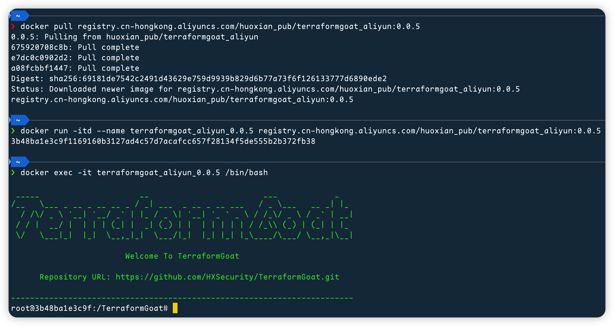

# TerraformGoat

[](https://github.com/HXSecurity/TerraformGoat/blob/main/LICENSE) [](https://github.com/HXSecurity/TerraformGoat/releases) [](https://github.com/HXSecurity/TerraformGoat/stargazers) [](https://github.com/HXSecurity/TerraformGoat/pulls) [](https://twitter.com/intent/tweet/?text=TerraformGoat%20is%20HXSecurity%20research%20lab's%20%22Vulnerable%20by%20Design%22%20multi%20cloud%20deployment%20tool.%20Check%20it%20out%20https%3A%2F%2Fgithub.com%2FHXSecurity%2FTerraformGoat%0A%23TerraformGoat%20%23Terraform%20%23Cloud%20%23Security%20%23cloudsecurity)

English | [中文](./README_CN.md)

TerraformGoat is HXSecurity research lab's "Vulnerable by Design" multi cloud deployment tool.

Currently supported cloud vendors include Alibaba Cloud, Tencent Cloud, Huawei Cloud, Amazon Web Services, Google Cloud Platform, Microsoft Azure.

## :dart: Scenarios

|  ID  | Cloud Service Company |    Types Of Cloud Services     |                    Vulnerable Environment                    |
| :--: | :-------------------: | :----------------------------: | :----------------------------------------------------------: |
|  1   |     Alibaba Cloud     |           Networking           | [VPC Security Group Open All   Ports](https://github.com/HXSecurity/TerraformGoat/tree/main/aliyun/networking/vpc_security_group_open_all_ports) |
|  2   |     Alibaba Cloud     |           Networking           | [VPC Security Group Open   Common Ports](https://github.com/HXSecurity/TerraformGoat/tree/main/aliyun/networking/vpc_security_group_open_common_ports) |
|  3   |     Alibaba Cloud     |         Object Storage         | [Bucket HTTP Enable](https://github.com/HXSecurity/TerraformGoat/tree/main/aliyun/oss/bucket_http_enable) |
|  4   |     Alibaba Cloud     |         Object Storage         | [Object ACL Writable](https://github.com/HXSecurity/TerraformGoat/tree/main/aliyun/oss/object_acl_writable) |
|  5   |     Alibaba Cloud     |         Object Storage         | [Object ACL Readable](https://github.com/HXSecurity/TerraformGoat/tree/main/aliyun/oss/object_acl_readable) |
|  6   |     Alibaba Cloud     |         Object Storage         | [Special Bucket Policy](https://github.com/HXSecurity/TerraformGoat/tree/main/aliyun/oss/special_bucket_policy) |
|  7   |     Alibaba Cloud     |         Object Storage         | [Bucket Public Access](https://github.com/HXSecurity/TerraformGoat/tree/main/aliyun/oss/bucket_public_access) |
|  8   |     Alibaba Cloud     |         Object Storage         | [Object Public Access](https://github.com/HXSecurity/TerraformGoat/tree/main/aliyun/oss/object_public_access) |
|  9   |     Alibaba Cloud     |         Object Storage         | [Bucket Logging Disable](https://github.com/HXSecurity/TerraformGoat/tree/main/aliyun/oss/bucket_logging_disable) |
|  10  |     Alibaba Cloud     |         Object Storage         | [Bucket Policy Readable](https://github.com/HXSecurity/TerraformGoat/tree/main/aliyun/oss/bucket_policy_readable) |
|  11  |     Alibaba Cloud     |         Object Storage         | [Bucket Object Traversal](https://github.com/HXSecurity/TerraformGoat/tree/main/aliyun/oss/bucket_object_traversal) |
|  12  |     Alibaba Cloud     |         Object Storage         | [Unrestricted File Upload](https://github.com/HXSecurity/TerraformGoat/tree/main/aliyun/oss/unrestricted_file_upload) |
|  13  |     Alibaba Cloud     |         Object Storage         | [Server Side Encryption No   KMS Set](https://github.com/HXSecurity/TerraformGoat/tree/main/aliyun/oss/server_side_encryption_no_kms_set) |
|  14  |     Alibaba Cloud     |         Object Storage         | [Server Side Encryption Not   Using BYOK](https://github.com/HXSecurity/TerraformGoat/tree/main/aliyun/oss/server_side_encryption_not_using_BYOK) |
|  15  |     Alibaba Cloud     |   Elastic Computing Service    | [ECS SSRF](https://github.com/HXSecurity/TerraformGoat/tree/main/aliyun/ecs/ecs_ssrf) |
|  16  |     Alibaba Cloud     |   Elastic Computing Service    | [ECS Unattached Disks Are   Unencrypted](https://github.com/HXSecurity/TerraformGoat/tree/main/aliyun/ecs/ecs_unattached_disks_are_unencrypted) |
|  17  |     Alibaba Cloud     |   Elastic Computing Service    | [ECS Virtual Machine Disks   Are Unencrypted](https://github.com/HXSecurity/TerraformGoat/tree/main/aliyun/ecs/ecs_virtual_machine_disks_are_unencrypted) |
|  18  |     Tencent Cloud     |           Networking           | [VPC Security Group Open All   Ports](https://github.com/HXSecurity/TerraformGoat/tree/main/tencentcloud/networking/vpc_security_group_open_all_ports) |
|  19  |     Tencent Cloud     |           Networking           | [VPC Security Group Open   Common Ports](https://github.com/HXSecurity/TerraformGoat/tree/main/tencentcloud/networking/vpc_security_group_open_common_ports) |
|  20  |     Tencent Cloud     |         Object Storage         | [Bucket ACL Writable](https://github.com/HXSecurity/TerraformGoat/tree/main/tencentcloud/cos/bucket_acl_writable) |
|  21  |     Tencent Cloud     |         Object Storage         | [Bucket ACL Readable](https://github.com/HXSecurity/TerraformGoat/tree/main/tencentcloud/cos/bucket_acl_readable) |
|  22  |     Tencent Cloud     |         Object Storage         | [Bucket Public Access](https://github.com/HXSecurity/TerraformGoat/tree/main/tencentcloud/cos/bucket_public_access) |
|  23  |     Tencent Cloud     |         Object Storage         | [Object Public Access](https://github.com/HXSecurity/TerraformGoat/tree/main/tencentcloud/cos/object_public_access) |
|  24  |     Tencent Cloud     |         Object Storage         | [Unrestricted File Upload](https://github.com/HXSecurity/TerraformGoat/tree/main/tencentcloud/cos/unrestricted_file_upload) |
|  25  |     Tencent Cloud     |         Object Storage         | [Bucket Object Traversal](https://github.com/HXSecurity/TerraformGoat/tree/main/tencentcloud/cos/bucket_object_traversal) |
|  26  |     Tencent Cloud     |         Object Storage         | [Bucket Logging Disable](https://github.com/HXSecurity/TerraformGoat/tree/main/tencentcloud/cos/bucket_logging_disable) |
|  27  |     Tencent Cloud     |         Object Storage         | [Server Side Encryption   Disable](https://github.com/HXSecurity/TerraformGoat/tree/main/tencentcloud/cos/server_side_encryption_disable) |
|  28  |     Tencent Cloud     |   Elastic Computing Service    | [CVM SSRF](https://github.com/HXSecurity/TerraformGoat/tree/main/tencentcloud/cvm/cvm_ssrf) |
|  29  |     Tencent Cloud     |   Elastic Computing Service    | [CBS Storage Are Not Used](https://github.com/HXSecurity/TerraformGoat/tree/main/tencentcloud/cvm/cbs_storage_are_not_used) |
|  30  |     Tencent Cloud     |   Elastic Computing Service    | [CVM Virtual Machine Disks   Are Unencrypted](https://github.com/HXSecurity/TerraformGoat/tree/main/tencentcloud/cvm/cvm_virtual_machine_disks_are_unencrypted) |
|  31  |     Huawei Cloud      |           Networking           | [ECS Unsafe Security Group](https://github.com/HXSecurity/TerraformGoat/tree/main/huaweicloud/networking/cis_unsafe_secgroup) |
|  32  |     Huawei Cloud      |         Object Storage         | [Object ACL Writable](https://github.com/HXSecurity/TerraformGoat/tree/main/huaweicloud/obs/object_acl_writable) |
|  33  |     Huawei Cloud      |         Object Storage         | [Special Bucket Policy](https://github.com/HXSecurity/TerraformGoat/tree/main/huaweicloud/obs/special_bucket_policy) |
|  34  |     Huawei Cloud      |         Object Storage         | [Unrestricted File Upload](https://github.com/HXSecurity/TerraformGoat/tree/main/huaweicloud/obs/unrestricted_file_upload) |
|  35  |     Huawei Cloud      |         Object Storage         | [Bucket Object Traversal](https://github.com/HXSecurity/TerraformGoat/tree/main/huaweicloud/obs/bucket_object_traversal) |
|  36  |     Huawei Cloud      |         Object Storage         | [Wrong Policy Causes   Arbitrary File Uploads](https://github.com/HXSecurity/TerraformGoat/tree/main/huaweicloud/obs/policy_of_unrestricted_file_upload) |
|  37  |     Huawei Cloud      |   Elastic Computing Service    | [ECS SSRF](https://github.com/HXSecurity/TerraformGoat/tree/main/huaweicloud/ecs/ecs_ssrf) |
|  38  |     Huawei Cloud      |  Relational Database Service   | [RDS Mysql Baseline Checking   Environment](https://github.com/HXSecurity/TerraformGoat/tree/main/huaweicloud/rds/cis_rds_mysql) |
|  39  |  Amazon Web Services  |           Networking           | [VPC Security Group Open All   Ports](https://github.com/HXSecurity/TerraformGoat/tree/main/aws/networking/vpc_security_group_open_all_ports) |
|  40  |  Amazon Web Services  |           Networking           | [VPC Security Group Open   Common Ports](https://github.com/HXSecurity/TerraformGoat/tree/main/aws/networking/vpc_security_group_open_common_ports) |
|  41  |  Amazon Web Services  |         Object Storage         | [Object ACL Writable](https://github.com/HXSecurity/TerraformGoat/tree/main/aws/s3/object_acl_writable) |
|  42  |  Amazon Web Services  |         Object Storage         | [Bucket ACL Writable](https://github.com/HXSecurity/TerraformGoat/tree/main/aws/s3/bucket_acl_writable) |
|  43  |  Amazon Web Services  |         Object Storage         | [Bucket ACL Readable](https://github.com/HXSecurity/TerraformGoat/tree/main/aws/s3/bucket_acl_readable) |
|  44  |  Amazon Web Services  |         Object Storage         | [MFA Delete Is Disable](https://github.com/HXSecurity/TerraformGoat/tree/main/aws/s3/mfa_delete_is_disable) |
|  45  |  Amazon Web Services  |         Object Storage         | [Special Bucket Policy](https://github.com/HXSecurity/TerraformGoat/tree/main/aws/s3/special_bucket_policy) |
|  46  |  Amazon Web Services  |         Object Storage         | [Bucket Object Traversal](https://github.com/HXSecurity/TerraformGoat/tree/main/aws/s3/bucket_object_traversal) |
|  47  |  Amazon Web Services  |         Object Storage         | [Unrestricted File Upload](https://github.com/HXSecurity/TerraformGoat/tree/main/aws/s3/unrestricted_file_upload) |
|  48  |  Amazon Web Services  |         Object Storage         | [Bucket Logging Disable](https://github.com/HXSecurity/TerraformGoat/tree/main/aws/s3/bucket_logging_disable) |
|  49  |  Amazon Web Services  |         Object Storage         | [Bucket Allow HTTP Access](https://github.com/HXSecurity/TerraformGoat/tree/main/aws/s3/bucket_allow_http_access) |
|  50  |  Amazon Web Services  |         Object Storage         | [Bucket Default Encryption   Disable](https://github.com/HXSecurity/TerraformGoat/tree/main/aws/s3/bucket_default_encryption_disable) |
|  51  |  Amazon Web Services  |   Elastic Computing Service    | [EC2 SSRF](https://github.com/HXSecurity/TerraformGoat/tree/main/aws/ec2/ec2_ssrf) |
|  52  |  Amazon Web Services  |   Elastic Computing Service    | [Console Takeover](https://github.com/HXSecurity/TerraformGoat/tree/main/aws/ec2/console_takeover) |
|  53  |  Amazon Web Services  |   Elastic Computing Service    | [EBS Volumes Are Not Used](https://github.com/HXSecurity/TerraformGoat/tree/main/aws/ec2/EBS_volumes_are_not_used) |
|  54  |  Amazon Web Services  |   Elastic Computing Service    | [EBS Volumes Encryption Is   Disabled](https://github.com/HXSecurity/TerraformGoat/tree/main/aws/ec2/EBS_volumes_encryption_is_disabled) |
|  55  |  Amazon Web Services  |   Elastic Computing Service    | [Snapshots Of EBS Volumes Are   Unencrypted](https://github.com/HXSecurity/TerraformGoat/tree/main/aws/ec2/snapshots_of_EBS_volumes_are_unencrypted) |
|  56  |  Amazon Web Services  | Identity and Access Management | [IAM Privilege Escalation](https://github.com/HXSecurity/TerraformGoat/tree/main/aws/iam/privilege_escalation) |
|  57  | Google Cloud Platform |         Object Storage         | [Object ACL Writable](https://github.com/HXSecurity/TerraformGoat/tree/main/gcp/cs/object_acl_writable) |
|  58  | Google Cloud Platform |         Object Storage         | [Bucket ACL Writable](https://github.com/HXSecurity/TerraformGoat/tree/main/gcp/cs/bucket_acl_writable) |
|  59  | Google Cloud Platform |         Object Storage         | [Bucket Object Traversal](https://github.com/HXSecurity/TerraformGoat/tree/main/gcp/cs/bucket_object_traversal) |
|  60  | Google Cloud Platform |         Object Storage         | [Unrestricted File Upload](https://github.com/HXSecurity/TerraformGoat/tree/main/gcp/cs/unrestricted_file_upload) |
|  61  | Google Cloud Platform |   Elastic Computing Service    | [VM Command Execution](https://github.com/HXSecurity/TerraformGoat/tree/main/gcp/vm/vm_command_execution) |
|  62  |    Microsoft Azure    |         Object Storage         | [Blob Public Access](https://github.com/HXSecurity/TerraformGoat/tree/main/azure/blob/blob_public_access/) |
|  63  |    Microsoft Azure    |         Object Storage         | [Container Blob Traversal](https://github.com/HXSecurity/TerraformGoat/tree/main/azure/blob/container_blob_traversal/) |
|  64  |    Microsoft Azure    |   Elastic Computing Service    | [VM Command Execution](https://github.com/HXSecurity/TerraformGoat/tree/main/azure/vm/vm_command_execution) |

## :dizzy: Install

TerraformGoat is deployed using Docker images and therefore requires Docker Engine environment support, Docker Engine installation can be found in [https://docs.docker.com/engine/install/](https://docs.docker.com/engine/install/)

Depending on the cloud service provider you are using, choose the corresponding installation command.

Alibaba Cloud

```bash
docker pull registry.cn-hongkong.aliyuncs.com/huoxian_pub/terraformgoat_aliyun:0.0.7
docker run -itd --name terraformgoat_aliyun_0.0.7 registry.cn-hongkong.aliyuncs.com/huoxian_pub/terraformgoat_aliyun:0.0.7
docker exec -it terraformgoat_aliyun_0.0.7 /bin/bash
```

Tencent Cloud

```bash
docker pull registry.cn-hongkong.aliyuncs.com/huoxian_pub/terraformgoat_tencentcloud:0.0.7
docker run -itd --name terraformgoat_tencentcloud_0.0.7 registry.cn-hongkong.aliyuncs.com/huoxian_pub/terraformgoat_tencentcloud:0.0.7
docker exec -it terraformgoat_tencentcloud_0.0.7 /bin/bash
```

Huawei Cloud

```bash
docker pull registry.cn-hongkong.aliyuncs.com/huoxian_pub/terraformgoat_huaweicloud:0.0.7
docker run -itd --name terraformgoat_huaweicloud_0.0.7 registry.cn-hongkong.aliyuncs.com/huoxian_pub/terraformgoat_huaweicloud:0.0.7
docker exec -it terraformgoat_huaweicloud_0.0.7 /bin/bash
```

Amazon Web Services

```bash
docker pull registry.cn-hongkong.aliyuncs.com/huoxian_pub/terraformgoat_aws:0.0.7
docker run -itd --name terraformgoat_aws_0.0.7 registry.cn-hongkong.aliyuncs.com/huoxian_pub/terraformgoat_aws:0.0.7
docker exec -it terraformgoat_aws_0.0.7 /bin/bash
```

Google Cloud Platform

```bash
docker pull registry.cn-hongkong.aliyuncs.com/huoxian_pub/terraformgoat_gcp:0.0.7
docker run -itd --name terraformgoat_gcp_0.0.7 registry.cn-hongkong.aliyuncs.com/huoxian_pub/terraformgoat_gcp:0.0.7
docker exec -it terraformgoat_gcp_0.0.7 /bin/bash
```

Microsoft Azure

```bash
docker pull registry.cn-hongkong.aliyuncs.com/huoxian_pub/terraformgoat_azure:0.0.7
docker run -itd --name terraformgoat_azure_0.0.7 registry.cn-hongkong.aliyuncs.com/huoxian_pub/terraformgoat_azure:0.0.7
docker exec -it terraformgoat_azure_0.0.7 /bin/bash
```

## :page_facing_up: Demo

After entering the container, cd to the corresponding scenario directory and you can start deploying the scenario.

Here is a demonstration of the  [Alibaba Cloud Bucket Object Traversal](https://github.com/HXSecurity/TerraformGoat/tree/main/aliyun/oss/bucket_object_traversal) scenario build.

```bash
docker pull registry.cn-hongkong.aliyuncs.com/huoxian_pub/terraformgoat_aliyun:0.0.7
docker run -itd --name terraformgoat_aliyun_0.0.7 registry.cn-hongkong.aliyuncs.com/huoxian_pub/terraformgoat_aliyun:0.0.7
docker exec -it terraformgoat_aliyun_0.0.7 /bin/bash
```



```bash
cd /TerraformGoat/aliyun/oss/bucket_object_traversal/
aliyun configure
terraform init
terraform apply
```


The program prompts `Enter a value:`, type `yes` and enter, use curl to access the bucket, you can see the object traversed.


To avoid the cloud service from continuing to incur charges, remember to destroy the scenario in time after using it.

```bash
terraform destroy
```

## :rocket: Uninstall

If you are in a container, first execute the `exit` command to exit the container, and then execute the following command under the host.

```shell
docker stop $(docker ps -a -q -f "name=terraformgoat*")
docker rm $(docker ps -a -q -f "name=terraformgoat*")
docker rmi $(docker images -a -q -f "reference=registry.cn-hongkong.aliyuncs.com/huoxian_pub/terraformgoat*")
```

## ⚠️ Notice

1. The README of each vulnerable environment is executed within the TerraformGoat container environment, so the TerraformGoat container environment needs to be deployed first.
2. Due to the horizontal risk of intranet horizontal on the cloud in some scenarios, it is strongly recommended that users use their own test accounts to configure the scenarios, avoid using the cloud account of the production environment, and install TerraformGoat using Dockerfile to isolate the user's local cloud vendor token and the test account token.
3. TerraformGoat is used for educational purposes only, It is not allowed to use it for illegal and criminal purposes, any consequences arising from TerraformGoat are the responsibility of the person using it, and not the HXSecurity organization.

## :confetti_ball: Contributing

Contributions are welcomed and greatly appreciated. Further reading — [CONTRIBUTING.md](https://github.com/HXSecurity/TerraformGoat/blob/main/CONTRIBUTING.md) for details on contribution workflow.

## 🪪 License

TerraformGoat is under the Apache 2.0 license. See the [LICENSE](https://github.com/HXSecurity/TerraformGoat/blob/main/LICENSE) file for details.

## :crystal_ball: Stats


