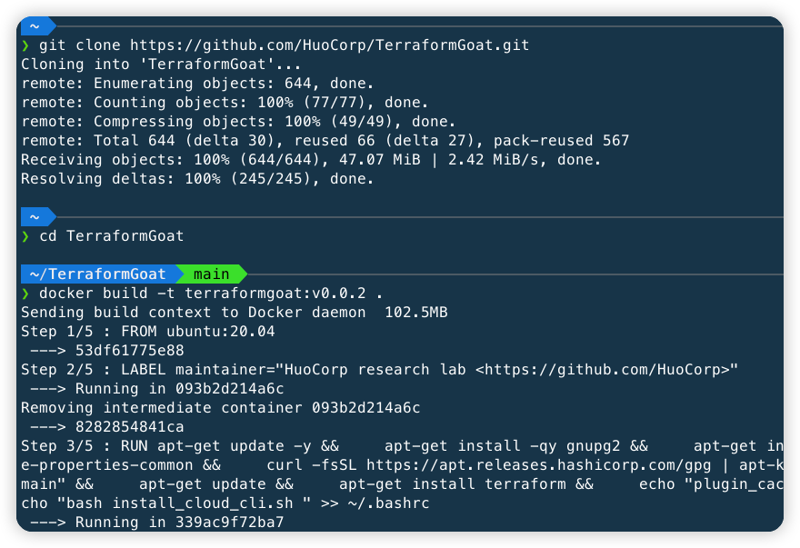
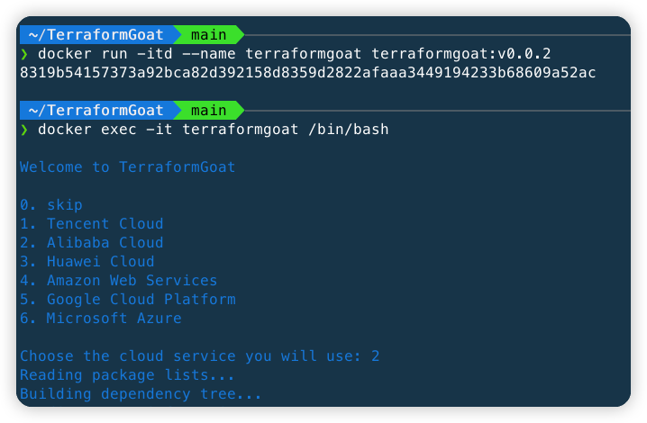

# TerraformGoat

[](https://github.com/HuoCorp/TerraformGoat/blob/main/LICENSE) [](https://github.com/HuoCorp/TerraformGoat/releases) [](https://github.com/HuoCorp/TerraformGoat/stargazers) [](https://github.com/HuoCorp/TerraformGoat/pulls) [](https://twitter.com/intent/tweet/?text=TerraformGoat%20is%20HuoCorp%20research%20lab's%20%22Vulnerable%20by%20Design%22%20multi%20cloud%20deployment%20tool.%20Check%20it%20out%20https%3A%2F%2Fgithub.com%2FHuoCorp%2FTerraformGoat%0A%23TerraformGoat%20%23Terraform%20%23Cloud%20%23Security%20%23cloudsecurity)

[English](./README.md) | 中文

TerraformGoat 是一个支持多云的云场景漏洞靶场搭建工具，目前支持阿里云、腾讯云、华为云、Amazon Web Services、Google
Cloud Platform、Microsoft Azure 六个云厂商的云场景漏洞搭建。

## :dart: 目前所支持的场景

| 序号 |         云厂商         |  云服务类型  |                           漏洞环境                           |
| :--: | :--------------------: | :----------: | :----------------------------------------------------------: |
|  1   |         腾讯云         |   对象存储   | [任意文件上传](https://github.com/HuoCorp/TerraformGoat/tree/main/tencentcloud/cos/unrestricted_file_upload) |
|  2   |         腾讯云         |   对象存储   | [Bucket 对象遍历](https://github.com/HuoCorp/TerraformGoat/tree/main/tencentcloud/cos/bucket_object_traversal) |
|  3  |         腾讯云         |   对象存储   | [Bucket ACL 可写](https://github.com/HuoCorp/TerraformGoat/tree/main/tencentcloud/cos/bucket_acl_writable) |
|  4  |         腾讯云         |   弹性计算服务   | [CVM SSRF 漏洞环境](https://github.com/HuoCorp/TerraformGoat/tree/main/tencentcloud/cvm/cvm_ssrf) |
|  5  |         阿里云         |   对象存储   | [任意文件上传](https://github.com/HuoCorp/TerraformGoat/tree/main/aliyun/oss/unrestricted_file_upload) |
|  6  |         阿里云         |   对象存储   | [Bucket 对象遍历](https://github.com/HuoCorp/TerraformGoat/tree/main/aliyun/oss/bucket_object_traversal) |
|  7  |         阿里云         |   对象存储   | [Object ACL 可写](https://github.com/HuoCorp/TerraformGoat/tree/main/aliyun/oss/object_acl_writable) |
|  8  |         阿里云         |   对象存储   | [Object ACL 可读](https://github.com/HuoCorp/TerraformGoat/tree/main/aliyun/oss/object_acl_readable) |
|  9  |         阿里云         |   对象存储   | [Bucket 公开访问](https://github.com/HuoCorp/TerraformGoat/tree/main/aliyun/oss/bucket_public_access) |
|  10  |         阿里云         |   对象存储   | [Object 公开访问](https://github.com/HuoCorp/TerraformGoat/tree/main/aliyun/oss/object_public_access) |
|  11  |         阿里云         |   对象存储   | [Bucket 策略可读](https://github.com/HuoCorp/TerraformGoat/tree/main/aliyun/oss/bucket_policy_readable) |
|  12  |         阿里云         |   对象存储   | [Bucket HTTP 开启](https://github.com/HuoCorp/TerraformGoat/tree/main/aliyun/oss/bucket_http_enable) |
|  13  |         阿里云         |   对象存储   | [特殊的 Bucket 策略](https://github.com/HuoCorp/TerraformGoat/tree/main/aliyun/oss/special_bucket_policy) |
|  14  |         阿里云         |   对象存储   | [Bucket 日志转存未开启](https://github.com/HuoCorp/TerraformGoat/tree/main/aliyun/oss/bucket_logging_disable) |
|  15  |         阿里云         |   对象存储   | [Bucket 服务端加密未使用 KMS](https://github.com/HuoCorp/TerraformGoat/tree/main/aliyun/oss/server_side_encryption_no_kms_set) |
|  16  |         阿里云         | 弹性计算服务 | [ECS SSRF 漏洞环境](https://github.com/HuoCorp/TerraformGoat/tree/main/aliyun/ecs/ecs_ssrf) |
|  17  |         华为云         |   对象存储   | [任意文件上传](https://github.com/HuoCorp/TerraformGoat/tree/main/huaweicloud/obs/unrestricted_file_upload) |
|  18  |         华为云         |   对象存储   | [Object ACL 可写](https://github.com/HuoCorp/TerraformGoat/tree/main/huaweicloud/obs/object_acl_writable) |
|  19  |         华为云         |   对象存储   | [Bucket 对象遍历](https://github.com/HuoCorp/TerraformGoat/tree/main/huaweicloud/obs/bucket_object_traversal) |
|  20  |         华为云         |   对象存储   | [特殊的 Bucket 策略](https://github.com/HuoCorp/TerraformGoat/tree/main/huaweicloud/obs/special_bucket_policy) |
|  21  |         华为云         | 弹性计算服务 | [ECS SSRF 漏洞环境](https://github.com/HuoCorp/TerraformGoat/tree/main/huaweicloud/ecs/ecs_ssrf) |
|  22  |  Amazon  Web Services  |   对象存储   | [任意文件上传](https://github.com/HuoCorp/TerraformGoat/tree/main/aws/s3/unrestricted_file_upload) |
|  23  |  Amazon  Web Services  |   对象存储   | [Object ACL 可写](https://github.com/HuoCorp/TerraformGoat/tree/main/aws/s3/object_acl_writable) |
|  24  |  Amazon  Web Services  |   对象存储   | [Bucket ACL 可写](https://github.com/HuoCorp/TerraformGoat/tree/main/aws/s3/bucket_acl_writable) |
|  25  |  Amazon  Web Services  |   对象存储   | [Bucket 对象遍历](https://github.com/HuoCorp/TerraformGoat/tree/main/aws/s3/bucket_object_traversal) |
|  26  |  Amazon  Web Services  |   对象存储   | [特殊的 Bucket 策略](https://github.com/HuoCorp/TerraformGoat/tree/main/aws/s3/special_bucket_policy) |
|  27  |  Amazon  Web Services  | 弹性计算服务 | [EC2 SSRF 漏洞环境](https://github.com/HuoCorp/TerraformGoat/tree/main/aws/ec2/ec2_ssrf) |
|  28  |  Amazon  Web Services  | 弹性计算服务 | [控制台接管漏洞环境](https://github.com/HuoCorp/TerraformGoat/tree/main/aws/ec2/console_takeover) |
|  29  |  Amazon  Web Services  | 身份和访问管理 | [IAM 提权环境](https://github.com/HuoCorp/TerraformGoat/tree/main/aws/iam/privilege_escalation) |
|  30  | Google  Cloud Platform |   对象存储   | [任意文件上传](https://github.com/HuoCorp/TerraformGoat/tree/main/gcp/cs/unrestricted_file_upload) |
|  31  | Google  Cloud Platform |   对象存储   | [Object ACL 可写](https://github.com/HuoCorp/TerraformGoat/tree/main/gcp/cs/object_acl_writable) |
|  32  | Google  Cloud Platform |   对象存储   | [Bucket ACL 可写](https://github.com/HuoCorp/TerraformGoat/tree/main/gcp/cs/bucket_acl_writable) |
|  33  | Google  Cloud Platform |   对象存储   | [Bucket 对象遍历](https://github.com/HuoCorp/TerraformGoat/tree/main/gcp/cs/bucket_object_traversal) |
|  34  |  Google  Cloud Platform  | 弹性计算服务 | [VM 命令执行漏洞环境](https://github.com/HuoCorp/TerraformGoat/tree/main/gcp/vm/vm_command_execution) |
|  35  |    Microsoft  Azure    |   对象存储   | [Blob 公开访问](https://github.com/HuoCorp/TerraformGoat/tree/main/azure/blob/blob_public_access/) |
|  36  |    Microsoft  Azure    |   对象存储   | [Container Blob 遍历](https://github.com/HuoCorp/TerraformGoat/tree/main/azure/blob/container_blob_traversal/) |
|  37  |  Microsoft  Azure  | 弹性计算服务 | [VM 命令执行漏洞环境](https://github.com/HuoCorp/TerraformGoat/tree/main/azure/vm/vm_command_execution) |

## :dizzy: 安装

TerraformGoat 使用 Dockerfile 构建，因此需要先安装 Docker 环境，Docker 安装方法可以参考：[https://docs.docker.com/get-docker/](https://docs.docker.com/get-docker/)

```shell
git clone https://github.com/HuoCorp/TerraformGoat.git
cd TerraformGoat
docker build -t terraformgoat:v0.0.3 .
```



docker build 完成后，启动并进入容器

```shell
docker run -itd --name terraformgoat terraformgoat:v0.0.3
docker exec -it terraformgoat /bin/bash
```

在进入容器时需要选择要使用到的云服务



选择你要用的云服务后会安装相关依赖，等相关依赖安装完后，就可以使用 TerraformGoat 了

这里以[阿里云 ECS SSRF](https://github.com/HuoCorp/TerraformGoat/tree/main/aliyun/elastic_computing_service/ecs_ssrf) 漏洞场景的搭建进行演示：

[](https://asciinema.org/a/493554)

## :rocket: 卸载

```shell
docker stop terraformgoat
docker rm terraformgoat
docker rmi terraformgoat:v0.0.3
```

## ⚠️ 注意事项

1. 在每个漏洞环境的 README 中都是在 TerraformGoat 容器环境内执行的，因此需要先部署 TerraformGoat 容器环境。
2. 由于部分靶场存在云上内网横向的风险，因此强烈建议用户使用自己的测试账号配置靶场，避免使用生产环境的云账号，使用 Dockerfile 安装 TerraformGoat 也是为了将用户本地的云厂商令牌和测试账号的令牌进行隔离。
3. TerraformGoat 仅可用于教育学习目的，不得用于违法犯罪目的，由 TerraformGoat 产生的结果由使用者承担，与 HuoCorp 无关。

## :confetti_ball: 贡献

我们非常欢迎并感谢你对 Terraform 项目进行贡献，在 [CONTRIBUTING.md](https://github.com/HuoCorp/TerraformGoat/blob/main/CONTRIBUTING.md) 中可以了解贡献流程的细节。

## 🪪 许可证

TerraformGoat 使用 Apache 2.0 许可证，详情参见 [LICENSE](https://github.com/HuoCorp/TerraformGoat/blob/main/LICENSE)

## :crystal_ball: Stats


