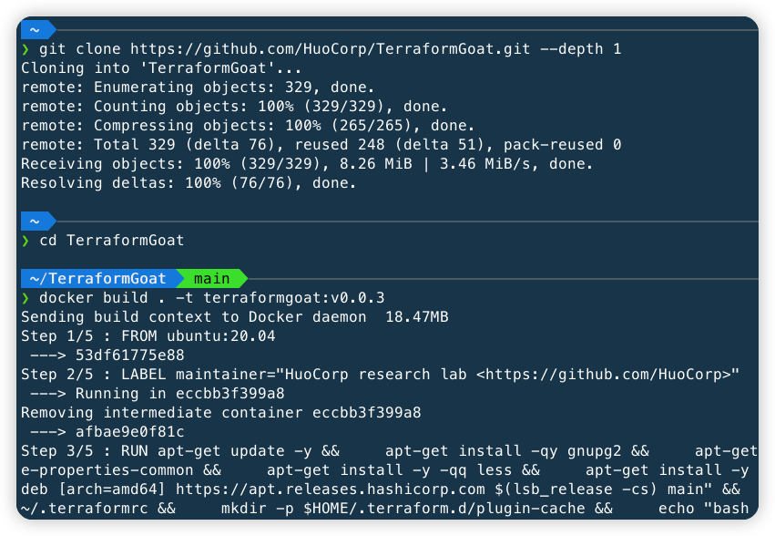
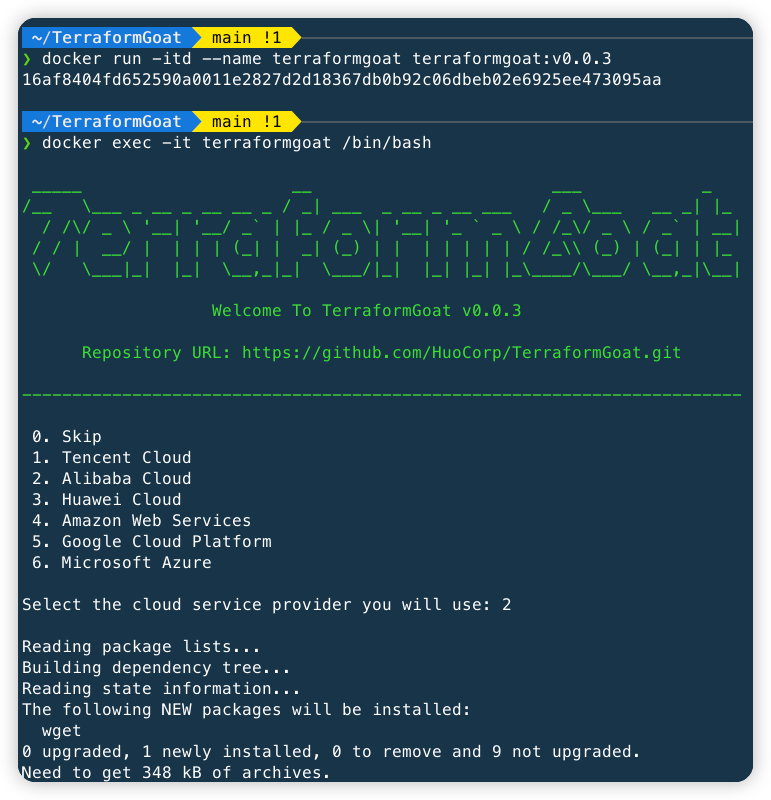

# TerraformGoat

[](https://github.com/HuoCorp/TerraformGoat/blob/main/LICENSE) [](https://github.com/HuoCorp/TerraformGoat/releases) [](https://github.com/HuoCorp/TerraformGoat/stargazers) [](https://github.com/HuoCorp/TerraformGoat/pulls) [](https://twitter.com/intent/tweet/?text=TerraformGoat%20is%20HuoCorp%20research%20lab's%20%22Vulnerable%20by%20Design%22%20multi%20cloud%20deployment%20tool.%20Check%20it%20out%20https%3A%2F%2Fgithub.com%2FHuoCorp%2FTerraformGoat%0A%23TerraformGoat%20%23Terraform%20%23Cloud%20%23Security%20%23cloudsecurity)

[English](./README.md) | 中文

TerraformGoat 是一个支持多云的云场景漏洞靶场搭建工具，目前支持阿里云、腾讯云、华为云、Amazon Web Services、Google
Cloud Platform、Microsoft Azure 六个云厂商的云场景漏洞搭建。

## :dart: 目前所支持的场景

| 序号 |        云厂商         |   云服务类型   |                           漏洞环境                           |
| :--: | :-------------------: | :------------: | :----------------------------------------------------------: |
|  1   |        腾讯云         |    对象存储    | [任意文件上传](https://github.com/HuoCorp/TerraformGoat/tree/main/tencentcloud/cos/unrestricted_file_upload) |
|  2   |        腾讯云         |    对象存储    | [Bucket 对象遍历](https://github.com/HuoCorp/TerraformGoat/tree/main/tencentcloud/cos/bucket_object_traversal) |
|  3   |        腾讯云         |    对象存储    | [Bucket 公开访问](https://github.com/HuoCorp/TerraformGoat/tree/main/tencentcloud/cos/bucket_public_access) |
|  4   |        腾讯云         |    对象存储    | [Object 公开访问](https://github.com/HuoCorp/TerraformGoat/tree/main/tencentcloud/cos/object_public_access) |
|  5   |        腾讯云         |    对象存储    | [Bucket ACL 可写](https://github.com/HuoCorp/TerraformGoat/tree/main/tencentcloud/cos/bucket_acl_writable) |
|  6   |        腾讯云         |    对象存储    | [Bucket ACL 可读](https://github.com/HuoCorp/TerraformGoat/tree/main/tencentcloud/cos/bucket_acl_readable) |
|  7   |        腾讯云         |    对象存储    | [服务端加密未开启](https://github.com/HuoCorp/TerraformGoat/tree/main/tencentcloud/cos/server_side_encryption_disable) |
|  8   |        腾讯云         |    对象存储    | [Bucket 日志存储未开启](https://github.com/HuoCorp/TerraformGoat/tree/main/tencentcloud/cos/bucket_logging_disable) |
|  9   |        腾讯云         |  弹性计算服务  | [CVM SSRF 漏洞环境](https://github.com/HuoCorp/TerraformGoat/tree/main/tencentcloud/cvm/cvm_ssrf) |
|  10  |        腾讯云         |  弹性计算服务  | [CVM 虚拟机的磁盘未开启加密](https://github.com/HuoCorp/TerraformGoat/tree/main/tencentcloud/cvm/cvm_virtual_machine_disks_are_unencrypted) |
|  11  |        腾讯云         |  弹性计算服务  | [CVM 安全组允许所有端口访问](https://github.com/HuoCorp/TerraformGoat/tree/main/tencentcloud/cvm/cvm_security_group_open_all_port) |
|  12  |        腾讯云         |  弹性计算服务  | [CVM 安全组允许常见端口访问](https://github.com/HuoCorp/TerraformGoat/tree/main/tencentcloud/cvm/cvm_security_group_open_common_port) |
|  13  |        阿里云         |    对象存储    | [任意文件上传](https://github.com/HuoCorp/TerraformGoat/tree/main/aliyun/oss/unrestricted_file_upload) |
|  14  |        阿里云         |    对象存储    | [Bucket 对象遍历](https://github.com/HuoCorp/TerraformGoat/tree/main/aliyun/oss/bucket_object_traversal) |
|  15  |        阿里云         |    对象存储    | [Object ACL 可写](https://github.com/HuoCorp/TerraformGoat/tree/main/aliyun/oss/object_acl_writable) |
|  16  |        阿里云         |    对象存储    | [Object ACL 可读](https://github.com/HuoCorp/TerraformGoat/tree/main/aliyun/oss/object_acl_readable) |
|  17  |        阿里云         |    对象存储    | [Bucket 公开访问](https://github.com/HuoCorp/TerraformGoat/tree/main/aliyun/oss/bucket_public_access) |
|  18  |        阿里云         |    对象存储    | [Object 公开访问](https://github.com/HuoCorp/TerraformGoat/tree/main/aliyun/oss/object_public_access) |
|  19  |        阿里云         |    对象存储    | [Bucket 策略可读](https://github.com/HuoCorp/TerraformGoat/tree/main/aliyun/oss/bucket_policy_readable) |
|  20  |        阿里云         |    对象存储    | [Bucket HTTP 开启](https://github.com/HuoCorp/TerraformGoat/tree/main/aliyun/oss/bucket_http_enable) |
|  21  |        阿里云         |    对象存储    | [特殊的 Bucket 策略](https://github.com/HuoCorp/TerraformGoat/tree/main/aliyun/oss/special_bucket_policy) |
|  22  |        阿里云         |    对象存储    | [Bucket 日志转存未开启](https://github.com/HuoCorp/TerraformGoat/tree/main/aliyun/oss/bucket_logging_disable) |
|  23  |        阿里云         |    对象存储    | [Bucket 服务端加密未使用 KMS](https://github.com/HuoCorp/TerraformGoat/tree/main/aliyun/oss/server_side_encryption_no_kms_set) |
|  24  |        阿里云         |    对象存储    | [Bucket 服务端加密未使用 BYOK](https://github.com/HuoCorp/TerraformGoat/tree/main/aliyun/oss/server_side_encryption_not_using_BYOK) |
|  25  |        阿里云         |  弹性计算服务  | [ECS SSRF 漏洞环境](https://github.com/HuoCorp/TerraformGoat/tree/main/aliyun/ecs/ecs_ssrf) |
|  26  |        阿里云         |  弹性计算服务  | [ECS 未连接的磁盘未开启加密](https://github.com/HuoCorp/TerraformGoat/tree/main/aliyun/ecs/ecs_unattached_disks_are_unencrypted) |
|  27  |        阿里云         |  弹性计算服务  | [ECS 虚拟机的磁盘未开启加密](https://github.com/HuoCorp/TerraformGoat/tree/main/aliyun/ecs/ecs_virtual_machine_disks_are_unencrypted) |
|  28  |        阿里云         |  弹性计算服务  | [ECS 安全组允许所有端口访问](https://github.com/HuoCorp/TerraformGoat/tree/main/aliyun/ecs/ecs_security_group_open_all_port) |
|  29  |        阿里云         |  弹性计算服务  | [ECS 安全组允许常见端口访问](https://github.com/HuoCorp/TerraformGoat/tree/main/aliyun/ecs/ecs_security_group_open_common_port) |
|  30  |        华为云         |    对象存储    | [任意文件上传](https://github.com/HuoCorp/TerraformGoat/tree/main/huaweicloud/obs/unrestricted_file_upload) |
|  31  |        华为云         |    对象存储    | [Object ACL 可写](https://github.com/HuoCorp/TerraformGoat/tree/main/huaweicloud/obs/object_acl_writable) |
|  32  |        华为云         |    对象存储    | [Bucket 对象遍历](https://github.com/HuoCorp/TerraformGoat/tree/main/huaweicloud/obs/bucket_object_traversal) |
|  33  |        华为云         |    对象存储    | [特殊的 Bucket 策略](https://github.com/HuoCorp/TerraformGoat/tree/main/huaweicloud/obs/special_bucket_policy) |
|  34  |        华为云         |    对象存储    | [错误的Policy策略导致任意文件上传](https://github.com/HuoCorp/TerraformGoat/tree/main/huaweicloud/obs/policy_of_unrestricted_file_upload) |
|  35  |        华为云         |  弹性计算服务  | [ECS SSRF 漏洞环境](https://github.com/HuoCorp/TerraformGoat/tree/main/huaweicloud/ecs/ecs_ssrf) |
|  36  |        华为云         |  弹性计算服务  | [ECS 不安全的安全组配置](https://github.com/HuoCorp/TerraformGoat/tree/main/huaweicloud/ecs/cis_unsafe_secgroup) |
|  37  |        华为云         |  关系型数据库  | [RDS Mysql基线检查环境](https://github.com/HuoCorp/TerraformGoat/tree/main/huaweicloud/rds/cis_rds_mysql) |
|  38  |  Amazon Web Services  |    对象存储    | [任意文件上传](https://github.com/HuoCorp/TerraformGoat/tree/main/aws/s3/unrestricted_file_upload) |
|  39  |  Amazon Web Services  |    对象存储    | [Object ACL 可写](https://github.com/HuoCorp/TerraformGoat/tree/main/aws/s3/object_acl_writable) |
|  40  |  Amazon Web Services  |    对象存储    | [Bucket ACL 可写](https://github.com/HuoCorp/TerraformGoat/tree/main/aws/s3/bucket_acl_writable) |
|  41  |  Amazon Web Services  |    对象存储    | [Bucket ACL 可读](https://github.com/HuoCorp/TerraformGoat/tree/main/aws/s3/bucket_acl_readable) |
|  42  |  Amazon Web Services  |    对象存储    | [Bucket 对象遍历](https://github.com/HuoCorp/TerraformGoat/tree/main/aws/s3/bucket_object_traversal) |
|  43  |  Amazon Web Services  |    对象存储    | [特殊的 Bucket 策略](https://github.com/HuoCorp/TerraformGoat/tree/main/aws/s3/special_bucket_policy) |
|  44  |  Amazon Web Services  |    对象存储    | [Bucket 允许 HTTP 访问](https://github.com/HuoCorp/TerraformGoat/tree/main/aws/s3/bucket_allow_http_access) |
|  45  |  Amazon Web Services  |    对象存储    | [Bucket 默认加密未开启](https://github.com/HuoCorp/TerraformGoat/tree/main/aws/s3/bucket_default_encryption_disable) |
|  46  |  Amazon Web Services  |    对象存储    | [Bucket 日志转存未开启](https://github.com/HuoCorp/TerraformGoat/tree/main/aws/s3/bucket_logging_disable) |
|  47  |  Amazon Web Services  |    对象存储    | [Bucket 删除未开启 MFA](https://github.com/HuoCorp/TerraformGoat/tree/main/aws/s3/mfa_delete_is_disable) |
|  48  |  Amazon Web Services  |  弹性计算服务  | [EC2 SSRF 漏洞环境](https://github.com/HuoCorp/TerraformGoat/tree/main/aws/ec2/ec2_ssrf) |
|  49  |  Amazon Web Services  |  弹性计算服务  | [控制台接管漏洞环境](https://github.com/HuoCorp/TerraformGoat/tree/main/aws/ec2/console_takeover) |
|  50  |  Amazon Web Services  | 身份和访问管理 | [IAM 提权环境](https://github.com/HuoCorp/TerraformGoat/tree/main/aws/iam/privilege_escalation) |
|  51  | Google Cloud Platform |    对象存储    | [任意文件上传](https://github.com/HuoCorp/TerraformGoat/tree/main/gcp/cs/unrestricted_file_upload) |
|  52  | Google Cloud Platform |    对象存储    | [Object ACL 可写](https://github.com/HuoCorp/TerraformGoat/tree/main/gcp/cs/object_acl_writable) |
|  53  | Google Cloud Platform |    对象存储    | [Bucket ACL 可写](https://github.com/HuoCorp/TerraformGoat/tree/main/gcp/cs/bucket_acl_writable) |
|  54  | Google Cloud Platform |    对象存储    | [Bucket 对象遍历](https://github.com/HuoCorp/TerraformGoat/tree/main/gcp/cs/bucket_object_traversal) |
|  55  | Google Cloud Platform |  弹性计算服务  | [VM 命令执行漏洞环境](https://github.com/HuoCorp/TerraformGoat/tree/main/gcp/vm/vm_command_execution) |
|  56  |    Microsoft Azure    |    对象存储    | [Blob 公开访问](https://github.com/HuoCorp/TerraformGoat/tree/main/azure/blob/blob_public_access/) |
|  57  |    Microsoft Azure    |    对象存储    | [Container Blob 遍历](https://github.com/HuoCorp/TerraformGoat/tree/main/azure/blob/container_blob_traversal/) |
|  58  |    Microsoft Azure    |  弹性计算服务  | [VM 命令执行漏洞环境](https://github.com/HuoCorp/TerraformGoat/tree/main/azure/vm/vm_command_execution) |

## :dizzy: 安装

TerraformGoat 使用 Dockerfile 构建，因此需要先安装 Docker 环境，Docker 安装方法可以参考：[https://docs.docker.com/get-docker/](https://docs.docker.com/get-docker/)

```shell
git clone https://github.com/HuoCorp/TerraformGoat.git --depth 1
cd TerraformGoat
docker build . -t terraformgoat:v0.0.3
```



docker build 完成后，启动并进入容器

```shell
docker run -itd --name terraformgoat terraformgoat:v0.0.3
docker exec -it terraformgoat /bin/bash
```

在进入容器时需要选择要使用到的云服务



选择你要用的云服务后会安装相关依赖，等相关依赖安装完后，就可以使用 TerraformGoat 了

这里以[阿里云 ECS SSRF](https://github.com/HuoCorp/TerraformGoat/tree/main/aliyun/ecs/ecs_ssrf) 漏洞场景的搭建进行演示：

[](https://asciinema.org/a/493554)

## :rocket: 卸载

```shell
docker stop terraformgoat
docker rm terraformgoat
docker rmi terraformgoat:v0.0.3
```

## ⚠️ 注意事项

1. 在每个漏洞环境的 README 中都是在 TerraformGoat 容器环境内执行的，因此需要先部署 TerraformGoat 容器环境。
2. 由于部分靶场存在云上内网横向的风险，因此强烈建议用户使用自己的测试账号配置靶场，避免使用生产环境的云账号，使用 Dockerfile 安装 TerraformGoat 也是为了将用户本地的云厂商令牌和测试账号的令牌进行隔离。
3. TerraformGoat 仅可用于教育学习目的，不得用于违法犯罪目的，由 TerraformGoat 产生的结果由使用者承担，与 HuoCorp 无关。

## :confetti_ball: 贡献

我们非常欢迎并感谢你对 TerraformGoat 项目进行贡献，在 [CONTRIBUTING.md](https://github.com/HuoCorp/TerraformGoat/blob/main/CONTRIBUTING.md) 中可以了解贡献流程的细节。

## 🪪 许可证

TerraformGoat 使用 Apache 2.0 许可证，详情参见 [LICENSE](https://github.com/HuoCorp/TerraformGoat/blob/main/LICENSE)

## :crystal_ball: Stats


