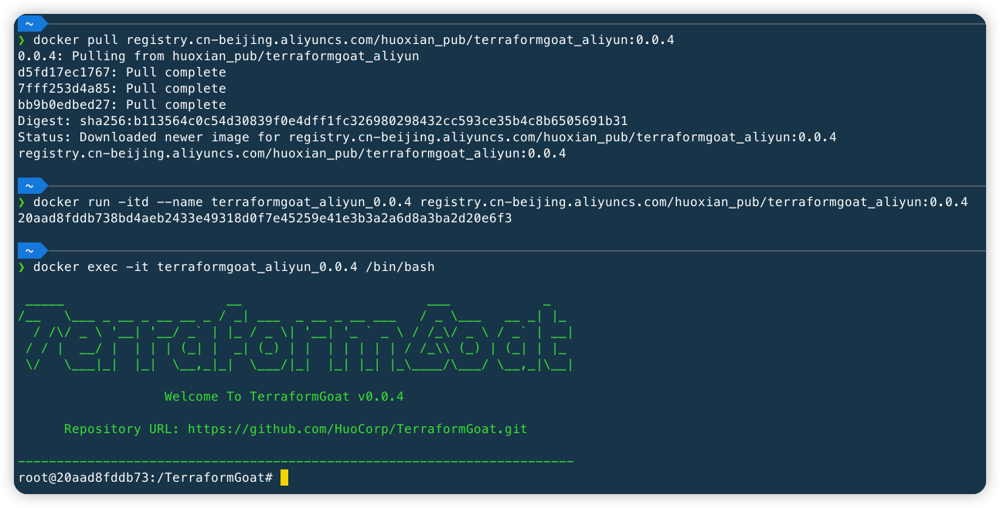

# TerraformGoat

[](https://github.com/HuoCorp/TerraformGoat/blob/main/LICENSE) [](https://github.com/HuoCorp/TerraformGoat/releases) [](https://github.com/HuoCorp/TerraformGoat/stargazers) [](https://github.com/HuoCorp/TerraformGoat/pulls) [](https://twitter.com/intent/tweet/?text=TerraformGoat%20is%20HuoCorp%20research%20lab's%20%22Vulnerable%20by%20Design%22%20multi%20cloud%20deployment%20tool.%20Check%20it%20out%20https%3A%2F%2Fgithub.com%2FHuoCorp%2FTerraformGoat%0A%23TerraformGoat%20%23Terraform%20%23Cloud%20%23Security%20%23cloudsecurity)

[English](./README.md) | 中文

TerraformGoat 是一个支持多云的云场景漏洞靶场搭建工具，目前支持阿里云、腾讯云、华为云、Amazon Web Services、Google
Cloud Platform、Microsoft Azure 六个云厂商的云场景漏洞搭建。

## :dart: 目前所支持的场景

|  ID  | Cloud Service Company |    Types Of Cloud Services     |                    Vulnerable Environment                    |
| :--: | :-------------------: | :----------------------------: | :----------------------------------------------------------: |
|  1   |     Alibaba Cloud     |         Object Storage         | [Bucket HTTP Enable](https://github.com/HuoCorp/TerraformGoat/tree/main/aliyun/oss/bucket_http_enable) |
|  2   |     Alibaba Cloud     |         Object Storage         | [Object ACL Writable](https://github.com/HuoCorp/TerraformGoat/tree/main/aliyun/oss/object_acl_writable) |
|  3   |     Alibaba Cloud     |         Object Storage         | [Object ACL Readable](https://github.com/HuoCorp/TerraformGoat/tree/main/aliyun/oss/object_acl_readable) |
|  4   |     Alibaba Cloud     |         Object Storage         | [Special Bucket Policy](https://github.com/HuoCorp/TerraformGoat/tree/main/aliyun/oss/special_bucket_policy) |
|  5   |     Alibaba Cloud     |         Object Storage         | [Bucket Public Access](https://github.com/HuoCorp/TerraformGoat/tree/main/aliyun/oss/bucket_public_access) |
|  6   |     Alibaba Cloud     |         Object Storage         | [Object Public Access](https://github.com/HuoCorp/TerraformGoat/tree/main/aliyun/oss/object_public_access) |
|  7   |     Alibaba Cloud     |         Object Storage         | [Bucket Logging Disable](https://github.com/HuoCorp/TerraformGoat/tree/main/aliyun/oss/bucket_logging_disable) |
|  8   |     Alibaba Cloud     |         Object Storage         | [Bucket Policy Readable](https://github.com/HuoCorp/TerraformGoat/tree/main/aliyun/oss/bucket_policy_readable) |
|  9   |     Alibaba Cloud     |         Object Storage         | [Bucket Object Traversal](https://github.com/HuoCorp/TerraformGoat/tree/main/aliyun/oss/bucket_object_traversal) |
|  10  |     Alibaba Cloud     |         Object Storage         | [Unrestricted File Upload](https://github.com/HuoCorp/TerraformGoat/tree/main/aliyun/oss/unrestricted_file_upload) |
|  11  |     Alibaba Cloud     |         Object Storage         | [Server Side Encryption No   KMS Set](https://github.com/HuoCorp/TerraformGoat/tree/main/aliyun/oss/server_side_encryption_no_kms_set) |
|  12  |     Alibaba Cloud     |         Object Storage         | [Server Side Encryption Not   Using BYOK](https://github.com/HuoCorp/TerraformGoat/tree/main/aliyun/oss/server_side_encryption_not_using_BYOK) |
|  13  |     Alibaba Cloud     |   Elastic Computing Service    | [ECS SSRF](https://github.com/HuoCorp/TerraformGoat/tree/main/aliyun/ecs/ecs_ssrf) |
|  14  |     Alibaba Cloud     |   Elastic Computing Service    | [ECS Unattached Disks Are   Unencrypted](https://github.com/HuoCorp/TerraformGoat/tree/main/aliyun/ecs/ecs_unattached_disks_are_unencrypted) |
|  15  |     Alibaba Cloud     |   Elastic Computing Service    | [ECS Virtual Machine Disks   Are Unencrypted](https://github.com/HuoCorp/TerraformGoat/tree/main/aliyun/ecs/ecs_virtual_machine_disks_are_unencrypted) |
|  16  |     Alibaba Cloud     |           Networking           | [ECS Security Group Open All   Port](https://github.com/HuoCorp/TerraformGoat/tree/main/aliyun/networking/ecs_security_group_open_all_port) |
|  17  |     Alibaba Cloud     |           Networking           | [ECS Security Group Open   Common Port](https://github.com/HuoCorp/TerraformGoat/tree/main/aliyun/networking/ecs_security_group_open_common_port) |
|  18  |     Tencent Cloud     |         Object Storage         | [Bucket ACL Writable](https://github.com/HuoCorp/TerraformGoat/tree/main/tencentcloud/cos/bucket_acl_writable) |
|  19  |     Tencent Cloud     |         Object Storage         | [Bucket ACL Readable](https://github.com/HuoCorp/TerraformGoat/tree/main/tencentcloud/cos/bucket_acl_readable) |
|  20  |     Tencent Cloud     |         Object Storage         | [Bucket Public Access](https://github.com/HuoCorp/TerraformGoat/tree/main/tencentcloud/cos/bucket_public_access) |
|  21  |     Tencent Cloud     |         Object Storage         | [Object Public Access](https://github.com/HuoCorp/TerraformGoat/tree/main/tencentcloud/cos/object_public_access) |
|  22  |     Tencent Cloud     |         Object Storage         | [Unrestricted File Upload](https://github.com/HuoCorp/TerraformGoat/tree/main/tencentcloud/cos/unrestricted_file_upload) |
|  23  |     Tencent Cloud     |         Object Storage         | [Bucket Object Traversal](https://github.com/HuoCorp/TerraformGoat/tree/main/tencentcloud/cos/bucket_object_traversal) |
|  24  |     Tencent Cloud     |         Object Storage         | [Bucket Logging Disable](https://github.com/HuoCorp/TerraformGoat/tree/main/tencentcloud/cos/bucket_logging_disable) |
|  25  |     Tencent Cloud     |         Object Storage         | [Server Side Encryption   Disable](https://github.com/HuoCorp/TerraformGoat/tree/main/tencentcloud/cos/server_side_encryption_disable) |
|  26  |     Tencent Cloud     |   Elastic Computing Service    | [CVM SSRF](https://github.com/HuoCorp/TerraformGoat/tree/main/tencentcloud/cvm/cvm_ssrf) |
|  27  |     Tencent Cloud     |   Elastic Computing Service    | [CVM Virtual Machine Disks   Are Unencrypted](https://github.com/HuoCorp/TerraformGoat/tree/main/tencentcloud/cvm/cvm_virtual_machine_disks_are_unencrypted) |
|  28  |     Tencent Cloud     |           Networking           | [CVM Security Group Open All   Port](https://github.com/HuoCorp/TerraformGoat/tree/main/tencentcloud/networking/cvm_security_group_open_all_port) |
|  29  |     Tencent Cloud     |           Networking           | [CVM Security Group Open   Common Port](https://github.com/HuoCorp/TerraformGoat/tree/main/tencentcloud/networking/cvm_security_group_open_common_port) |
|  30  |     Huawei Cloud      |         Object Storage         | [Object ACL Writable](https://github.com/HuoCorp/TerraformGoat/tree/main/huaweicloud/obs/object_acl_writable) |
|  31  |     Huawei Cloud      |         Object Storage         | [Special Bucket Policy](https://github.com/HuoCorp/TerraformGoat/tree/main/huaweicloud/obs/special_bucket_policy) |
|  32  |     Huawei Cloud      |         Object Storage         | [Unrestricted File Upload](https://github.com/HuoCorp/TerraformGoat/tree/main/huaweicloud/obs/unrestricted_file_upload) |
|  33  |     Huawei Cloud      |         Object Storage         | [Bucket Object Traversal](https://github.com/HuoCorp/TerraformGoat/tree/main/huaweicloud/obs/bucket_object_traversal) |
|  34  |     Huawei Cloud      |         Object Storage         | [Wrong Policy Causes   Arbitrary File Uploads](https://github.com/HuoCorp/TerraformGoat/tree/main/huaweicloud/obs/policy_of_unrestricted_file_upload) |
|  35  |     Huawei Cloud      |   Elastic Computing Service    | [ECS SSRF](https://github.com/HuoCorp/TerraformGoat/tree/main/huaweicloud/ecs/ecs_ssrf) |
|  36  |     Huawei Cloud      |           Networking           | [ECS Unsafe Security Group](https://github.com/HuoCorp/TerraformGoat/tree/main/huaweicloud/networking/cis_unsafe_secgroup) |
|  37  |     Huawei Cloud      |  Relational Database Service   | [RDS Mysql Baseline Checking   Environment](https://github.com/HuoCorp/TerraformGoat/tree/main/huaweicloud/rds/cis_rds_mysql) |
|  38  |  Amazon Web Services  |         Object Storage         | [Object ACL Writable](https://github.com/HuoCorp/TerraformGoat/tree/main/aws/s3/object_acl_writable) |
|  39  |  Amazon Web Services  |         Object Storage         | [Bucket ACL Writable](https://github.com/HuoCorp/TerraformGoat/tree/main/aws/s3/bucket_acl_writable) |
|  40  |  Amazon Web Services  |         Object Storage         | [Bucket ACL Readable](https://github.com/HuoCorp/TerraformGoat/tree/main/aws/s3/bucket_acl_readable) |
|  41  |  Amazon Web Services  |         Object Storage         | [MFA Delete Is Disable](https://github.com/HuoCorp/TerraformGoat/tree/main/aws/s3/mfa_delete_is_disable) |
|  42  |  Amazon Web Services  |         Object Storage         | [Special Bucket Policy](https://github.com/HuoCorp/TerraformGoat/tree/main/aws/s3/special_bucket_policy) |
|  43  |  Amazon Web Services  |         Object Storage         | [Bucket Object Traversal](https://github.com/HuoCorp/TerraformGoat/tree/main/aws/s3/bucket_object_traversal) |
|  44  |  Amazon Web Services  |         Object Storage         | [Unrestricted File Upload](https://github.com/HuoCorp/TerraformGoat/tree/main/aws/s3/unrestricted_file_upload) |
|  45  |  Amazon Web Services  |         Object Storage         | [Bucket Logging Disable](https://github.com/HuoCorp/TerraformGoat/tree/main/aws/s3/bucket_logging_disable) |
|  46  |  Amazon Web Services  |         Object Storage         | [Bucket Allow HTTP Access](https://github.com/HuoCorp/TerraformGoat/tree/main/aws/s3/bucket_allow_http_access) |
|  47  |  Amazon Web Services  |         Object Storage         | [Bucket Default Encryption   Disable](https://github.com/HuoCorp/TerraformGoat/tree/main/aws/s3/bucket_default_encryption_disable) |
|  48  |  Amazon Web Services  |   Elastic Computing Service    | [EC2 SSRF](https://github.com/HuoCorp/TerraformGoat/tree/main/aws/ec2/ec2_ssrf) |
|  49  |  Amazon Web Services  |   Elastic Computing Service    | [Console Takeover](https://github.com/HuoCorp/TerraformGoat/tree/main/aws/ec2/console_takeover) |
|  50  |  Amazon Web Services  | Identity and Access Management | [IAM Privilege Escalation](https://github.com/HuoCorp/TerraformGoat/tree/main/aws/iam/privilege_escalation) |
|  51  | Google Cloud Platform |         Object Storage         | [Object ACL Writable](https://github.com/HuoCorp/TerraformGoat/tree/main/gcp/cs/object_acl_writable) |
|  52  | Google Cloud Platform |         Object Storage         | [Bucket ACL Writable](https://github.com/HuoCorp/TerraformGoat/tree/main/gcp/cs/bucket_acl_writable) |
|  53  | Google Cloud Platform |         Object Storage         | [Bucket Object Traversal](https://github.com/HuoCorp/TerraformGoat/tree/main/gcp/cs/bucket_object_traversal) |
|  54  | Google Cloud Platform |         Object Storage         | [Unrestricted File Upload](https://github.com/HuoCorp/TerraformGoat/tree/main/gcp/cs/unrestricted_file_upload) |
|  55  | Google Cloud Platform |   Elastic Computing Service    | [VM Command Execution](https://github.com/HuoCorp/TerraformGoat/tree/main/gcp/vm/vm_command_execution) |
|  56  |    Microsoft Azure    |         Object Storage         | [Blob Public Access](https://github.com/HuoCorp/TerraformGoat/tree/main/azure/blob/blob_public_access/) |
|  57  |    Microsoft Azure    |         Object Storage         | [Container Blob Traversal](https://github.com/HuoCorp/TerraformGoat/tree/main/azure/blob/container_blob_traversal/) |
|  58  |    Microsoft Azure    |   Elastic Computing Service    | [VM Command Execution](https://github.com/HuoCorp/TerraformGoat/tree/main/azure/vm/vm_command_execution) |

## :dizzy: 安装

根据你使用到的云服务提供商，选择对应的安装命令。

阿里云

```bash
docker pull registry.cn-beijing.aliyuncs.com/huoxian_pub/terraformgoat_aliyun:0.0.4
docker run -itd --name terraformgoat_aliyun_0.0.4 registry.cn-beijing.aliyuncs.com/huoxian_pub/terraformgoat_aliyun:0.0.4
docker exec -it terraformgoat_aliyun_0.0.4 /bin/bash
```

腾讯云

```bash
docker pull registry.cn-beijing.aliyuncs.com/huoxian_pub/terraformgoat_tencentcloud:0.0.4
docker run -itd --name terraformgoat_tencentcloud_0.0.4 registry.cn-beijing.aliyuncs.com/huoxian_pub/terraformgoat_tencentcloud:0.0.4
docker exec -it terraformgoat_tencentcloud_0.0.4 /bin/bash
```

华为云

```bash
docker pull registry.cn-beijing.aliyuncs.com/huoxian_pub/terraformgoat_huaweicloud:0.0.4
docker run -itd --name terraformgoat_huaweicloud_0.0.4 registry.cn-beijing.aliyuncs.com/huoxian_pub/terraformgoat_huaweicloud:0.0.4
docker exec -it terraformgoat_huaweicloud_0.0.4 /bin/bash
```

Amazon Web Services

```bash
docker pull registry.cn-beijing.aliyuncs.com/huoxian_pub/terraformgoat_aws:0.0.4
docker run -itd --name terraformgoat_aws_0.0.4 registry.cn-beijing.aliyuncs.com/huoxian_pub/terraformgoat_aws:0.0.4
docker exec -it terraformgoat_aws_0.0.4 /bin/bash
```

Google Cloud Platform

```bash
docker pull registry.cn-beijing.aliyuncs.com/huoxian_pub/terraformgoat_gcp:0.0.4
docker run -itd --name terraformgoat_gcp_0.0.4 registry.cn-beijing.aliyuncs.com/huoxian_pub/terraformgoat_gcp:0.0.4
docker exec -it terraformgoat_gcp_0.0.4 /bin/bash
```

Microsoft Azure

```bash
docker pull registry.cn-beijing.aliyuncs.com/huoxian_pub/terraformgoat_azure:0.0.4
docker run -itd --name terraformgoat_azure_0.0.4 registry.cn-beijing.aliyuncs.com/huoxian_pub/terraformgoat_azure:0.0.4
docker exec -it terraformgoat_azure_0.0.4 /bin/bash
```

## :page_facing_up: 演示

进入到容器后，cd 到对应的场景目录，就可以开始部署靶场了，这里以 [阿里云 Bucket 对象遍历](https://github.com/HuoCorp/TerraformGoat/tree/main/aliyun/oss/bucket_object_traversal) 漏洞场景的搭建进行演示：

```bash
docker pull registry.cn-beijing.aliyuncs.com/huoxian_pub/terraformgoat_aliyun:0.0.4
docker run -itd --name terraformgoat_aliyun_0.0.4 registry.cn-beijing.aliyuncs.com/huoxian_pub/terraformgoat_aliyun:0.0.4
docker exec -it terraformgoat_aliyun_0.0.4 /bin/bash
```



```bash
cd /TerraformGoat/aliyun/oss/bucket_object_traversal/
aliyun configure
terraform init
terraform apply
```


提示`Enter a value:`，输入 `yes` 并回车，使用 curl 访问该 bucket，可以看到遍历到的对象。


## :rocket: 卸载

如果在容器中，先执行 `exit` 命令退出容器，然后在宿主机下执行以下命令。

```shell
docker stop $(docker ps -a -q -f "name=terraformgoat*")
docker rm $(docker ps -a -q -f "name=terraformgoat*")
docker rmi $(docker images -a -q -f "reference=registry.cn-beijing.aliyuncs.com/huoxian_pub/terraformgoat*")
```

## ⚠️ 注意事项

1. 在每个漏洞环境的 README 中都是在 TerraformGoat 容器环境内执行的，因此需要先部署 TerraformGoat 容器环境。
2. 由于部分靶场存在云上内网横向的风险，因此强烈建议用户使用自己的测试账号配置靶场，避免使用生产环境的云账号，使用 Dockerfile 安装 TerraformGoat 也是为了将用户本地的云厂商令牌和测试账号的令牌进行隔离。
3. TerraformGoat 仅可用于教育学习目的，不得用于违法犯罪目的，由 TerraformGoat 产生的结果由使用者承担，与 HuoCorp 无关。

## :confetti_ball: 贡献

我们非常欢迎并感谢你对 TerraformGoat 项目进行贡献，在 [CONTRIBUTING.md](https://github.com/HuoCorp/TerraformGoat/blob/main/CONTRIBUTING.md) 中可以了解贡献流程的细节。

## 🪪 许可证

TerraformGoat 使用 Apache 2.0 许可证，详情参见 [LICENSE](https://github.com/HuoCorp/TerraformGoat/blob/main/LICENSE)

## :crystal_ball: Stats


