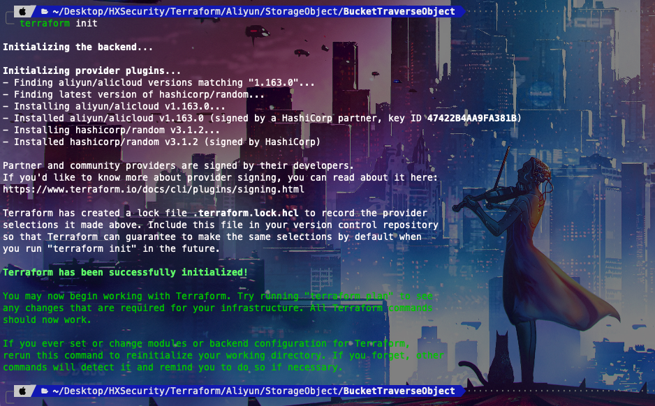
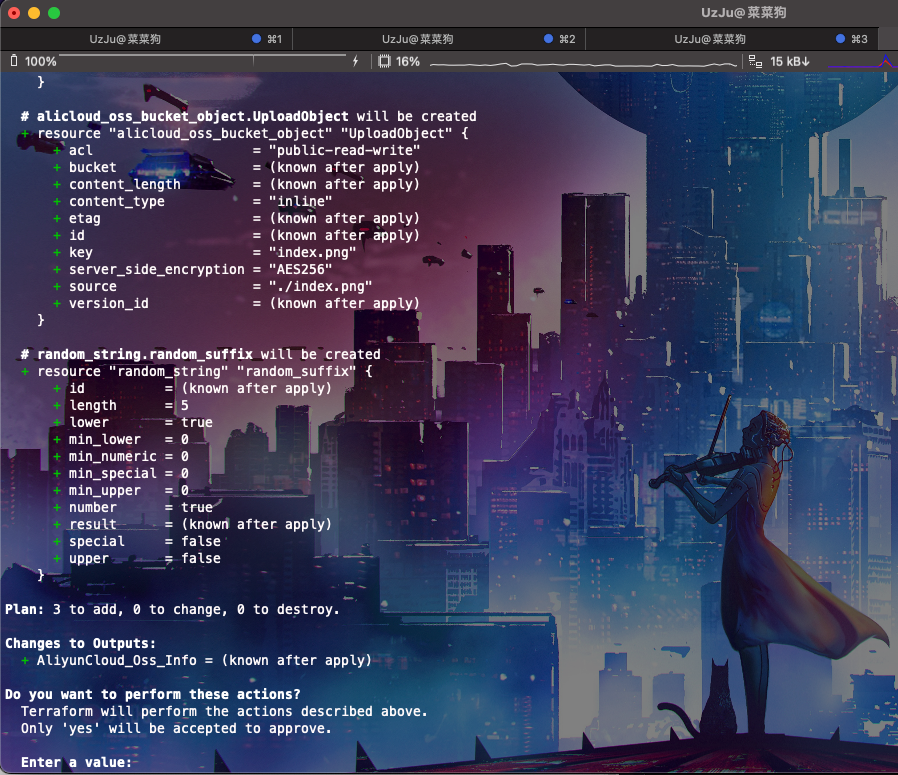
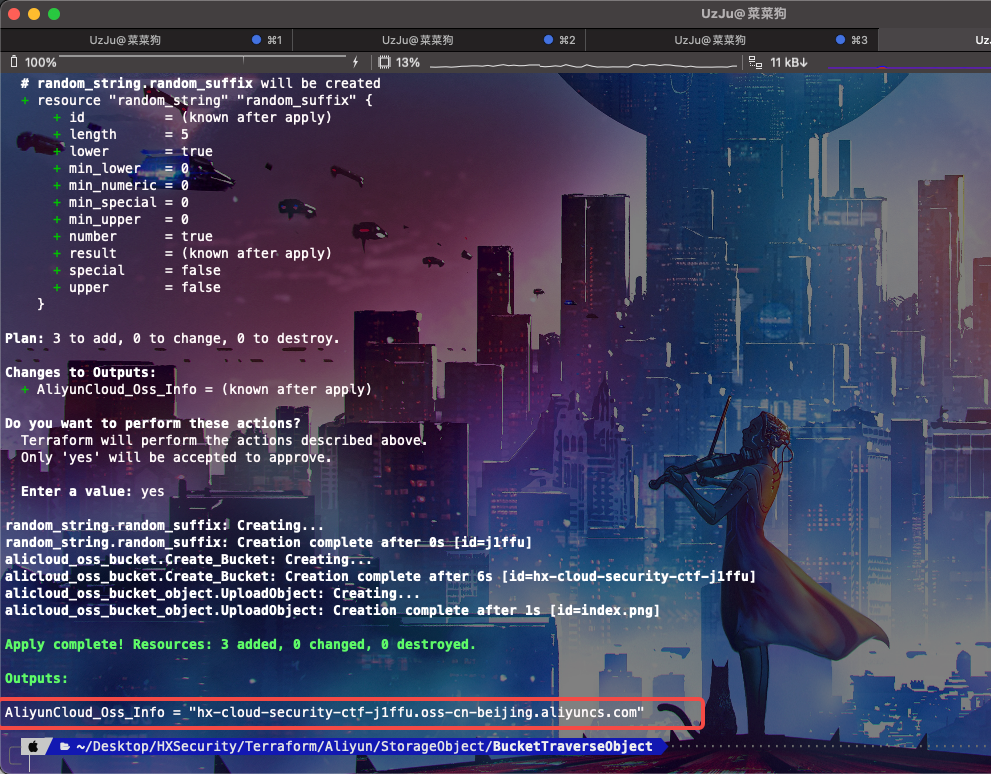
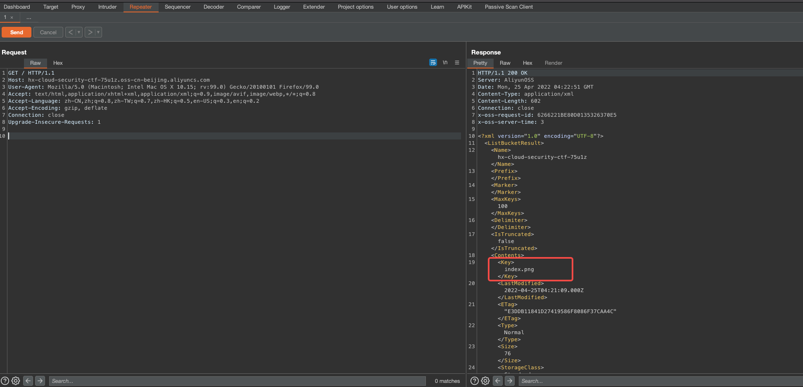
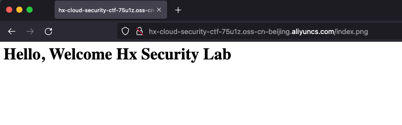
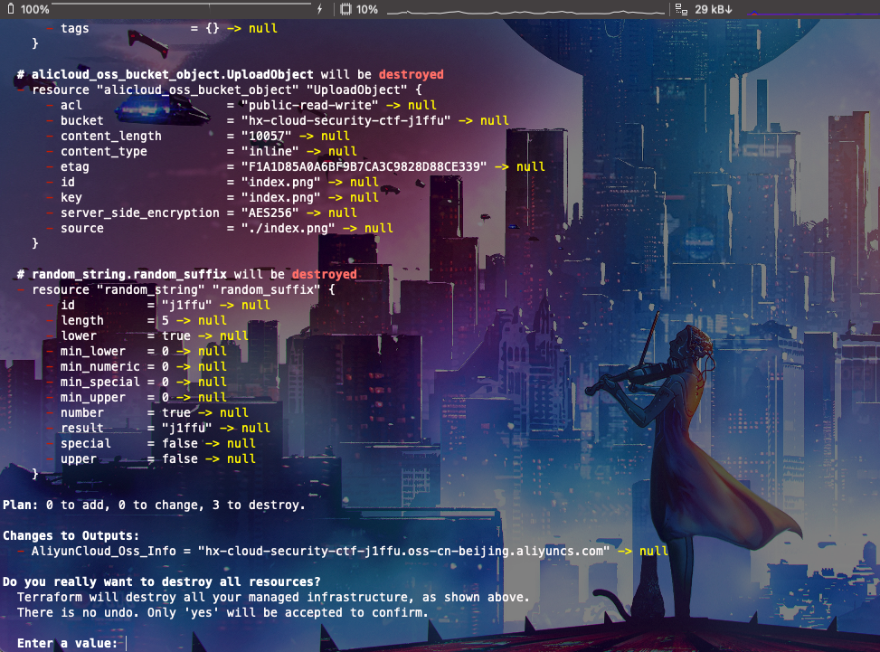
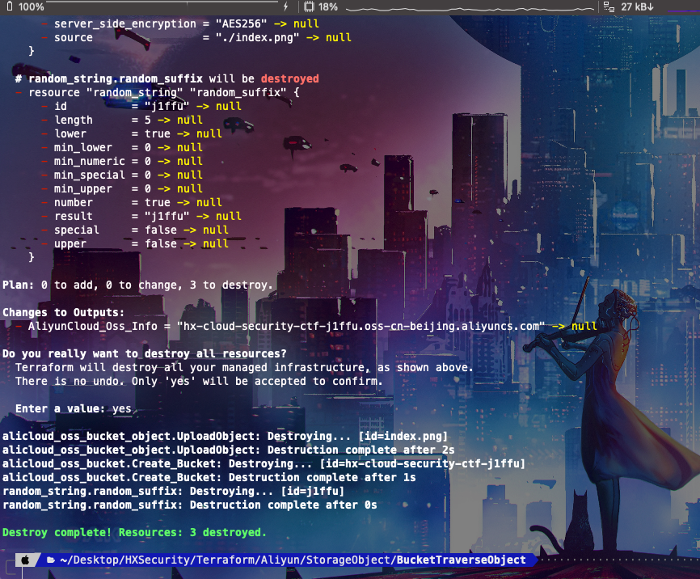

# Description

English | [中文](./README_CN.md)

This is a script that will help you quickly build a storage bucket object traversal scenario.

```bash
cd /TerraformGoat/aliyun/object_storage_service/bucket_object_traversal/
```

Configure Alibaba Cloud Access Credentials

```shell
aliyun configure
```

> You can create and view your AccessKey on the [AccessKey page](https://ram.console.aliyun.com/manage/ak) of the Alibaba Cloud console

```BASH
terraform init
```



```bash
terraform apply
```

If you confirm that there are no problems, just press enter



Type “yes” to start the build, at which point you can go make a cup of coffee because it will be done before you get back, very fast!



Access to hx-cloud-security-ctf-xxx.oss-cn-beijing.aliyuncs.com

## Get Flag



Find File Location, in /index.png



But it is not a picture.


What is this? Maybe you can check the latitude and longitude to determine where this is the location!

## Destruction Challenge

```bash
terraform destroy
```



If you have made up your mind, then just type yes


