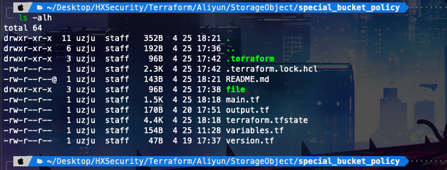
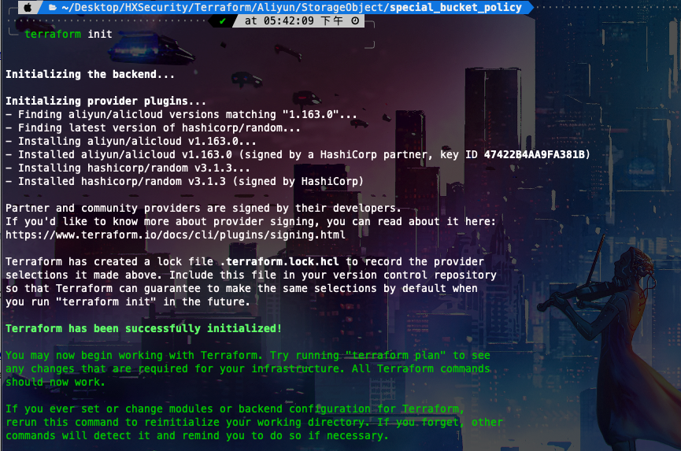
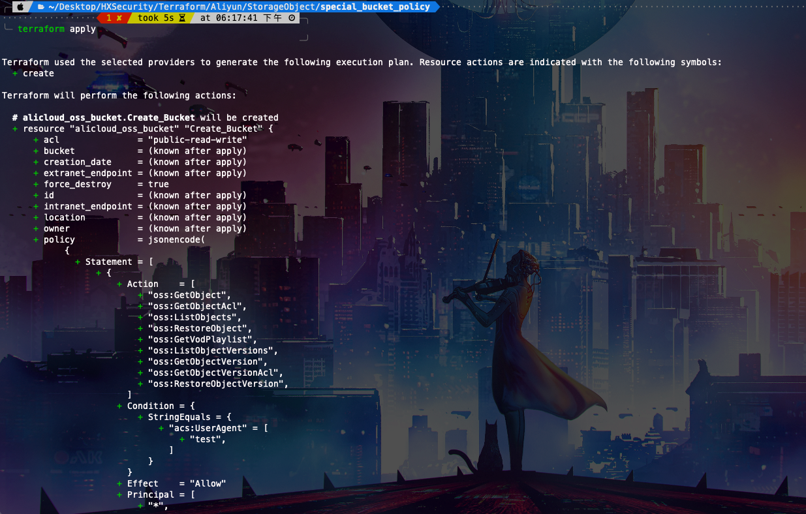
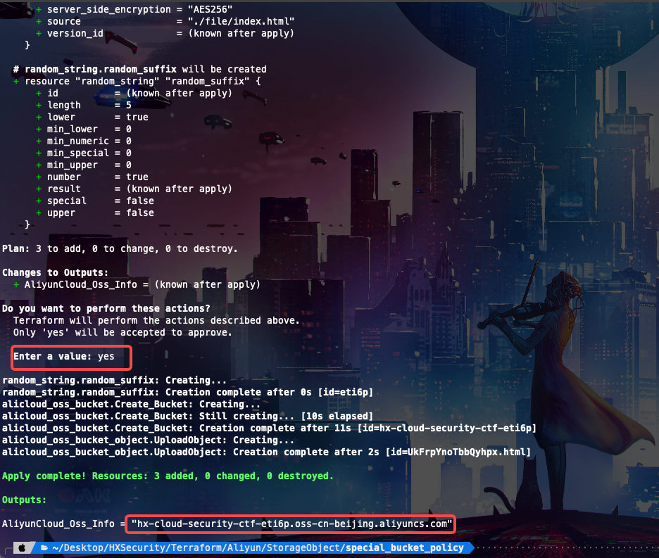
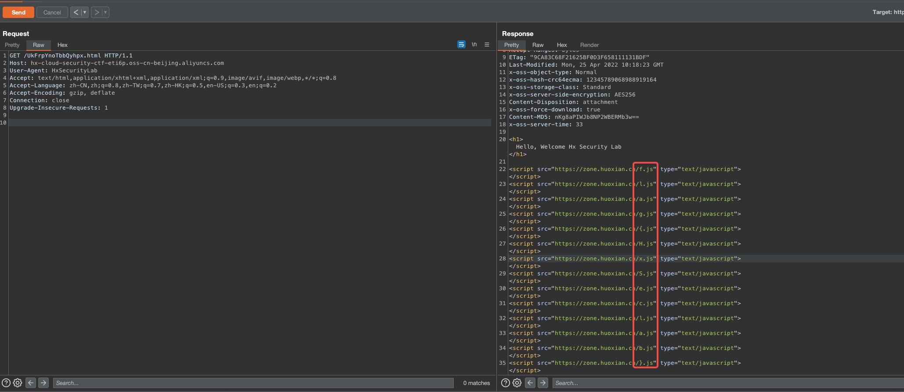
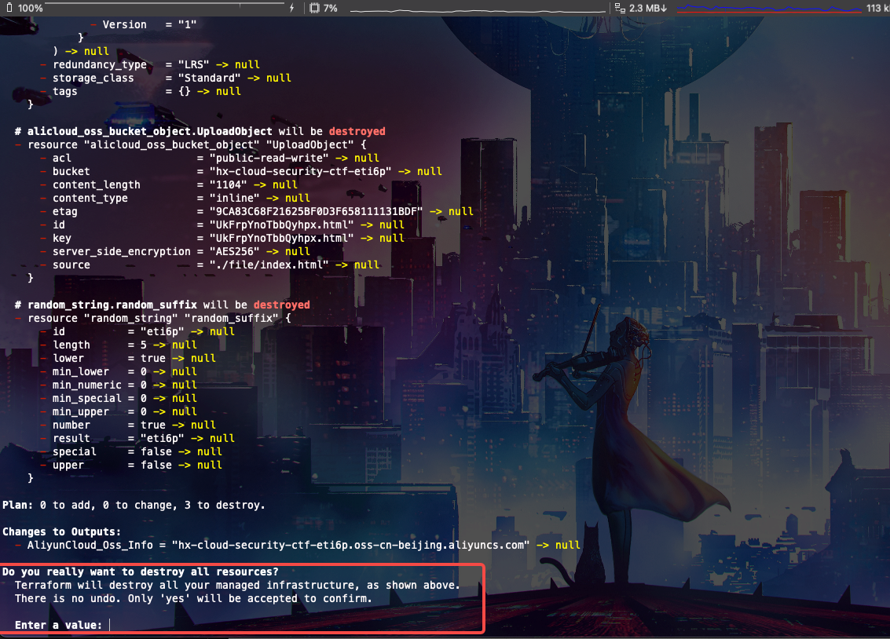
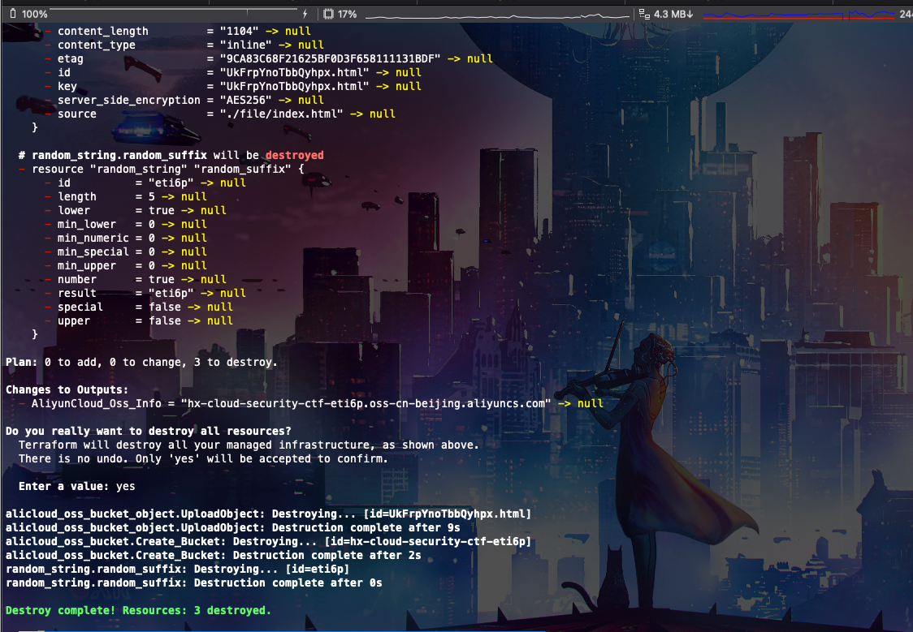

# Description

English | [中文](./README_CN.md)

This is a script that will help you quickly start a storage bucket with a special policy configuration, Get Flag

Although in actual use will not encounter this kind of range, but enjoy playing

## Deployment Environment

### Git Clone

```bash
cd /TerraformGoat/aliyun/object_storage_service/special_bucket_policy/
```



```BASH
terraform init
```



```bash
terraform apply
```



If you confirm that there are no problems, just type yes



## Get Flag


**The bucket you access does not belong to you.**


Add UserAgent to the request header

```http
GET / HTTP/1.1
Host: hx-cloud-security-ctf-eti6p.oss-cn-beijing.aliyuncs.com
User-Agent: HxSecurityLab
Accept: text/html,application/xhtml+xml,application/xml;q=0.9,image/avif,image/webp,*/*;q=0.8
Accept-Language: zh-CN,zh;q=0.8,zh-TW;q=0.7,zh-HK;q=0.5,en-US;q=0.3,en;q=0.2
Accept-Encoding: gzip, deflate
Connection: close
Upgrade-Insecure-Requests: 1
```

When you see the file name, just visit that name **UkFrpYnoTbbQyhpx.html**



## Destruction Challenge

```bash
terraform destroy
```



If it is confirmed that there is no problem, just type yes and wait


