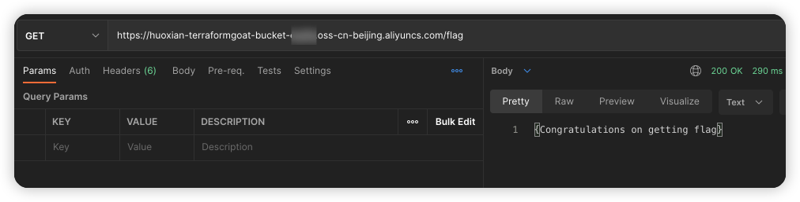

# Alibaba Cloud OSS Object Public Access Vulnerable Environment

English | [中文](./README_CN.md)

## Description

This is a scenario used to build the Alibaba Cloud OSS object public access vulnerability environment.

After building the environment with Terraform, Anyone can access the contents of the object.

## Deployment Environment

Execute the following command in the container

```shell
cd /TerraformGoat/aliyun/oss/object_public_access
```

Configure Alibaba Cloud Access Credentials

```shell
aliyun configure
```

> You can create and view your AccessKey on the [AccessKey page](https://ram.console.aliyun.com/manage/ak) of the Alibaba Cloud console

Deploy Vulnerable Environment

```shell
terraform init
terraform apply
```

> When the terminal prompts `Enter a value:`, enter `yes`

After the environment is set up, You can see the bucket url of the scenario at Outputs.

## Vulnerability Utilization

Access the bucket url to get the content of the object

```shell
https://huoxian-terraformgoat-bucket-xxx.oss-cn-beijing.aliyuncs.com/flag
```



## Destroy the environment

```shell
terraform destroy
```
