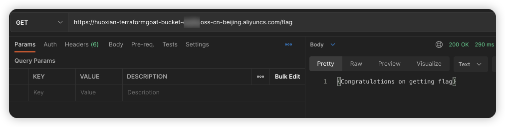

# 阿里云 OSS Object 公开访问漏洞环境

[English](./README.md) | 中文

## 描述信息

这是一个用于构建阿里云 OSS Object 公开访问漏洞环境的靶场。

使用 Terraform 构建环境后，任何人都可以直接访问到 Object 中的内容。

## 环境搭建

在容器中执行以下命令

```shell
cd /TerraformGoat/aliyun/oss/object_public_access
```

配置阿里云访问凭证

```shell
aliyun configure
```

> 在阿里云控制台的 [AccessKey 页面](https://ram.console.aliyun.com/manage/ak) 可以创建和查看您的 AccessKey

部署靶场

```shell
terraform init
terraform apply
```

> 在终端提示 `Enter a value:` 时，输入 `yes` 即可

环境搭建完后，在 Outputs 处可以看到 OSS 的 URL

## 漏洞利用

访问 Outputs 中的 URL，可以直接访问到 Object 的内容

```shell
https://huoxian-terraformgoat-bucket-xxx.oss-cn-beijing.aliyuncs.com/flag
```



## 销毁环境

```shell
terraform destroy
```
