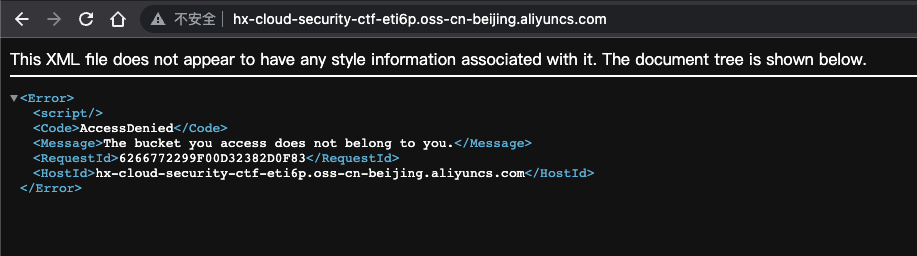

# 描述

[English](./README.md) | 中文

这是一个可以帮你快速构建存储桶特殊策略场景的脚本。
虽然你在实际环境中可能不会遇到这种情况，但是玩的愉快!

## Git Clone

```bash
cd /TerraformGoat/aliyun/oss/special_bucket_policy/
```

配置阿里云访问凭证

```shell
aliyun configure
```

> 在阿里云控制台的 [AccessKey 页面](https://ram.console.aliyun.com/manage/ak) 可以创建和查看您的 AccessKey

```BASH
terraform init
terraform apply
```

如果确认没有问题，输入yes即可

## Get Flag



根据页面返回的信息可以看到这个 Bucket 访问被拒绝。


在请求头中添加UserAgent

```http
GET / HTTP/1.1
Host: hx-cloud-security-ctf-eti6p.oss-cn-beijing.aliyuncs.com
User-Agent: HxSecurityLab
Accept: text/html,application/xhtml+xml,application/xml;q=0.9,image/avif,image/webp,*/*;q=0.8
Accept-Language: zh-CN,zh;q=0.8,zh-TW;q=0.7,zh-HK;q=0.5,en-US;q=0.3,en;q=0.2
Accept-Encoding: gzip, deflate
Connection: close
Upgrade-Insecure-Requests: 1
```

## 销毁挑战

```bash
terraform destroy
```

如果确认没有问题，输入yes等待即可
