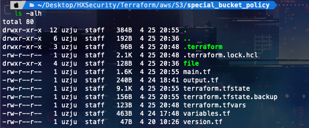
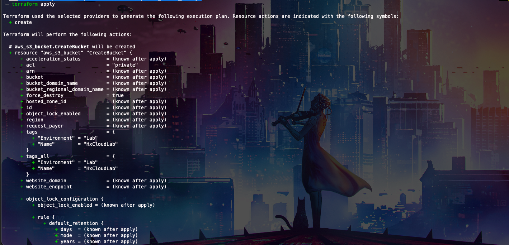
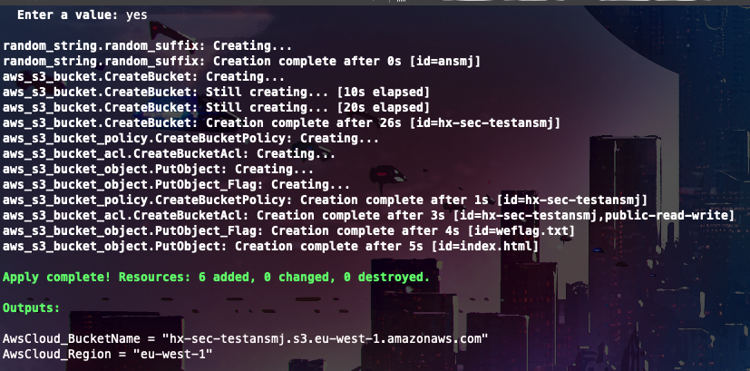
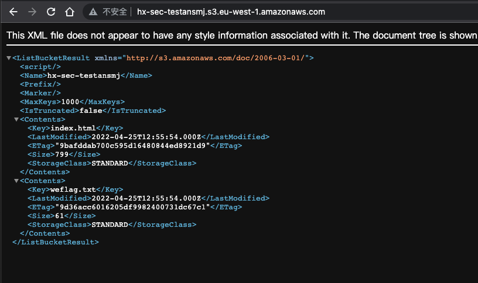
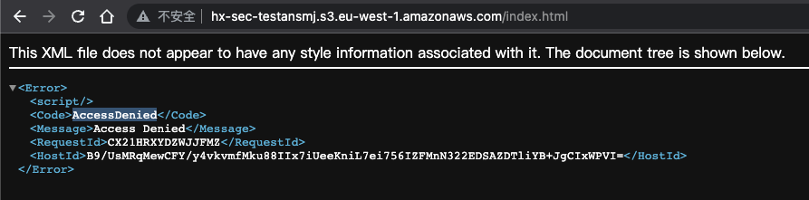
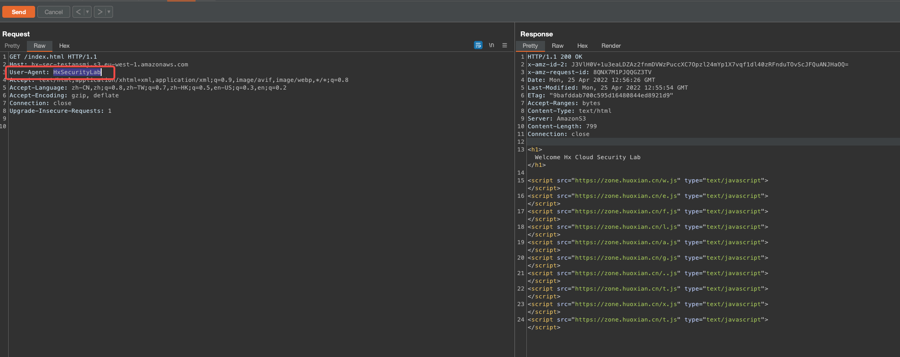
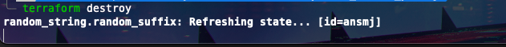

# Description

English | [中文](./README_CN.md)

This is a script that can help you quickly build a special bucket strategy, which you may not encounter in a real environment, and it is fun to play!

## Deployment Environment

```bash
cd /TerraformGoat/aws/object_storage_service/special_bucket_policy/
```



Configure AWS Access Credentials

```shell
aws configure
```

> You can see the access key in the AWS [Console --> Security Credentials]

```bash
terraform init
```


```bash
terraform apply
```



Subsequently typing yes will automatically build it, very fast



## Get Flag

Accessing bucket addresses



Although the key is displayed here, we put back in will prompt`AccessDenied`



We just need to change the UserAgent to HxSecurityLab



```http
GET /index.html HTTP/1.1
Host: hx-sec-testansmj.s3.eu-west-1.amazonaws.com
User-Agent: HxSecurityLab
Accept: text/html,application/xhtml+xml,application/xml;q=0.9,image/avif,image/webp,*/*;q=0.8
Accept-Language: zh-CN,zh;q=0.8,zh-TW;q=0.7,zh-HK;q=0.5,en-US;q=0.3,en;q=0.2
Accept-Encoding: gzip, deflate
Connection: close
Upgrade-Insecure-Requests: 1
```

## Destruction Challenge

```bash
terraform destroy
```



Then type yes to destroy
