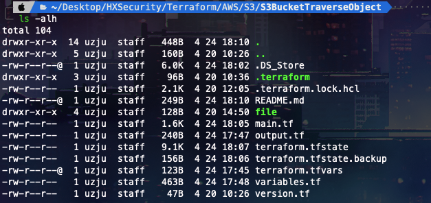
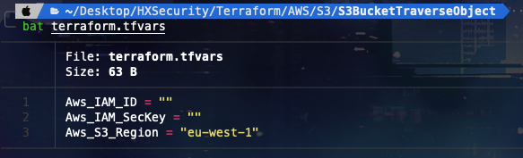
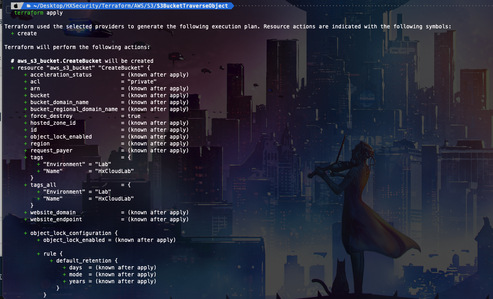
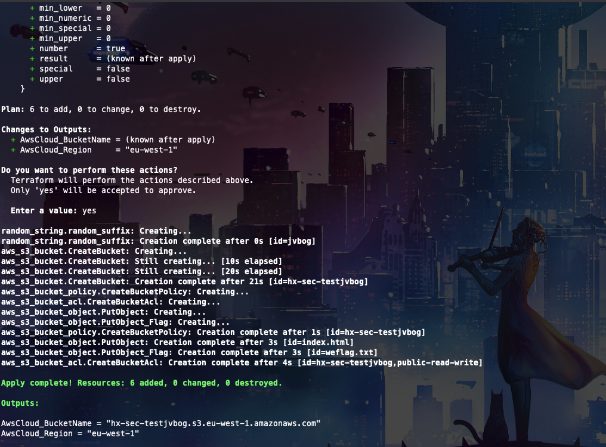
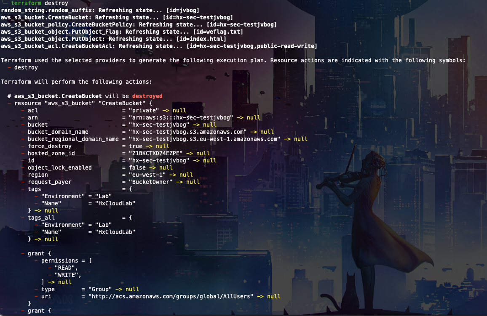
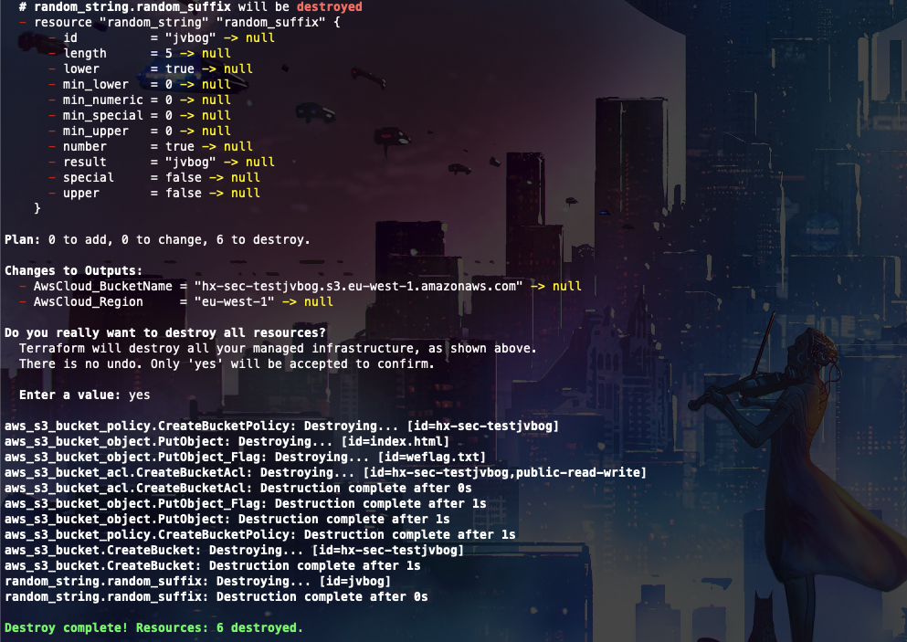

# 描述

[English](./README.md) | 中文

这是一个可以帮你快速构建存储桶对象遍历场景的脚本

## 部署环境

```bash
cd /TerraformGoat/aws/s3/bucket_object_traversal/
```



配置 AWS 访问凭证

```shell
aws configure
```

> 在 AWS 「控制台——》安全凭证」处可以设置并查看你的 `aws_access_key_id` 和 `aws_secret_access_key`

```bash
terraform init
```


```bash
vim terraform.tfvars
```



在这里写下你的AWS IAM用户ID和密钥

```bash
terraform apply
```



你如何确认没有问题，只需输入 "yes"，然后你就可以去泡杯咖啡，但在你回来之前，它就会建成并完成，因为它非常快！"。



现在可以去获取Flag了

## 销毁挑战

```bash
terraform destroy
```



输入yes



goOoOoOd by~~~
