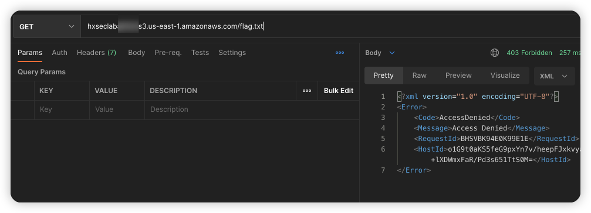

# Description

English | [中文](./README_CN.md)

This is a script that can help you quickly build a special bucket strategy

## Deployment Environment

```bash
cd /TerraformGoat/aws/s3/special_bucket_policy/
```

Configure AWS Access Credentials

```shell
aws configure
```

> You can see the access key in the AWS [Console --> Security Credentials]

```bash
terraform init
terraform apply
```

typing yes

## Get Flag

access flag



Set the UserAgent to HxSecurityLab


```http
GET /flag.txt HTTP/1.1
Host: hxseclabxxxxxx.s3.eu-west-1.amazonaws.com
User-Agent: HxSecurityLab
Accept: text/html,application/xhtml+xml,application/xml;q=0.9,image/avif,image/webp,*/*;q=0.8
Accept-Language: zh-CN,zh;q=0.8,zh-TW;q=0.7,zh-HK;q=0.5,en-US;q=0.3,en;q=0.2
Accept-Encoding: gzip, deflate
Connection: close
Upgrade-Insecure-Requests: 1
```

## Destruction Challenge

```bash
terraform destroy
```

Then type yes to destroy
