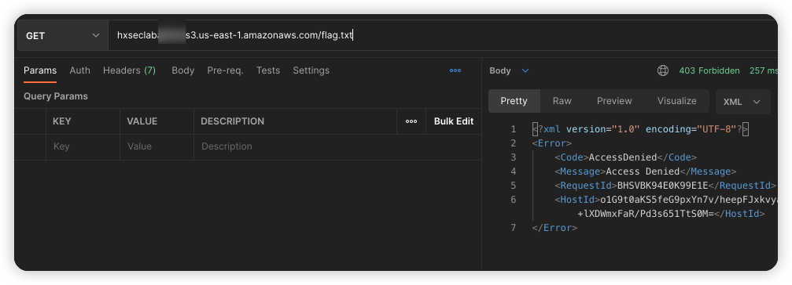
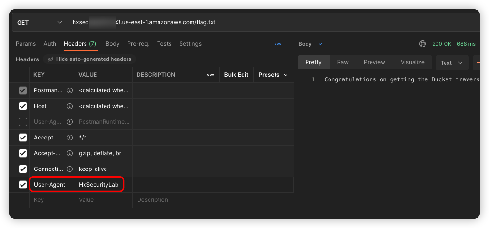

# 描述

[English](./README.md) | 中文

这是一个可以帮你快速构建特殊的存储桶策略的脚本

## 部署环境

```bash
cd /TerraformGoat/aws/s3/special_bucket_policy/
```

配置 AWS 访问凭证

```shell
aws configure
```

> 在 AWS 「控制台——》安全凭证」处可以设置并查看你的 `aws_access_key_id` 和 `aws_secret_access_key`

```bash
terraform init
terraform apply
```

随后输入 yes

## Get Flag

访问 flag



将UserAgent修改为HxSecurityLab



```http
GET /flag.txt HTTP/1.1
Host: hxseclabxxxxxx.s3.eu-west-1.amazonaws.com
User-Agent: HxSecurityLab
Accept: text/html,application/xhtml+xml,application/xml;q=0.9,image/avif,image/webp,*/*;q=0.8
Accept-Language: zh-CN,zh;q=0.8,zh-TW;q=0.7,zh-HK;q=0.5,en-US;q=0.3,en;q=0.2
Accept-Encoding: gzip, deflate
Connection: close
Upgrade-Insecure-Requests: 1
```

## 销毁挑战

```bash
terraform destroy
```

随后输入yes即可销毁
