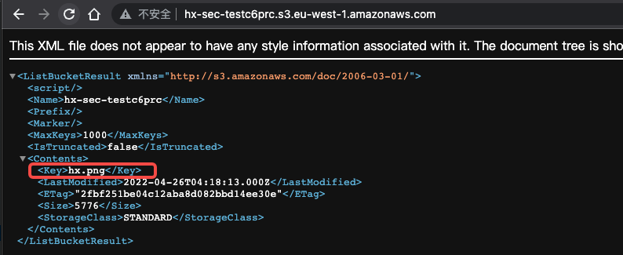

# Description

English | [中文](./README_CN.md)

This is a script that can help you quickly build a bucket arbitrary file overwrite scene

## Deployment environment

```bash
cd /TerraformGoat/aws/s3/unrestricted_file_upload/
```


Configure AWS Access Credentials

```shell
aws configure
```

> You can see the access key in the AWS [Console --> Security Credentials]

```bash
terraform init
```


```bash
terraform apply
```


## Exploit

Access to the storage bucket we built




We can upload any file on this bucket


## Destruction Challenge

```bash
terraform destroy
```


Just type yes and wait for it be destroyed
