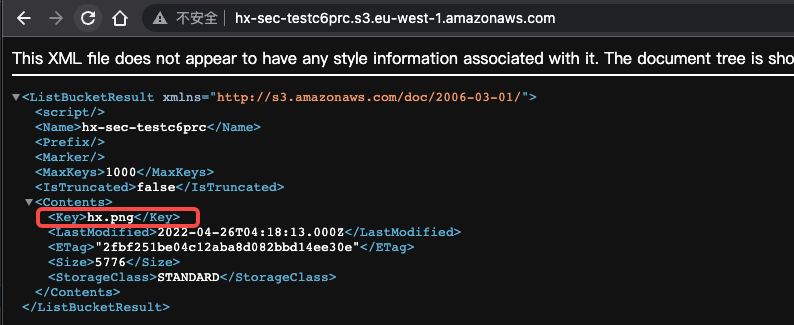
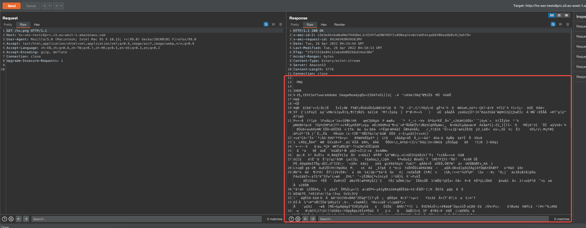
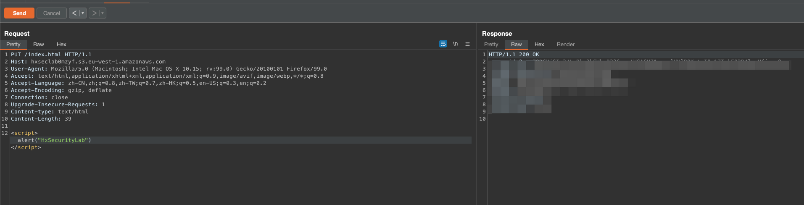
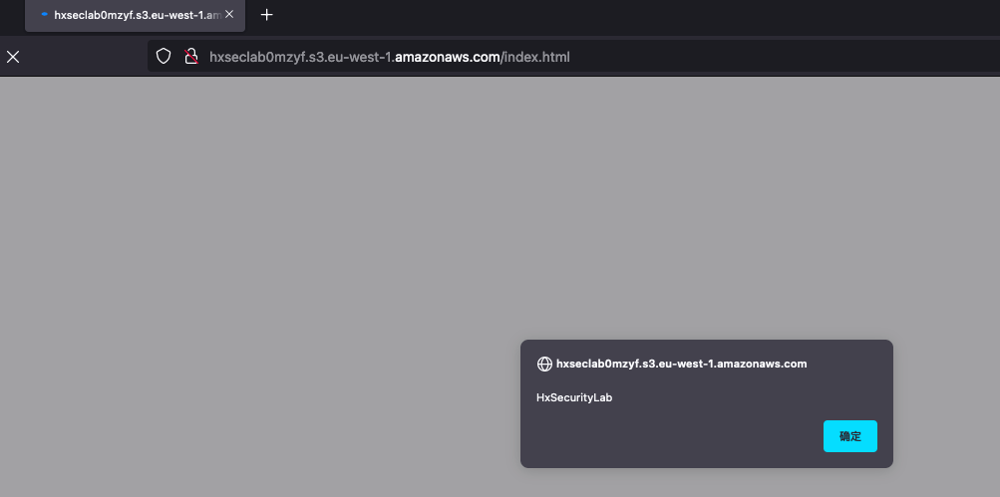

# 描述

[English](./README.md) | 中文

这是一个可以帮你快速构建存储桶任意文件覆盖场景的脚本

## 部署环境

```bash
cd /TerraformGoat/aws/s3/unrestricted_file_upload/
```

配置 AWS 访问凭证

```shell
aws configure
```

> 在 AWS 「控制台——》安全凭证」处可以设置并查看你的 `aws_access_key_id` 和 `aws_secret_access_key`

```bash
terraform init
terraform apply
```

## Exploit

访问我们构建的存储桶





我们可以在该存储桶上上传任意的文件





## 销毁挑战

```bash
terraform destroy
```

输入yes等待销毁即可
