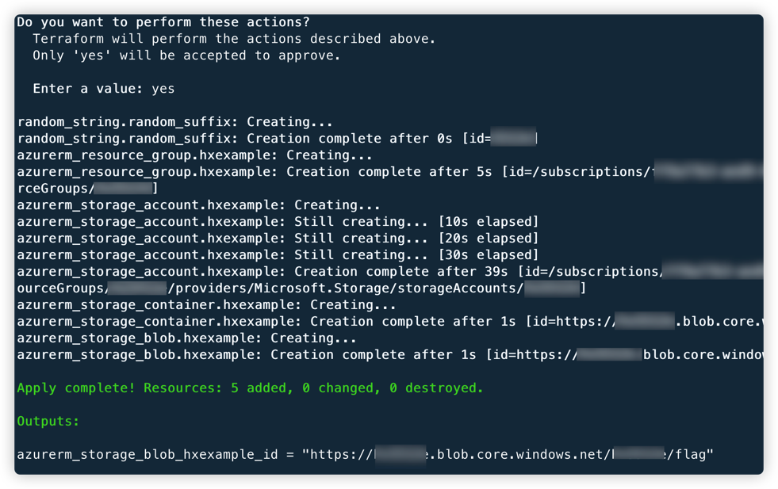

# Microsoft Azure storage blob public access vulnerability environment

English | [中文](./README_CN.md)

## Description

This is a vulnerability environment scenario for building public access to Microsoft cloud storage blobs.

After you build an environment with Terraform, users can access blobs with public access directly.

## Deployment Environment

Execute the following command in the container

```shell
cd /TerraformGoat/azure/blob/blob_public_access/
```

Use the `az login` command for Azure identity authentication, and follow the prompts to authenticate.

```shell
az login
```

Deploy Vulnerable Environment

```shell
terraform init
terraform apply
```

> When the terminal prompts `Enter a value:`, enter `yes`



After the environment is set up, You can see the access address of the blob at Outputs.

## Vulnerability Utilization

Visit the blob address to see the blob information.


## Destroy the environment

```shell
terraform destroy
```
