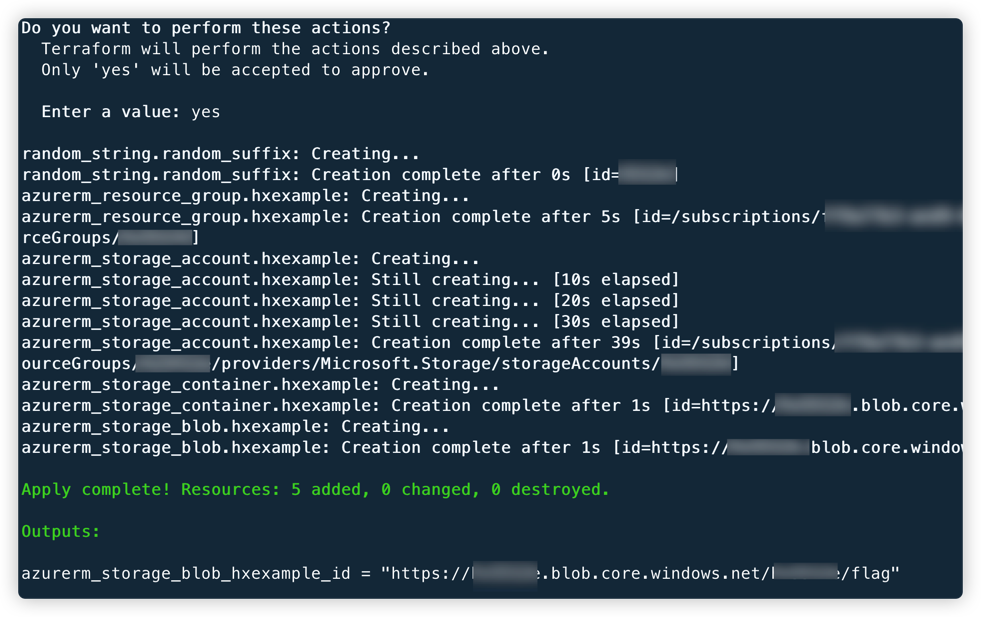
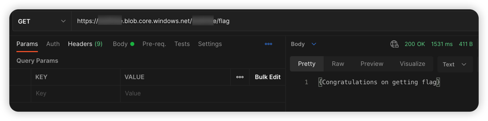

# MicroSoft Azure storage blob 公开访问漏洞环境

[English](./README.md) | 中文

## 描述信息

这是一个用于构建微软云存储 blob 公开访问的漏洞环境靶场。

使用 Terraform 构建环境后，用户可以直接访问到存在公开访问权限的 blob

## 环境搭建

在容器中执行以下命令

```shell
cd /TerraformGoat/azure/blob/blob_public_access/
```

通过 `az login` 命令进行 Azure 身份认证，根据提示进行认证即可。

```shell
az login
```

部署靶场

```shell
terraform init
terraform apply
```

> 在终端提示 `Enter a value:` 时，输入 `yes` 即可



当命令执行完后，在 Outputs 处可以看到 blob 的访问地址。

## 漏洞利用

访问 blob 地址，可以看到 blob 的信息



## 销毁环境

```shell
terraform destroy
```
