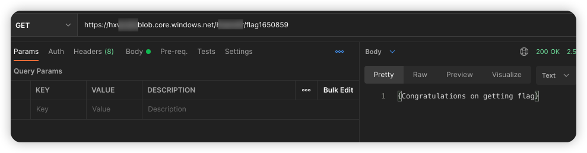

# Microsoft Azure storage blob traversal vulnerability environment

English | [中文](./README_CN.md)

## Description

This is a vulnerability environment scenario for building traversal to Microsoft cloud storage blobs.

After you build an environment with Terraform, the blobs in the container can be traversed.

## Deployment Environment

Execute the following command in the container

```shell
cd /TerraformGoat/azure/blob/container_blob_traversal/
```

Use the `az login` command for Azure identity authentication, and follow the prompts to authenticate.

```shell
az login
```

Deploy Vulnerable Environment

```shell
terraform init
terraform apply
```

> When the terminal prompts `Enter a value:`, enter `yes`

After the environment is set up, You can see the access address of the container at Outputs.

## Vulnerability Utilization

access container address, traverse blobs

```shell
https://hxxxxxx.blob.core.windows.net/hxxxxxx?restype=contriner&comp=list
```


find the flag file

```shell
https://hxxxxxx.blob.core.windows.net/hxxxxxx/flag1650859
```



## Destroy the environment

```shell
terraform destroy
```
