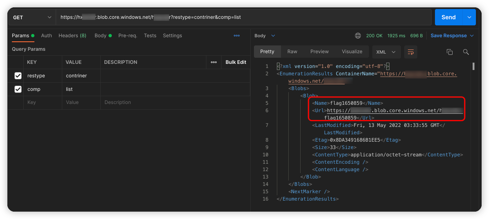
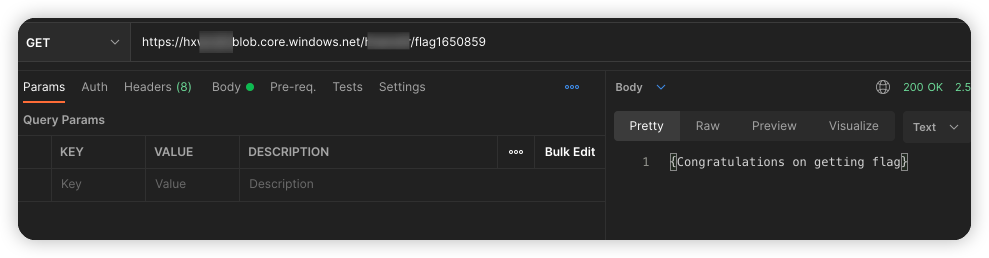

# MicroSoft Azure storage blob 遍历漏洞环境

[English](./README.md) | 中文

## 描述信息

这是一个用于构建微软云存储 blob 遍历的漏洞环境靶场。

使用 Terraform 构建环境后，用户可以遍历到 container 中的 blob

## 环境搭建

在容器中执行以下命令

```shell
cd /TerraformGoat/azure/blob/container_blob_traversal/
```

通过 `az login` 命令进行 Azure 身份认证，根据提示进行认证即可。

```shell
az login
```

部署靶场

```shell
terraform init
terraform apply
```

> 在终端提示 `Enter a value:` 时，输入 `yes` 即可

当命令执行完后，在 Outputs 处可以看到 container 的访问地址。

## 漏洞利用

访问 container 地址，可以遍历 blob

```shell
https://hxxxxxx.blob.core.windows.net/hxxxxxx?restype=contriner&comp=list
```



发现 flag 文件

```shell
https://hxxxxxx.blob.core.windows.net/hxxxxxx/flag1650859
```



成功获得 flag

## 销毁环境

```shell
terraform destroy
```
