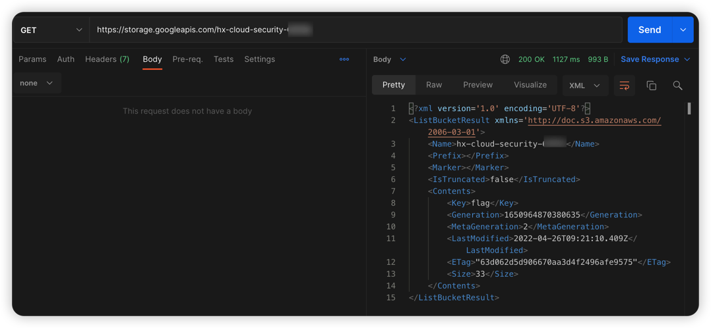
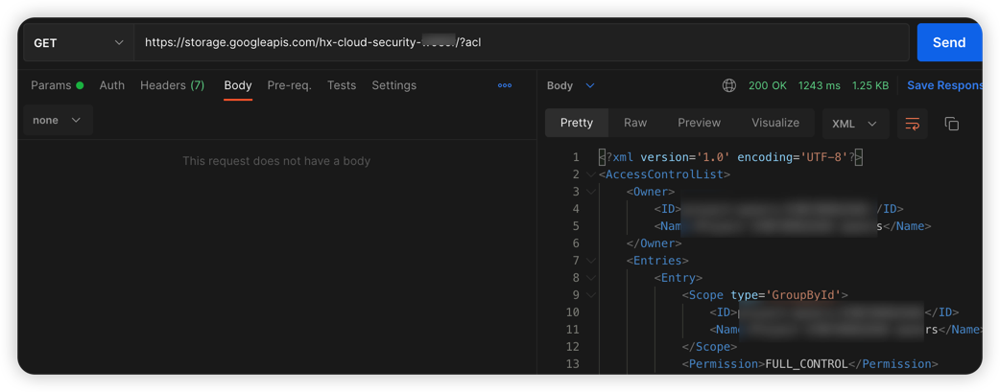
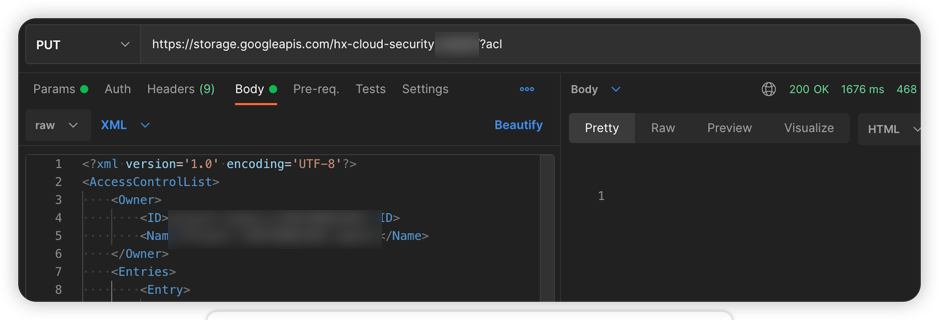
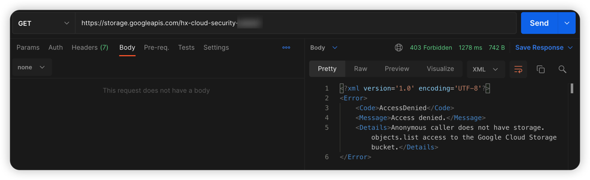

# GCP cloud storage Bucket ACL writable vulnerability environment

English | [中文](./README_CN.md)

## Description

This is a vulnerability environment scenario for building GCP cloud storage bucket ACLs that can be written.

After you build an environment using Terraform, you can modify the bucket's ACL policy to make data that could otherwise be read unreadable, resulting in an unavailable cloud storage service.

## Deployment Environment

Perform gcp authentication with the following command, generate a key file at [service account](https://console.cloud.google.com/projectselector2/iam-admin/serviceaccounts?supportedpurview=project), and copy the key to Authentication in the container

```shell
docker cp key.json terraformgoat:/terraformgoat # run on the host
docker exec -it terraformgoat /bin/bash  # run on the host
gcloud auth activate-service-account --key-file key.json # run on the container
```

Execute the following command in the container

```shell
cd /TerraformGoat/gcp/cs/bucket_acl_writable/
```

Edit the `terraform.tfvars` file and fill in the file with your `gcp project id`

```shell
vim terraform.tfvars
```

Deploy Vulnerable Environment

```shell
terraform init
terraform apply
```

> When the terminal prompts `Enter a value:`, enter `yes`


After the environment is set up, you can see the created Bucket at Outputs.

This Bucket has Bucket ACL read and write permissions.

## Vulnerability Utilization

Try to traverse Object and find that it can be traversed



Attempt to read the Bucket's ACL policy and found that it can be read

```shell
https://storage.googleapis.com/hx-cloud-security-xxx/?acl
```



Try to use the PUT method to modify the ACL policy of the Bucket, delete the following policy based on the original policy, and find that it can be uploaded.

```xml
<Entry>
  <Scope type='AllUsers'/>
  <Permission>FULL_CONTROL</Permission>
</Entry>
```



Try to traverse the Object again and find that it cannot be traversed, indicating that the ACL policy uploaded just now takes effect.



## Destroy the environment

```shell
terraform destroy
```
