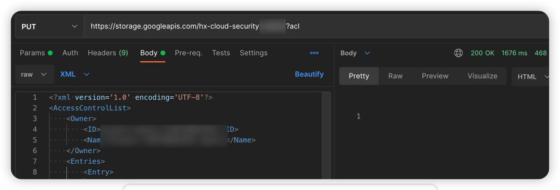

# GCP 云存储 Bucket ACL 可写漏洞环境

[English](./README.md) | 中文

## 描述信息

这是一个用于构建 GCP 云存储 Bucket ACL 可写的漏洞环境靶场。

使用 Terraform 构建环境后，用户可以通过修改 Bucket 的 ACL 策略将原本能读取的数据修改为不可读，从而导致云存储服务不可用。

## 环境搭建

通过以下命令进行 gcp 身份认证，在[服务账户](https://console.cloud.google.com/projectselector2/iam-admin/serviceaccounts?supportedpurview=project)处生成一个密钥文件，将密钥复制到容器中进行身份认证

```shell
docker cp key.json terraformgoat:/terraformgoat # 在宿主机中运行
docker exec -it terraformgoat /bin/bash  # 在宿主机中运行
gcloud auth activate-service-account --key-file key.json # 在容器中运行
```

在容器中执行以下命令

```shell
cd /TerraformGoat/gcp/cs/bucket_acl_writable/
```

编辑 `terraform.tfvars` 文件，在文件中填入你的 `gcp project id`

```shell
vim terraform.tfvars
```

部署靶场

```shell
terraform init
terraform apply
```

> 在终端提示 `Enter a value:` 时，输入 `yes` 即可


当命令执行完后，在 Outputs 处可以看到 Bucket 名称，这个 Bucket 存在 Bucket ACL 读取和写入权限

## 漏洞利用

尝试遍历 Object，发现可以遍历


尝试读取 Bucket 的 ACL 策略，发现可以读取

```shell
https://storage.googleapis.com/hx-cloud-security-xxx/?acl
```


尝试使用 PUT 方法修改 Bucket 的 ACL 策略，在原有策略的基础上删除以下策略，发现可以上传

```xml
<Entry>
  <Scope type='AllUsers'/>
  <Permission>FULL_CONTROL</Permission>
</Entry>
```



再次尝试遍历 Object，发现已经遍历不到了，说明刚才上传的 ACL 策略生效了


## 销毁环境

```shell
terraform destroy
```
