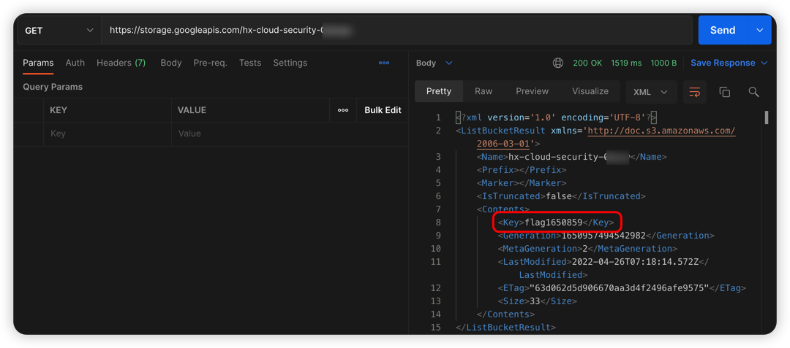

# GCP 云存储 Bucket 对象遍历漏洞环境

[English](./README.md) | 中文

## 描述信息

这是一个用于构建 GCP 云对象存储 Bucket 对象遍历漏洞环境靶场。

使用 Terraform 构建环境后，用户可以在存在漏洞的 Bucket 中遍历对象，通过拼接对象的 Key 值访问到对象。

## 环境搭建

通过以下命令进行 gcp 身份认证，在[服务账户](https://console.cloud.google.com/projectselector2/iam-admin/serviceaccounts?supportedpurview=project)处生成一个密钥文件，将密钥复制到容器中进行身份认证

```shell
docker cp key.json terraformgoat:/terraformgoat # 在宿主机中运行
docker exec -it terraformgoat /bin/bash  # 在宿主机中运行
gcloud auth activate-service-account --key-file key.json # 在容器中运行
```

在容器中执行以下命令

```shell
cd /TerraformGoat/gcp/cs/bucket_object_traversal/
```

编辑 `terraform.tfvars` 文件，在文件中填入你的 `gcp project id`

```shell
vim terraform.tfvars
```

部署靶场

```shell
terraform init
terraform apply
```

> 在终端提示 `Enter a value:` 时，输入 `yes` 即可


当命令执行完后，在 Outputs 处可以看到 Bucket 名称。

## 漏洞利用

访问存储桶，可以对 Bucket 中的对象进行遍历



可以看到 Bucket 中对象的 Key 值为 flag1650859，拼接这个 Key 可以访问到对象的内容


## 销毁环境

```shell
terraform destroy
```
