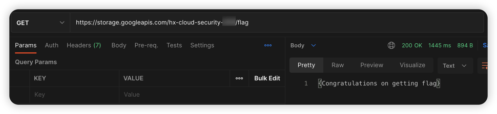
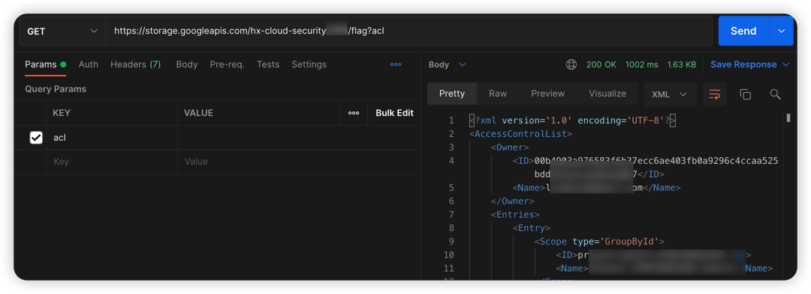
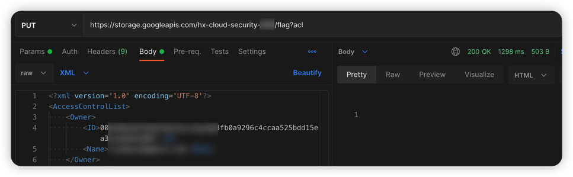
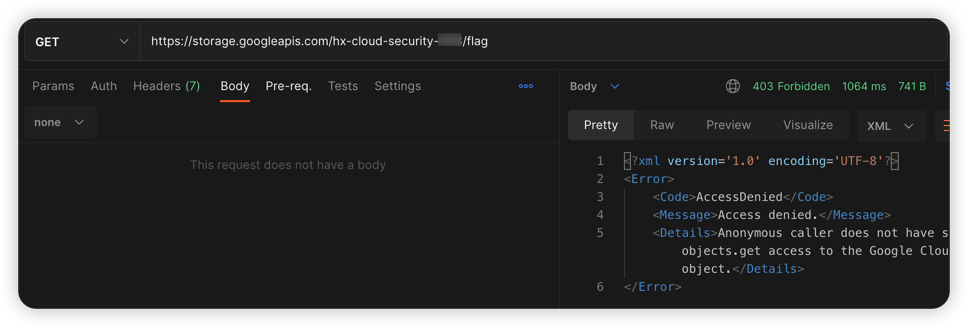

# GCP cloud storage object ACL writable vulnerability environment

English | [中文](./README_CN.md)

## Description

This is a vulnerability environment scenario for building GCP cloud storage object ACL writable.

After building the environment with Terraform, Users can read the data that could not be read by modifying the ACL policy of the object.

## Deployment Environment

Perform gcp authentication with the following command, generate a key file at [service account](https://console.cloud.google.com/projectselector2/iam-admin/serviceaccounts?supportedpurview=project), and copy the key to Authentication in the container

```shell
docker cp key.json terraformgoat:/terraformgoat # run on the host
docker exec -it terraformgoat /bin/bash  # run on the host
gcloud auth activate-service-account --key-file key.json # run on the container
```

Execute the following command in the container

```shell
cd /TerraformGoat/gcp/cs/object_acl_writable/
```

Edit the `terraform.tfvars` file and fill in the file with your `gcp project id`

```shell
vim terraform.tfvars
```

Deploy Vulnerable Environment

```shell
terraform init
terraform apply
```

> When the terminal prompts `Enter a value:`, enter `yes`


When the command is executed, you can see the bucket name at Outputs, this bucket has Object ACL read and write permissions, and the Object Key is flag

## Vulnerability Utilization

Attempt to read the flag file and found that it is accessible

```shell
https://storage.googleapis.com/hx-cloud-security-xxx/flag
```



Attempt to read the ACL policy of the flag file and found that it can be read.

```shell
https://storage.googleapis.com/hx-cloud-security-xxx/flag?acl
```



Try to use the PUT method to upload the Object ACL policy of the flag file, On the basis of the original policy, delete the following policy and find that it can be uploaded.

```xml
<Entry>
  <Scope type='AllUsers'/>
  <Permission>FULL_CONTROL</Permission>
</Entry>
```



If you try to read the flag file again, it can no longer be read. Using this method can paralyze websites that reference cloud storage resources.



## Destroy the environment

```shell
terraform destroy
```
