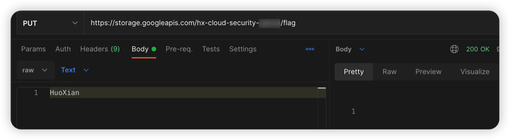
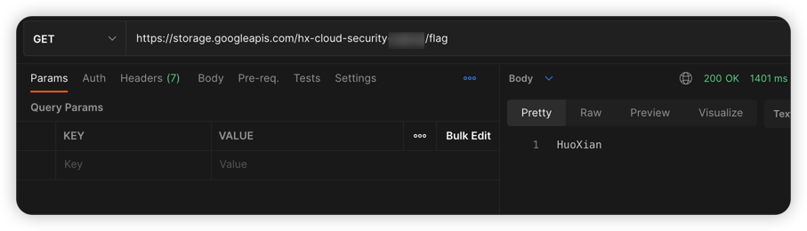

# GCP cloud storage unrestricted file upload vulnerability environment

English | [中文](./README_CN.md)

## Description

This is a vulnerability environment scenario for building GCP cloud storage unrestricted file upload.

After building the environment with Terraform, Users can upload any file to cloud storage through PUT method.

## Deployment Environment

Perform gcp authentication with the following command, generate a key file at [service account](https://console.cloud.google.com/projectselector2/iam-admin/serviceaccounts?supportedpurview=project), and copy the key to Authentication in the container

```shell
docker cp key.json terraformgoat:/terraformgoat # run on the host
docker exec -it terraformgoat /bin/bash  # run on the host
gcloud auth activate-service-account --key-file key.json # run on the container
```

Execute the following command in the container

```shell
cd /TerraformGoat/gcp/cs/unrestricted_file_upload/
```

Edit the `terraform.tfvars` file and fill in the file with your `gcp project id`

```shell
vim terraform.tfvars
```

Deploy Vulnerable Environment

```shell
terraform init
terraform apply
```

> When the terminal prompts `Enter a value:`, enter `yes`


When the command finishes executing, you can see the Bucket name at Outputs.

## Vulnerability Utilization

Use the PUT method to upload the file and find that it can be uploaded successfully.



Can successfully access the file just uploaded.



## Destroy the environment

```shell
terraform destroy
```
