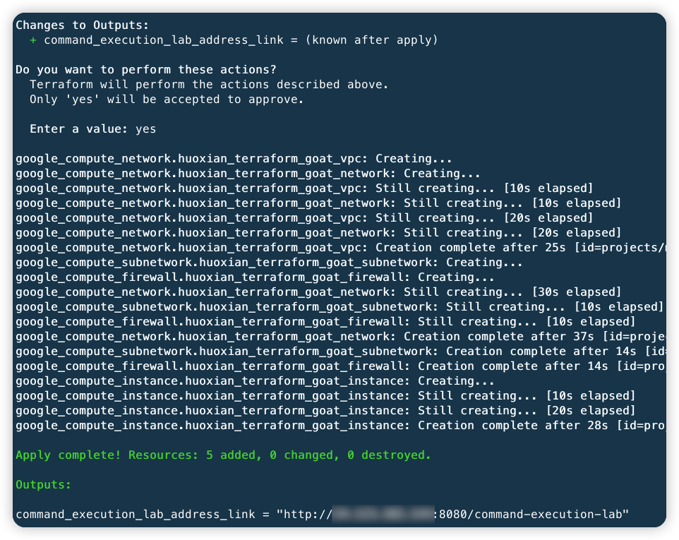
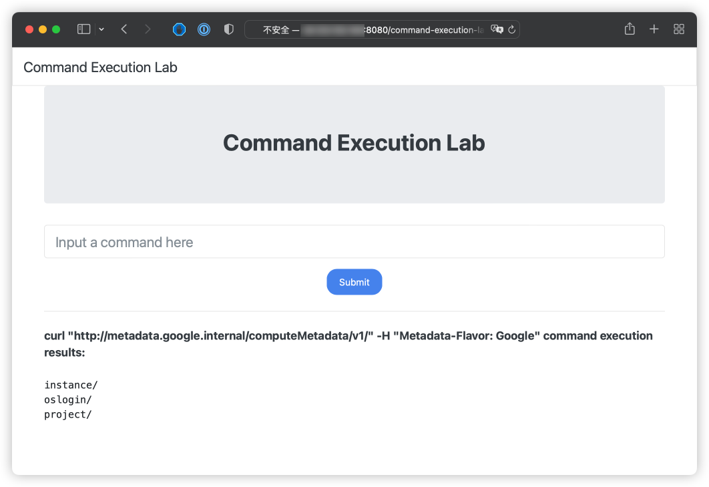
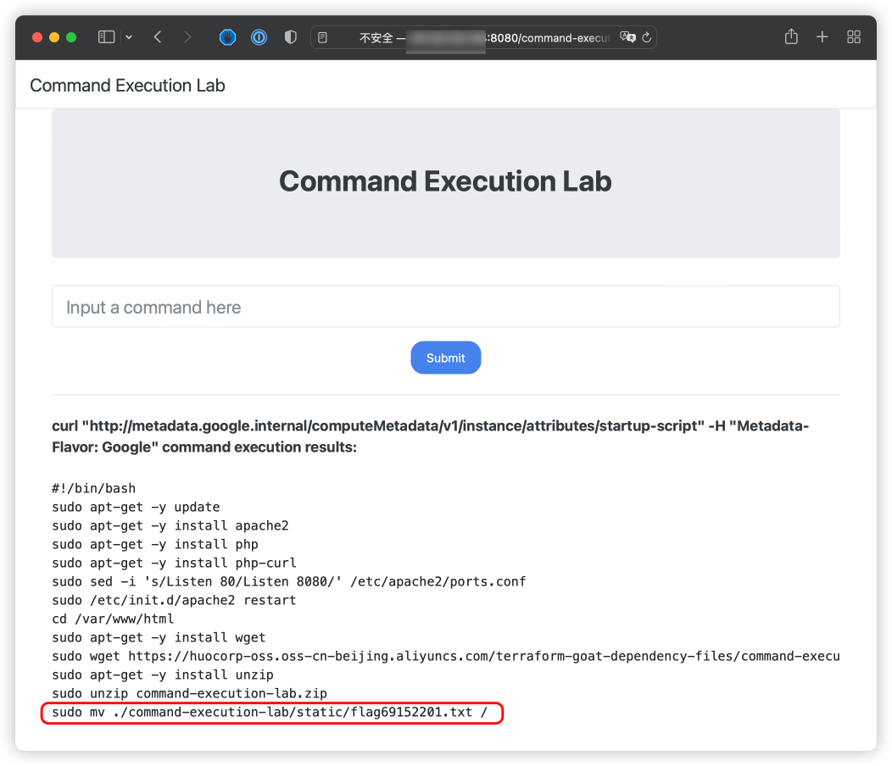
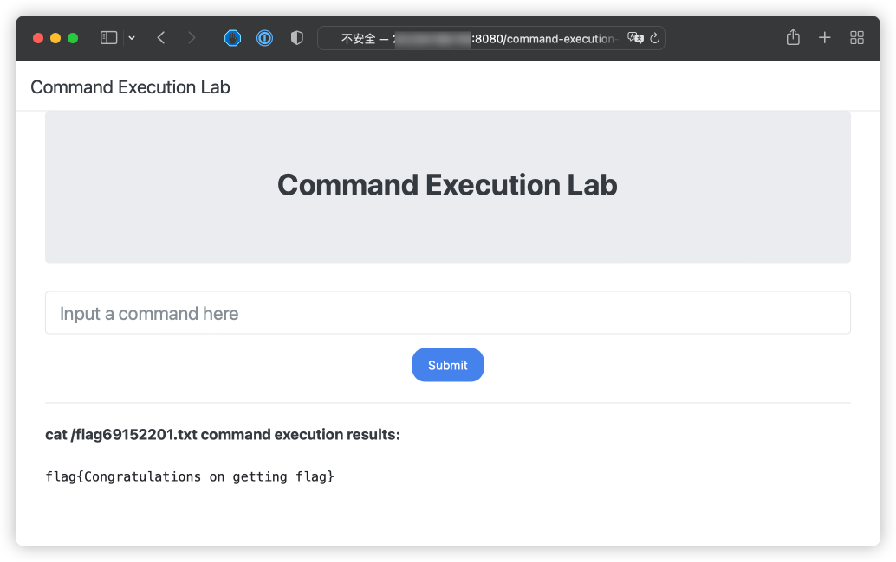

# GCP VM 命令执行漏洞环境

[English](./README.md) | 中文

## 描述信息

这是一个用于构建 GCP VM 命令执行漏洞环境的靶场。

使用 Terraform 构建环境后，用户可以通过命令执行漏洞获取到 VM 上的元数据、用户数据等信息。

## 环境搭建

通过以下命令进行 gcp 身份认证，在[服务账户](https://console.cloud.google.com/projectselector2/iam-admin/serviceaccounts?supportedpurview=project)处生成一个密钥文件，将密钥复制到容器中进行身份认证

```shell
docker cp key.json terraformgoat:/terraformgoat # 在宿主机中运行
docker exec -it terraformgoat /bin/bash  # 在宿主机中运行
gcloud auth activate-service-account --key-file key.json # 在容器中运行
```

在容器中执行以下命令

```shell
cd /TerraformGoat/gcp/vm/vm_command_execution
```

编辑 `terraform.tfvars` 文件，在文件中填入你的 `gcp project id`

```shell
vim terraform.tfvars
```

部署靶场

```shell
terraform init
terraform apply
```

> 在终端提示 `Enter a value:` 时，输入 `yes` 即可



环境搭建完后，在 Outputs 处可以看到靶场的访问地址，打开浏览器访问即可

> 由于靶场搭建需要一定时间，因此如果浏览器访问不到，可以等待 1-2 分钟后再访问试试。

## 漏洞利用

在存在命令执行漏洞的 VM 上，我们可以利用命令执行获取 VM 的元数据、用户数据等信息。

读取元数据

```shell
curl "http://metadata.google.internal/computeMetadata/v1/" -H "Metadata-Flavor: Google"
```



读取用户数据

> 前提是目标已经配置了用户数据

```shell
curl "http://metadata.google.internal/computeMetadata/v1/instance/attributes/startup-script" -H "Metadata-Flavor: Google"
```



在用户数据信息中，可以看到在靶场的根目录下有个 flag 文件，尝试利用命令执行读取这个文件

```shell
cat /flag69152201.txt
```



成功读取到 flag 文件

## 销毁环境

```shell
terraform destroy
```
