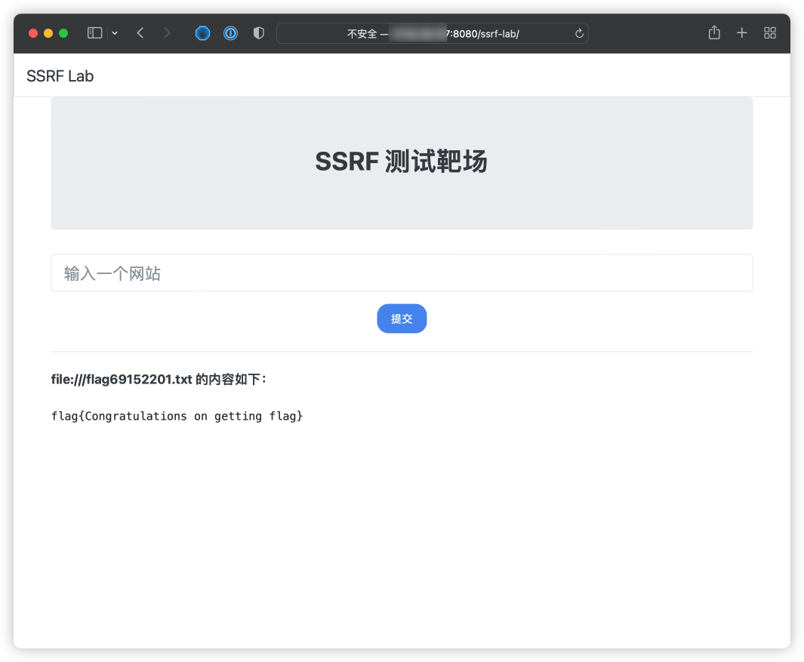

# Huawei Cloud ECS SSRF Vulnerable Environment

English | [中文](./README_CN.md)

## Description

This is a scenario used to build the Huawei Cloud ECS SSRF vulnerability environment.

After building the environment with Terraform, users can obtain metadata and user data and other information on ECS through the SSRF vulnerabilities.

## Deployment Environment

Execute the following command in the container

```shell
cd /TerraformGoat/huaweicloud/ecs/ecs_ssrf/
```

Edit the `terraform.tfvars` file and fill in the file with your `huaweicloud_access_key` and `huaweicloud_secret_key`.

> The access key can be found in HUAWEI CLOUD [Console --> My Credentials]

```shell
vim terraform.tfvars
```

Deploy Vulnerable Environment

```shell
terraform init
terraform apply
```

> When the terminal prompts `Enter a value:`, enter `yes`


After the environment is set up, You can see the access address of the scenario at Outputs, then access to the browser.

## Vulnerability Utilization

On ECS with SSRF vulnerabilities, we can use SSRF to read ECS metadata, user data and other information.

read metadata

```shell
http://169.254.169.254/latest/meta-data/
```


read user data

> The premise is that the target has been configured with user data, otherwise will be disconnected.

```shell
http://169.254.169.254/latest/user-data/
```


In the user data information, you can see that there is a flag file in the root directory of the scenario, try to use SSRF to read this file.

```shell
file:///flag69152201.txt
```



Successfully read the flag file.

## Destroy the environment

```shell
terraform destroy
```
