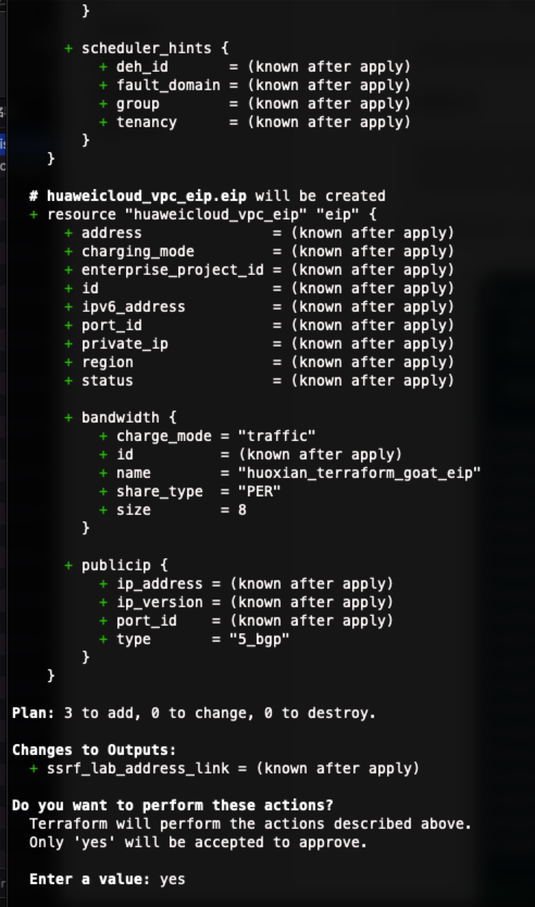
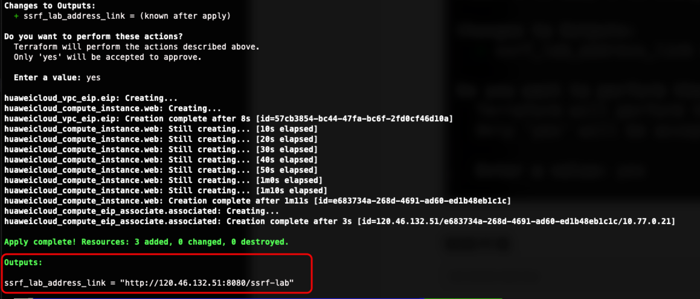
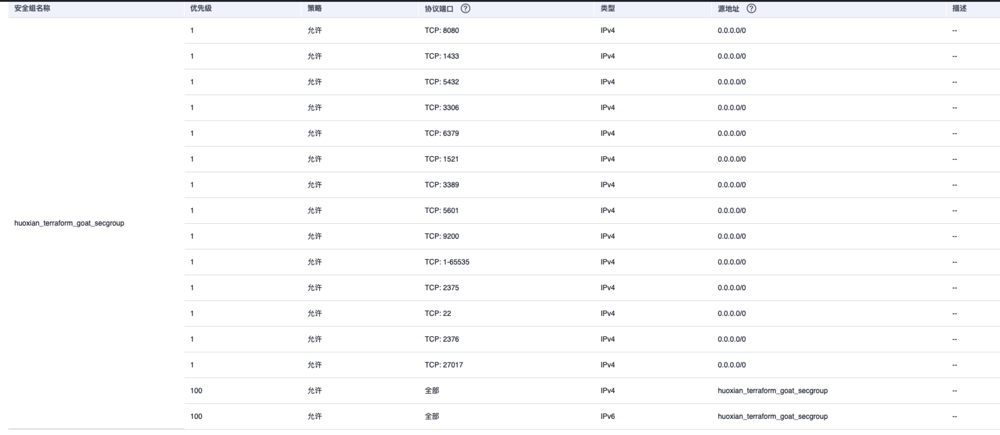

# Huawei Cloud ECS CIS Security Group Baseline Inspection Target Range

English | [中文](./README_CN.md)

## Description

> The range is only used for security baseline check

This is a firing range for building an insecure ECS security group configuration for Huawei Cloud ECS

Insecure security group configurations can lead to malicious attackers accessing the ECS

## Deployment Environment

Execute the following command in the container

```shell
cd /TerraformGoat/huaweicloud/networking/cis_unsafe_secgroup/
```

Edit the `terraform.tfvars` file and fill in the file with your `huaweicloud_access_key` and `huaweicloud_secret_key`.

> The access key can be found in HUAWEI CLOUD [Console --> My Credentials]

```shell
vim terraform.tfvars
```

Deployment of firing ranges

```shell
terraform init
terraform apply
```

> When the terminal prompts `Enter a value:`, enter `yes`





Although this is still an ECS SSRF environment, we can find in the console that more dangerous ports are open



As you can see above, for example, docker's 2375, kibana, es, which are not recommended to be open in the public network

## Destroy the environment

```shell
terraform destroy
```
