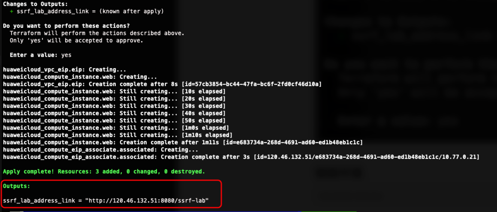
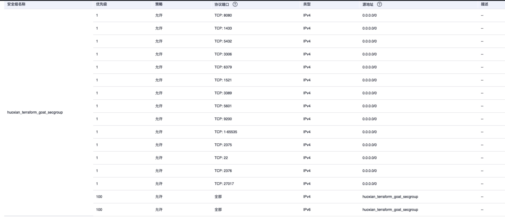

# 华为云 ECS CIS安全组基线检查靶场

[English](./README.md) | 中文

## 描述信息

> 该靶场仅用于安全基线检查

这是一个用于构建华为云 ECS不安全的ECS安全组配置的靶场

不安全的安全组配置可能导致恶意攻击者访问ECS

## 环境搭建

在容器中执行以下命令

```shell
cd /TerraformGoat/huaweicloud/networking/cis_unsafe_secgroup/
```

编辑 `terraform.tfvars` 文件，在文件中填入你的 `huaweicloud_access_key` 和 `huaweicloud_secret_key`

> 在华为云「控制台 --》我的凭证」处可以找到访问密钥

```shell
vim terraform.tfvars
```

部署靶场

```shell
terraform init
terraform apply
```

> 在终端提示 `Enter a value:` 时，输入 `yes` 即可




虽然这里还是一个ECS SSRF的环境，但是我们在控制台中可以发现，开放了比较多危险的端口



上图可以看到，例如docker的2375，kibana，es，这些是不建议在公网中开放的

## 销毁环境

```shell
terraform destroy
```
