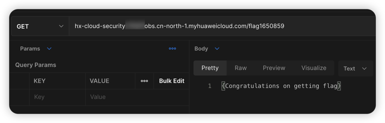

# Huawei Cloud OBS bucket object traversal vulnerability environment

English | [中文](./README_CN.md)

## Description

This is a vulnerability environment scenario for building Huawei Cloud object storage bucket object traversal.

When you build an environment using Terraform, users can traverse objects in a vulnerable bucket and access them by stitching them into key values.

## Deployment Environment

run in a container

```shell
cd /TerraformGoat/huaweicloud/obs/bucket_object_traversal/
```

Edit the `terraform.tfvars` file and fill in the file with your `huaweicloud_access_key` and `huaweicloud_secret_key`.

> The access key can be found in HUAWEI CLOUD [Console --> My Credentials]

```shell
vim terraform.tfvars
```

Deploy Vulnerable Environment

```shell
terraform init
terraform apply
```

> When the terminal prompts `Enter a value:`, enter `yes`


After the environment is set up, you can see the created Bucket at Outputs.

## Vulnerability Utilization

Access the bucket, you can traverse the objects in the Bucket.


The key value is flag1650859, splicing this key can access the content of the object.



## Destroy the environment

```shell
terraform destroy
```
