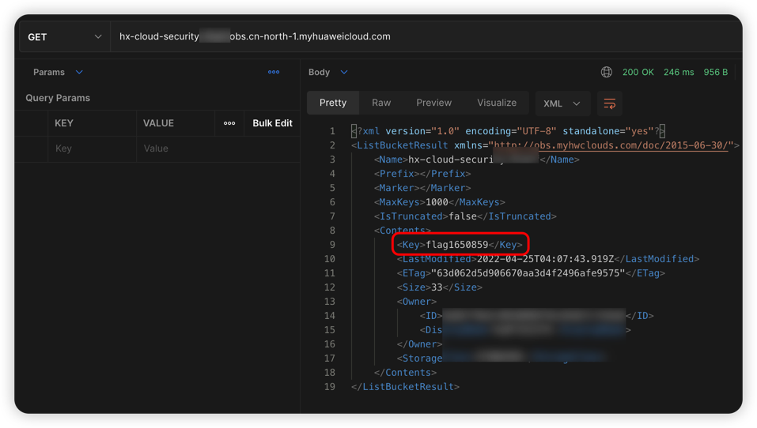
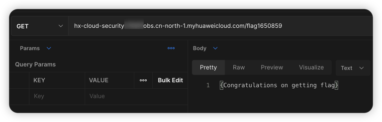

# 华为云 OBS Bucket 对象遍历漏洞环境

[English](./README.md) | 中文

## 描述信息

这是一个用于构建华为云对象存储 Bucket 对象遍历漏洞环境靶场。

使用 Terraform 构建环境后，用户可以在存在漏洞的 Bucket 中遍历对象，通过拼接对象的 Key 值访问到对象。

## 环境搭建

在容器中运行

```shell
cd /TerraformGoat/huaweicloud/obs/bucket_object_traversal/
```

编辑 `terraform.tfvars` 文件，在文件中填入你的 `huaweicloud_access_key` 和 `huaweicloud_secret_key`

> 在华为云「控制台 --》我的凭证」处可以找到访问密钥

```shell
vim terraform.tfvars
```

部署靶场

```shell
terraform init
terraform apply
```

> 在终端提示 `Enter a value:` 时，输入 `yes` 即可


当命令执行完后，在 Outputs 处可以看到 Bucket 名称。

## 漏洞利用

访问存储桶，可以对 Bucket 中的对象进行遍历



可以看到 Bucket 中对象的 Key 值为 flag1650859，拼接这个 Key 可以访问到对象的内容



## 销毁环境

```shell
terraform destroy
```
