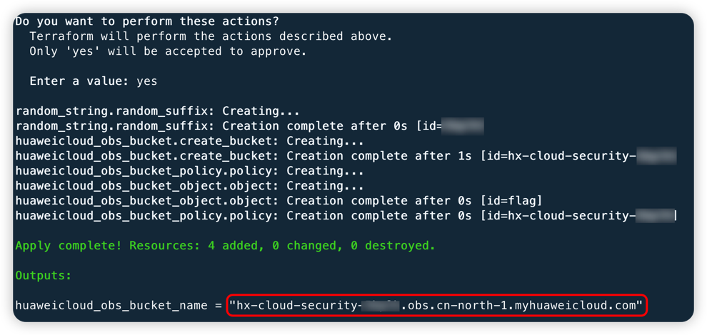

# Huawei Cloud OBS Policy configuration causes any file upload vulnerability environment

English | [中文](./README_CN.md)

## Description

This is a vulnerability environment firing range for building Huawei Cloud Object Storage arbitrary file uploads.

After building the environment with Terraform, users can upload arbitrary files in the vulnerable Bucket.

Tips:

What is the difference between this vulnerability environment and `/TerraformGoat/huaweicloud/obs/unrestricted_file_upload/`?

1、/TerraformGoat/huaweicloud/obs/unrestricted_file_upload/ is caused by ACL configuration

2、/TerraformGoat/huaweicloud/obs/policy_of_unrestricted_file_upload/ is caused by Policy configuration

## Deployment Environment

run in a container

```shell
cd /TerraformGoat/huaweicloud/obs/policy_of_unrestricted_file_upload/
```

Edit the `terraform.tfvars` file and fill in the file with your `huaweicloud_access_key` and `huaweicloud_secret_key`.

> The access key can be found in HUAWEI CLOUD [Console --> My Credentials]

```shell
vim terraform.tfvars
```

Deploy Vulnerable Environment

```shell
terraform init
terraform apply
```

> When the terminal prompts `Enter a value:`, enter `yes`



After the environment is set up, you can see the created Bucket at Outputs.

## Vulnerability Utilization

Upload files using the PUT method


Access the file just uploaded and find that it can be read.


## Destroy the environment

```shell
terraform destroy
```
