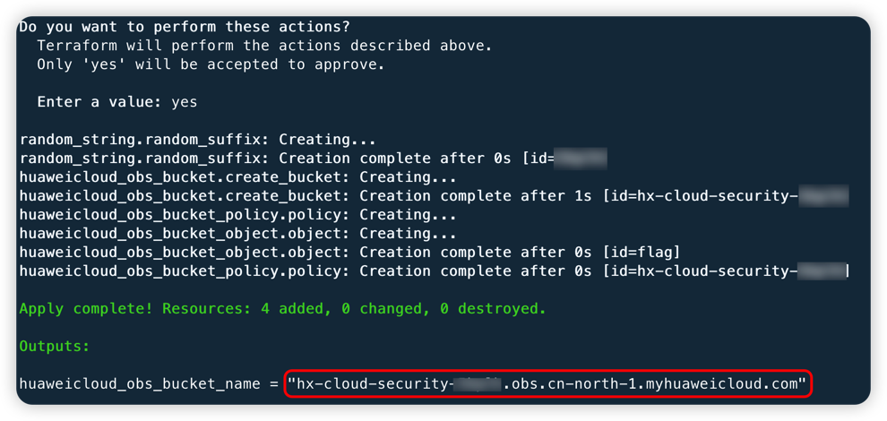
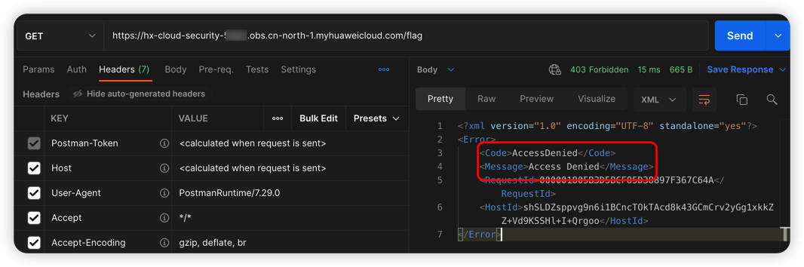
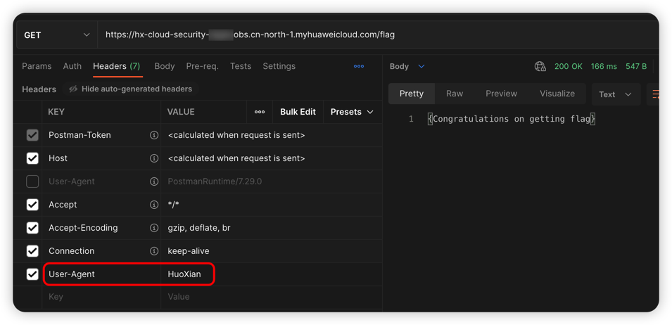

# 华为云 OBS 特殊的 Bucket 策略漏洞环境

[English](./README.md) | 中文

## 描述信息

这是一个用于构建华为云对象存储特殊的 Bucket 策略的漏洞环境靶场。

使用 Terraform 构建环境后，用户可以配置特定的 Bucket 策略读取到原本不能读取的数据。

## 环境搭建

在容器中运行

```shell
cd /TerraformGoat/huaweicloud/obs/special_bucket_policy/
```

编辑 `terraform.tfvars` 文件，在文件中填入你的 `huaweicloud_access_key` 和 `huaweicloud_secret_key`

> 在华为云「控制台 --》我的凭证」处可以找到访问密钥

```shell
vim terraform.tfvars
```

部署靶场

```shell
terraform init
terraform apply
```

> 在终端提示 `Enter a value:` 时，输入 `yes` 即可



当命令执行完后，在 Outputs 处可以看到 Bucket 名称，这个 Bucket 存在特殊的 Bucket 策略，策略如下：

```shell
{
    "Version": "2008-10-17", 
    "Id": "HuoXianPolicy", 
    "Statement": [
        {
            "Effect": "Allow", 
            "Principal": "*", 
            "Action": "s3:GetObject", 
            "Resource": "arn:aws:s3:::bucket_name/flag", 
            "Condition": {
                "StringLike": {
                    "aws:UserAgent": "HuoXian"
                }
            }
        }
    ]
}
```

## 漏洞利用

观察策略文件，可以知道将 UserAgent 设置为 HuoXian 就可以读取到 flag 文件，关于 Condition 元素的更多解释可以参考：[https://docs.aws.amazon.com/zh_cn/AmazonS3/latest/userguide/amazon-s3-policy-keys.html](https://docs.aws.amazon.com/zh_cn/AmazonS3/latest/userguide/amazon-s3-policy-keys.html)

```shell
https://hx-cloud-security-xxx.obs.cn-north-1.myhuaweicloud.com/flag
```

直接访问可以看到提示 AccessDenied



将 UserAgent 设置为 HuoXian，可以看到成功读取到 flag 文件



## 销毁环境

```shell
terraform destroy
```
