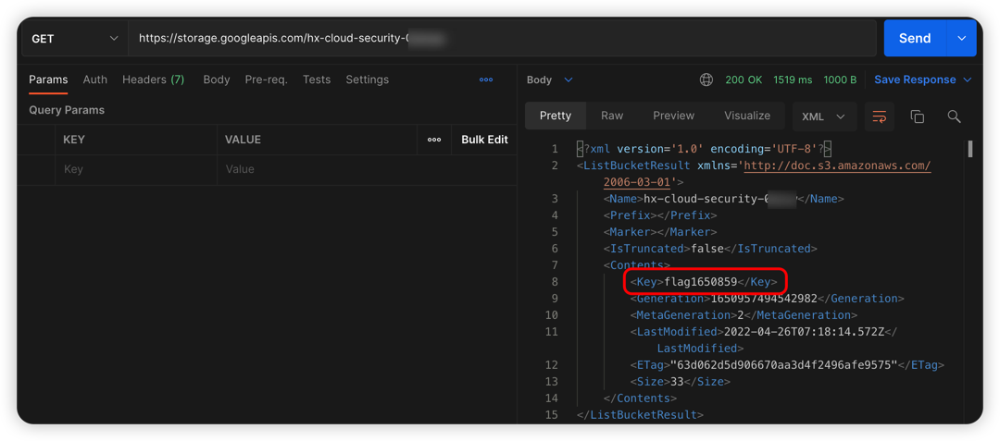

# GCP cloud storage bucket object traversal vulnerability environment

English | [中文](./README_CN.md)

## Description

This is a vulnerability environment shooting range for building GCP cloud storage bucket object traversal.

After building the environment with Terraform, Users can traverse the objects in the vulnerable Bucket and access the objects by splicing the key values of the objects.

## Deployment Environment

Perform gcp authentication with the following command, generate a key file at [service account](https://console.cloud.google.com/projectselector2/iam-admin/serviceaccounts?supportedpurview=project), and copy the key to Authentication in the container

```shell
docker cp key.json terraformgoat:/terraformgoat # run on the host
docker exec -it terraformgoat /bin/bash  # run on the host
gcloud auth activate-service-account --key-file key.json # run on the container
```

Execute the following command in the container

```shell
cd /TerraformGoat/object_storage_service/gcp/bucket_object_traversal/
```

Edit the `terraform.tfvars` file and fill in the file with your `gcp project id`

```shell
vim terraform.tfvars
```

Deploy Vulnerable Environment

```shell
terraform init
terraform apply
```

> When the terminal prompts `Enter a value:`, enter `yes`


When the command finishes executing, you can see the bucket name at Outputs.

## Vulnerability Utilization

Access the bucket, you can traverse the objects in the Bucket.



The key is flag1650859, splicing this key can access the content of the object.


## Destroy the environment

```shell
terraform destroy
```
